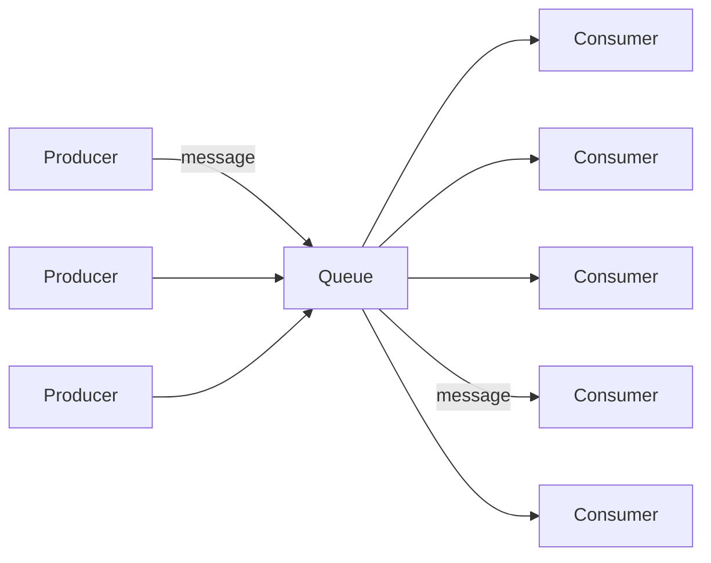
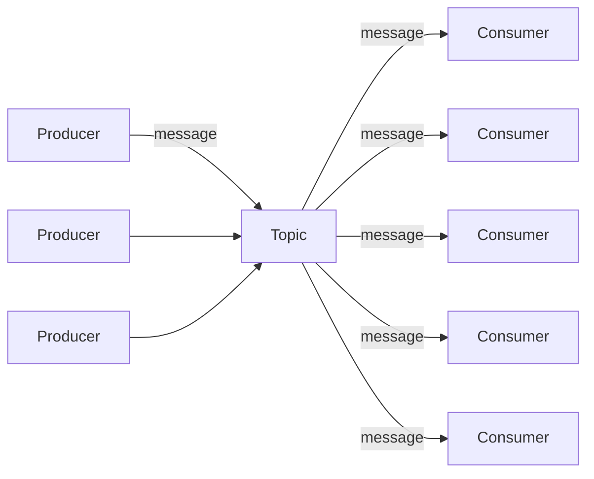
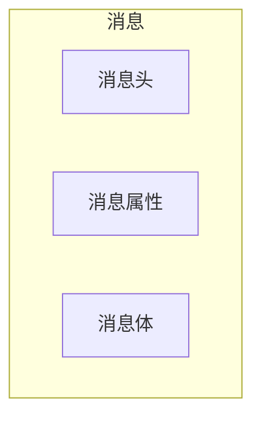
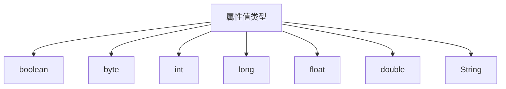

# 一 : ActiveMQ 是什么

ActiveMQ 是 Apache 出品, 最流行的, 能力强劲的开源消息总线

ActiveMQ 是一个完全支持 JMS1.1 和 J2EE 1.4 规范的 JMS Provider 实现, 尽管 jMS 规范出台已经是很久的事情了, 但是 JMS 在当今的 J2EE 应用中间仍然扮演着特殊的地位


# 二 : JMS 规范

Java 消息服务 (java message service, 即 JMS) 应用程序接口是一个 java 平台中关于面向消息中间件 (MOM) 的 API, 用于在两个应用程序之间, 或分布式系统中发送消息, 进行异步通信; 

**JMS 是一个与具体平台无关的 API**

## (一) JMS 的对象模型

| 对象              | 解释                       |
| ----------------- | -------------------------- |
| ConnectionFactory | 连接工厂                   |
| Connection        | 连接                       |
| Session           | 会话                       |
| Destination       | 目的                       |
| MessageProducer   | 生产者                     |
| MessageConsumer   | 消费者                     |
| Message           | 消息                       |
| Broker            | 消息中间件的实例(ActiveMQ) |

## (二) JMS 的消息模型

Point-to-Point (P2P) / 点对点 



Publish / Subscribe (Pub / Sub) / 主题 (发布订阅)



## (三) JMS 的消息结构



**消息头 :** 关于一些消息的描述信息

| 名称             | 解释                                                         |
| ---------------- | ------------------------------------------------------------ |
| JMSDestination   | 消息的目的地, Topic 或者是 Queue                             |
| JMSDeliveryMode  | 消息的发送模式                                               |
| JMSTimestamp     | 消息传递给Broker的时间戳, 它不是实际发送的事件               |
| JMSExpiration    | 消息的有效期,在有效期内,消息消费者才可以消费                 |
| JMSPriority      | 消息的优先级;0-4为正常的优先级,5-9为高优先级                 |
| JMSMessageID     | 一个字符串用来唯一标示一个消息                               |
| JMSReplyTo       | 有时消息生产者希望消费者返回一个消息,JMSReplyTo为一个Destination,表示需要回复的目的地 |
| JMSCorrelationID | 通常用来关联多个Message                                      |
| JMSType          | 表示消息体的结构,和JMS提供者有关                             |
| JMSRedelivered   | 如果这个值为true,表示消息是被重新发送了                      |

**消息属性 :** 可以理解为消息的附加消息头, 属性名可以自定义; 



**消息体类型 :** 

| 类型          | 解释               |
| ------------- | ------------------ |
| BytesMessage  | 用来传递字节消息   |
| MapMessage    | 用来传递键值对消息 |
| ObjectMessage | 用来传递序列化对象 |
| StreamMessage | 用来传递文件等     |
| TextMessage   | 用来传递字符串     |


# 三 : ActiveMQ 的特性

1. 支持多种编程语言

2. 支持多种传输协议

3. 有多种持久化方式


# 四 : 安装 ActiveMQ

## (一) 环境准备

CentOS 7, JDK 1.8

## (二) 下载 ActiveMQ

下载地址 : https://activemq.apache.org/download-archives

```shell
# 进入/tmp
cd /tmp
# 安装wget
yum install -y wget
# 使用 wget 下载存档
wget -c https://archive.apache.org/dist/activemq/5.15.8/apache-activemq-5.15.8-bin.tar.gz
```

## (三) 安装 ActiveMQ

提取存档

```shell
tar -zxvf apache-activemq-5.15.8-bin.tar.gz -C /var
```

修改ActiveMQ的目录名

```shell
mv /var/apache-activemq-5.15.8/ /var/activemq/
```

## (四) 启动 ActiveMQ

作为后台进程启动ActiveMQ

```shell
[root@localhost bin]# ./activemq start
INFO: Loading '/opt/activemq//bin/env'
INFO: Using java '/usr/bin/java'
INFO: Starting - inspect logfiles specified in logging.properties and log4j.properties to get details
INFO: pidfile created : '/opt/activemq//data/activemq.pid' (pid '68433')
```

停止ActiveMQ

```shell
[root@localhost bin]# ./bin/activemq stop
```

## (五) ActiveMQ 服务

前面使用命令运行 ActiveMQ, 但最好的方式是**将 ActiveMQ 作为服务启动;**

使用 system 服务将可以确保 ActiveMQ 能在系统启动时自动启动

**创建 ActiveMQ 服务**

```shell
# 1.使用vim创建一个system的服务
vi /usr/lib/systemd/system/activemq.service
# 2.填入以下内容
[Unit]
Description=ActiveMQ service
After=network.target

[Service]
Type=forking
ExecStart=/var/activemq/bin/activemq start
ExecStop=/var/activemq/bin/activemq stop
User=root
Group=root
Restart=always
RestartSec=9
StandardOutput=syslog	#输出到系统日志中/var/log/message
StandardError=syslog
SyslogIdentifier=activemq

[Install]
WantedBy=multi-user.target
```

**修改配置文件**

```shell
# 找到java命令的位置
[root@localhost ~]# whereis java
java: /usr/bin/java /usr/local/java /usr/share/man/man1/java.1

# 2.修改/var/activemq/bin/env中的JAVA_HOME为JDK的目录
JAVA_HOME="/usr/java/jdk1.8.0_221-amd64"
JAVACMD="auto"
```

**ActiveMQ 服务操作**

```shell
# 启动ActiveMQ服务
systemctl start activemq
# 查看服务状态
systemctl status activemq
# 设置开机启动
systemctl enable activemq
# 检查开机自启
systemctl list-unit-files | grep activemq
```

**防火墙添加 ActiveMQ 的端口 :** ActiveMQ 启动后, 外部还无法访问, 还需要在防火墙配置中增加 ActiveMQ 的 Web 管理端口和通讯端口

```shell
# 添加端口: Web管理端口默认为8161，通讯端口默认为61616
firewall-cmd --zone=public --add-port=8161/tcp --permanent
firewall-cmd --zone=public --add-port=61616/tcp --permanent
# 重启防火墙
systemctl restart firewalld.service
```


# 五 : 使用 ActiveMQ

## (一) 使用 ActiveMQ 的 web 管理平台

ActiveMQ 自带有管理平台, 在浏览器访问

```http
http://IP:8161/admin
```

默认开启了身份校验

```yaml
账号: admin
密码: admin
```

**Web 管理配置 :** ActiveMQ 的 Web 管理平台是基于 jetty 运行, 因此在/var/activemq/conf目录可以看到jetty的配置文件

```shell
[root@localhost ~]# ll /var/activemq/conf
-rw-r--r-- 1 root root 1087 Nov 15  2018 jetty-realm.properties
-rw-r--r-- 1 root root 7795 Nov 15  2018 jetty.xml
```

修改web管理平台的默认端口 : /var/activemq/conf/jetty.xml

```xml
<bean id="securityConstraint" class="org.eclipse.jetty.util.security.Constraint">
    <property name="name" value="BASIC" />
    <property name="roles" value="user,admin" />
    <!-- 改为false即可关闭登陆 -->
    <property name="authenticate" value="true" />
</bean>

<bean id="jettyPort" class="org.apache.activemq.web.WebConsolePort" init-method="start">
    <!-- the default port number for the web console -->
    <property name="host" value="0.0.0.0"/>
    <!--此处即为管理平台的端口-->
    <property name="port" value="8161"/>
</bean>
```

修改账号密码 : /var/activemq/conf/jetty-realm.properties

```shell
# Defines users that can access the web (console, demo, etc.)
# username: password [,rolename ...]
# 在此即可维护账号密码，格式(用户名:密码,角色)
admin: 888888, admin
user: 123, user
```

## (二) 在 Java 中使用 ActiveMQ

使用 jar 包 : 在 activemq 的根目录有 `activemq-all-5.15.8.jar` 包, 将其直接复制到工程即可

Maven 依赖

```xml
<dependency>
    <groupId>org.apache.activemq</groupId>
    <artifactId>activemq-all</artifactId>
    <version>5.15.8</version>
</dependency>
```

生产者

```java
public class Producer {

    public static void main(String[] args) {

        try {
            // 1.创建连接工厂
            ActiveMQConnectionFactory connectionFactory = new ActiveMQConnectionFactory(
                "admin","admin","tcp://10.0.0.11:61616");
            // 2.创建连接对象
            Connection connection = connectionFactory.createConnection();
            // 启动
            connection.start();
            // 3.创建会话
            // 第一个参数表示是否支持事务,如果为true,会忽略第二个参数,并设置为SESSION_TRANSACTED
            // 如果为false,第二个参数可设为AUTO_ACKNOWLEDGE,CLIENT_ACKNOWLEDGE,DUPS_OK_ACKNOWLEDGE
            Session session = connection.createSession(false, Session.AUTO_ACKNOWLEDGE);
            // 4.创建发送目标(queue/topic)
            Destination destination = session.createQueue("queue1");
			//Destination destination = session.createTopic("topic1");
            // 5.创建消息生产者
            MessageProducer producer = session.createProducer(destination);
            // 指定持久化策略:
            producer.setDeliveryMode(DeliveryMode.PERSISTENT);
            // 6.创建消息
            TextMessage textMessage = session.createTextMessage("hello amq");
            // 7.发送消息
            producer.send(textMessage);
			// 8.关闭会话和连接
            session.close();
            connection.close();

        } catch (JMSException e) {
            e.printStackTrace();
        }

    }
}
```

消费者

```java
public class Consumer {

    public static void main(String[] args) {
        try {
            // 1.创建连接工厂
            ActiveMQConnectionFactory connectionFactory = new ActiveMQConnectionFactory(
                "tcp://10.0.0.11:61616");
            // 2.创建连接对象
            Connection connection = connectionFactory.createConnection("admin", "admin");
            // 启动
            connection.start();
            // 3.创建会话
            Session session = connection.createSession(false, Session.AUTO_ACKNOWLEDGE);
            // 4.创建接收目标(queue/topic)
            Destination destination = session.createQueue("queue1");
            //Destination destination = session.createTopic("topic1");
            // 5.创建消息消费者
            MessageConsumer consumer = session.createConsumer(destination);
            // 6.接收消息
            Message message = consumer.receive();
            if (message instanceof TextMessage) System.out.println(((TextMessage) message).getText());
			// 7.关闭会话和连接
            session.close();
            connection.close();
        } catch (JMSException e) {
            e.printStackTrace();
        }
    }
}
```

## (三) 在 Spring 中使用 ActiveMQ

Spring官方教程 : http://spring.io/guides/gs/messaging-jms

spring 依赖

```xml
<dependency>
    <groupId>org.springframework</groupId>
    <artifactId>spring-jms</artifactId>
    <version>5.1.3.RELEASE</version>
</dependency>
<dependency>
    <groupId>org.apache.activemq</groupId>
    <artifactId>activemq-broker</artifactId>
    <version>5.15.8</version>
    <exclusions>
        <exclusion>
            <groupId>org.apachegeronimo.specs</groupId>
            <artifactId>geronimo-jms_1.1_spec</artifactId>
        </exclusion>
    </exclusions>
</dependency>
```

springboot 依赖

```xml
<dependency>
    <groupId>org.springframework.boot</groupId>
    <artifactId>spring-boot-starter-activemq</artifactId>
</dependency>
```

配置文件

```yaml
spring:
  activemq:
    broker-url: tcp://10.0.0.11:61616
    user: admin
    password: admin
```

启动类

```java
@SpringBootApplication
@EnableJms
public class AmqApplication {
    public static void main(String[] args) {
        SpringApplication.run(AmqApplication.class, args);
    }
}
```

生产者

```java
@Component
public class Producer {

    @Autowired
    private JmsTemplate jmsTemplate;

    @PostConstruct
    public void init() {
        jmsTemplate.convertAndSend("queue1", "hello spring");
    }
}
```

消费者

```java
@Component
public class Consumer {
    
    @JmsListener(destination = "queue1")
    public void receive(String message) {
        System.out.println("收到消息: " + message);
    }
}
```

