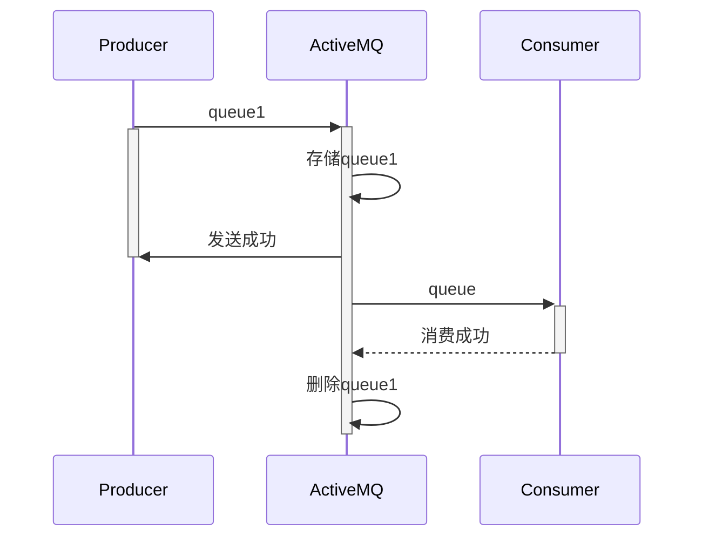
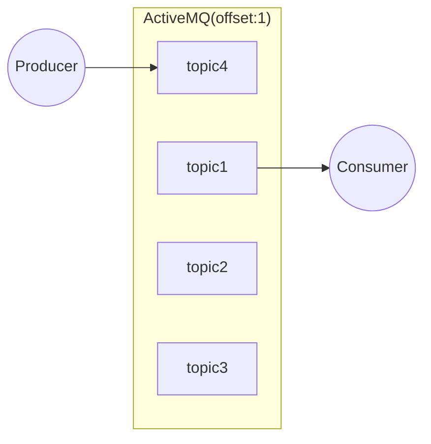
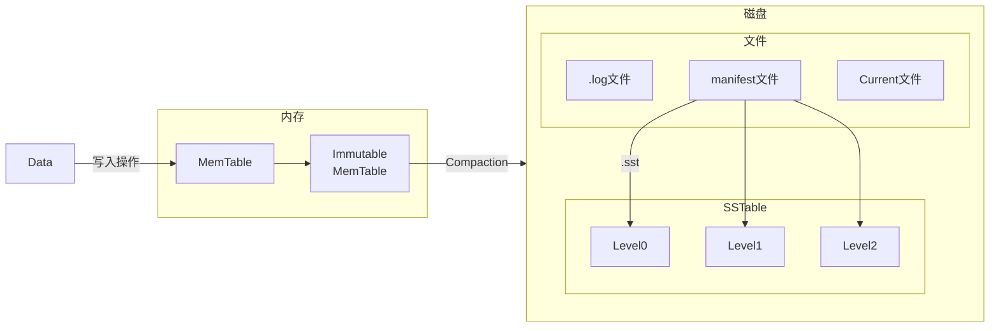

## 一 : ActiveMQ持久化机制

ActiveMO 的消息持久化机制有JDBC, AMO, KahaDB和LevelDB无论使用哪种持久化方式, 消息的存储逻辑都是一致的。

### (一) Queue类型的持久化机制

消息一旦消费成功就会被删除



### (二) Topic 类型的持久化机制

和queue有所不同, 由于topic会有多个消费者订阅, 所以AMQ需要保存不同订阅者的处理进度, 这里就需要有一个类似 java gc 的定期清除策略




## 二 : 持久化方式

### (一) JDBC方式

**将消息存储到数据库**中, 例如: Mysql、SQL Server、Oracle、DB2等

| 优点             | 缺点   |
| ---------------- | ------ |
| 方便管理         | 性能低 |
| 可以支持强一致性 | /      |

### (二) AMQ方式

基于文件的存储方式, 它具有**写入速度快和容易恢复的特点**, 但是由于其重建索引时间过长, 而且索引文件占用磁盘空间过大, 所以已经不推荐使用

| 优点         | 缺点                 |
| ------------ | -------------------- |
| 性能高于JDBC | 索引占用磁盘空间量大 |
| /            | 重建索引速度非常慢   |


### (三) KahaDB方式

从 ActiveMQ 5.4开始**默认**的持久化方式, KahaDb恢复时间远远小于其前身AMQ并且使用更少的数据文件, 所以可以完全代替AMQ

| 属性                 | 默认值 | 描述                   |
| -------------------- | ------ | ---------------------- |
| indexWriteBatchSize  | 1000   | 索引批量写入磁盘的条数 |
| indexCacheSize       | 10000  | 索引缓存条数           |
| journalMaxFileLength | 32mb   | 数据文件的大小         |

### (四) LevelDB方式

LevelDB 是 Google 开发的一套用于持久化数据的高性能类库LevelDB并不是一种服务, 用户需要自行实现 Server。 是单进程的服务, 能够处理十亿级别规模 Key-Value 型数据, 占用内存小。**5.9以后弃用了**

特点 : 

1. 基于KV存储
2. Key值有序存储
3. 操作接口简单
4. 支持数据快照
5. 支持数据压缩

LevelDB的结构



ActiveMQ配置LevelDB : 修改配置文件 `${ACTIVEMQ_HOME}/conf/activemq.xml`

```xml
<persistenceAdapter>
    <levelDB directory="${activemq.data}/activemg-data"/>
</persistenceAdapter>
```


## 三 : 事务机制

### (一) 事务实现机制

生产者

| Producer                                        | Message and direction | Server                                                       |
| ----------------------------------------------- | --------------------- | ------------------------------------------------------------ |
| **Action:** Create Session<br>transacted: true  |                       |                                                              |
| **Action:** Send Message<br>transactionlD: xxxx | =>                    | **Actions:**<br>1.transaction store<br>2.wait for commit or rollback |
| **Action:** commit/rollback                     | =>                    | **Actions:**<br>Store Message<br>or<br>Discard Message       |

消费者

| Consumer                                       | Message and direction | Server                                                   |
| ---------------------------------------------- | --------------------- | -------------------------------------------------------- |
| **Action:** Create Session<br>transacted: true |                       |                                                          |
| **Action:** Receive Message                    | <=                    | **Action:** Send Message                                 |
| **Action:** commit/rollback                    | =>                    | **Actions:**<br>Store Message<br/>or<br/>Discard Message |

### (二) 开启事务

代码示例

```java
//第一个参数为事务开关, 为true则会忽略第二个参数, 被jms服务器设置为SESSION_TRANSACTED
conn.createSession(true,Session.SESSION_TRANSACTED);

// 提交事务
session.commit();
// 回滚事务:对应的消息会重发,默认会重发6次
session.rollback();
```

