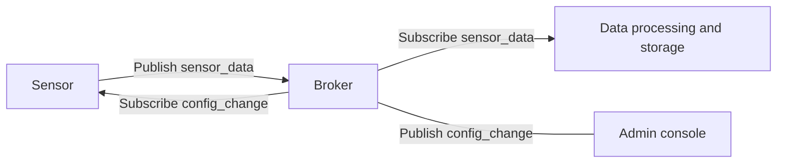

## 一 : ActiveMQ 支持哪些协议

### (一) 支持的协议

ActiveMO支持多种协议传输和传输方式, 允许客户端使用多种协议连接。

ActiveMQ支持的协议 : AUTO、OpenWire、AMQP、Stomp、MQTT等。

ActiveMO支持的基础传输方式 : VM、TCP、SSL、UDP、Peer、Multicast、HTTP(S)等, 以及更高级的Failover、Fanout、 Discovery、 ZeroConf方式。

### (二) 协议连接配置

在 `${ACTIVEMQ_HOME}/conf/activemq.xml` 中, 通过配置 `<transportConnectors>` 就可以使用多种传输方式。

```xml
<transportConnectors>
    <!-- DOS protection, limit concurrent connections to 1000 and frame size to 100MB -->
    <transportConnector name="openwire" uri="tcp:/0.0.0.0:61616?maximumConnections-1000&wireFormat.maxFramesSize=104857600"/>
    <transportConnector name="amqp" uri="amgp://0.0.0.0:5672?maximumConnections=1000&wirefFormat.maxFramesSize=104857600"/>
    <transportConnector name="stomp" uri="stomp://0.0.0.0:61613?maximumConnections=1000&wireFormat.maxFrameSize=104857600"/>
    <transportConnector name="matt" uri="matt:/0.0.0.0:1883?maximumConnections=1000&wireformat,.maxFramesize=104857600"/>
    <transportConnector name-"ws" uri="ws://0.0.0.0:61614?maximumConnections=1000&wireFormat,maxFrameSize=104857600"/>
</transportConnectors>
```


## 二 : 传输方式配置

### (一) TCP

由于TCP具有可靠传输的特性, 它在ActiveMQ中也是最常使用的一种协议。在默认的配置中, TCP连接的端口为61616

配置格式

```shell
tcp://hostname:port?key=value
```

配置注意事项

* 在服务器端配置时, 参数要以 `transport.` 开头

  ```shell
  # 服务器端配置示例
  tcp://ocalhost:61616?transport.threadName&transport.trace=false&transport.soTimeout=60000
  ```

* 在客户端连接时, 参数省略 `transport.` 前缀

  ```shell
  # 客户端配置示例
  tcp://localhost:61616?threadName&trace=false&soTimeout=60000
  ```

TCP配置参数说明

| 属性                 | 默认值            | 描述                                                         |
| -------------------- | ----------------- | ------------------------------------------------------------ |
| backlog              | 5000              | 指定传输服务器套接字等待接受的最大连接数。                   |
| connectionTimeout    | 30000             | 超时时间, >=1时才有超时时间 (单位为毫秒); 为0表示没有超时, 负值被忽略。 |
| daemon               | false             | 如果为true, 则传输线程将以守护进程模式运行; 将代理嵌入Spring容器或Web容器中时, 请将此参数设置为true,以允许容器正确关闭。 |
| dynamicManagement    | false             | 如果为true, 则可以通过JMX管理TransportLogger。               |
| ioBufferSize         | 8*1024            | 协议解析使用的缓冲区的大小。(非TCP缓冲区)                    |
| jmxPort              | 1099              | (仅在客户端有效)JMX端口                                      |
| keepAlive            | false             | 如果为true, 则在**Broker连接上启用TCP KeepAlive**, 以防止连接在TCP级别超时; 这不要和**InactivitvMonitor使用的KeepAlivelnfo**消息混淆。 |
| maximumConnections   | Integer.MAX_VALUE | broker允许的最大socket数量                                   |
| socketBufferSize     | 64*1024           | 设置接受的套接字读写缓冲区的大小(以字节为单位)               |
| soLinger             | Integer.MIN_VALUE | 当值>-1时, 设置套接字的选项soLinger; 设置为-1时, 将禁用soLinger套接字选项 |
| soTimeout            | 0                 | 设置套接字的读取超时(以毫秒为单位); 0表示没有超时            |
| soWriteTimeout       | 0                 | 设置套接字的写入超时(以毫秒为单位); 0表示没有超时            |
| stackSize            | 0                 | 设置服务端后台读取线程的堆栈大小; 必须以128K的倍数指定; 0表示忽略此参数 |
| startLogging         | true              | true, 将传输信息TransportLogger对象写入日志; 仅在trace=true的场景下生效 |
| tcpNoDelay           | false             | 如果为true, 则设置套接字的选项TCP_NODELAY; 这会禁用Nagle的小数据包传输算法 |
| threadName           | N/A               | 指定调用transport的线程名称; 若以服务器host命名, 调试线程的时候可以看到 |
| **trace**            | false             | 为true时, 服务器记录传输发送的所有命令内容; log4j.logger.org.apache.activemq.transport.TransportLogger=DEBUG |
| trafficClass         | 0                 | ip协议级别的服务质量参数。(0x02, 0x04, 0x08, 0x10)           |
| uselnactivityMonitor | true              | false, 则禁用InactivityMonitor, 连接永远不会超时             |
| **useKeepAlive**     | true              | true,在空闲连接上发送KeepAlivelnfo消息, 防止它超时; false, 指定的时间内没有接收到数据, 连接超时。 |

### (二) SSL

需要一个安全连接的时候可以考虑使用SSL, 适用于client和broker在公网的情况如使用aws云平台等; 

官方文档 : [http://activemq.apache.org/ssl-transport-reference.html](http://activemq.apache.org/ssl-transport-reference.html)

配置格式(可配置参数和TCP相同)

```shell
ssl://localhost:61616
```

SSL客户端配置 : JMS 客户端需要使用ActiveMQSslConnectionFactory 类创建连接, brokerUrl以 `ssl://` 开头, 以下是 Spring 配置示例

```xml
<bean id="AMQJMSConnectionFactory" class="org.apache.activemq.ActiveMQSslConnectionFactory">
    <property name="trustStore" value="/path/to/truststore.ts" />
    <property name="trustStorePassword" value="password" />
    <property name="keyStore" value="/path/to/keystore.ks" />
    <property name="keyStorePassword" value="password" />
    <property name="brokerURL" value="ssl://localhost:61616" />
    <property name="userName" value="admin" /><property name="password" value="admin" />
</bean>
```

SSL主机名验证 : 从ActiveMQ5.15.6开始, ActiveMo 开始支持TLS主机名验证, 默认情况下客户端启用了该验证, 而服务器端没有启用。

服务器端配置

```shell
ssl://localhost:61616?transport.verifyHostName=true
```

客户端端配置

```shell
ssl://localhost:61616?socket.verifyHostName=false
# 或者
ssl://localhost:61616?verifyHostName=false
```

### (三) NIO

使用 Java 的 NIO 方式对连接进行改进, 因为 NIO 使用线程池, 可以复用线程, 所以可以用更少的线程维持更多的连接; 如果有大量的客户端, 或者性能瓶颈在网络传输上, 可以考虑使用NIO的连接方式。

NIO配置格式, 可配置参数和TCP相同

```shell
nio://hostname:port?key=value
# NIO是OpenWire协议的传输方式,其它协议,像AMQP、MQTT、Stomp,也有NIO的实现,通常在协议前缀中加"+nio"来区分。示例:
mgtt+nio://localhost:1883
```

NIO传输线程使用情况配置 : 从5.15.0开始, ActiveMQ支持调整NIO的传输线程, 可以设置以下属性

| 属性                                                         | 默认值 | 描述                                                         |
| ------------------------------------------------------------ | ------ | ------------------------------------------------------------ |
| org.apache.activemq.transport.nio.SelectorManager.corePoolSize | 10     | 核心线程池线程数                                             |
| org.apache.activemq.transport.nio.SelectorManager.maximumPoolSize | 1024   | 线程池最大线程数                                             |
| org.apache.activemq.transport.nio.SelectorManager.workQueueCapacity | 0      | 线程池队列容量                                               |
| org.apache.activemq.transport.nio.SelectorManager.rejectWork | false  | 当达到容量时, 允许使用IOException 拒绝工作以便可以保留现有的QOS |

NIO传输线程使用情况配置 : 属性可以在 `${ACTIVEMQ_HOME}/bin/env` 中配置, 示例 :

```shell
ACTIVEMQ_OPTS="$ACTIVEMQ_OPTS -Dorg.apache.activemq.transport.nio.SelectorManager.corePoolSize=2000 -Dorg.apache.activemq.transport.nio.SelectorManagermaximumPoolSize=2000 -Dorg.apache.activemq.transport.nio.SelectorManager.workQueueCapacity=1024"
```

NIO SSL : 从ActiveMQ5.6版本开始, NIO可以支持和SSL搭配使用的传输连接。

NIO+SSL配置格式, 可配置参数和TCP相同

```shell
nio+ssl://0.0.0.0:61616
```

### (四) UDP

与面向连接, 可靠的字节流服务的TCP不同, UDP是一个面向数据的简单传输连接, 没有TCP的三次握手, 所以性能大大强于TCP, 但是是以牺牲可靠性为前提。适用于丢失也无所谓的消息。

UDP配置格式

```shell
udp://localhost:8123
```

UDP配置参数说明

| 属性         | 默认值 | 描述                                  |
| ------------ | ------ | ------------------------------------- |
| trace        | false  | 为true时, 将会记录传输发送的所有命令  |
| useLocalHost | true   | 为true时, 本机机器名被解析为localhost |
| datagramSize | 4*1024 | 指定数据报的大小                      |

### (五) HTTP(S)

需要穿越防火墙, 可以考虑使用HTTP(S), 但由于HTTP(S)是短连接, 每次创建连接的成本较高, 所以性能最差。通过XML传输数据。

HTTP配置格式

```shell
http://localhost:8080?param1=val1&param2=val2
```

HTTPS配置格式

```shell
https://localhost:8080?param1=val1&param2=val2
```

### (六) VM

虚拟机协议(方法直调), 使用场景是client和broker在同一个Java虚拟机内嵌的情况, 无需网络通信的开销。

VM配置格式

```shell
vm://brokerName?marshal=false&broker.persistent=false
```

VM配置参数说明

| 属性         | 默认值  | 描述                                                         |
| ------------ | ------- | ------------------------------------------------------------ |
| create       | true    | 如果不存在, 则创建broker                                     |
| waitForStart | -1      | 如果>0, 则表示等待代理启动的超时 (以毫秒为单位); 值-1和0表示不等待, 仅在ActiveMQ 5.2+支持 |
| wireFormat   | default | 命令的组装格式(协议)                                         |
| marshal      | false   | 强制发送的每个命令使用WireFormat进行格式转换                 |


## 三 : OpenWire 协议

### (一) OpenWire协议是什么

**OpenWire** 是Apache的一种跨语言的协议, 允许从不同的语言和平台访问ActiveMQ, 是ActiveMQ 4.x以后的版本默认的传输协议。

官方文档 : 

* [http://activemq.apache.org/openwire-version-2-specification.html](http://activemq.apache.org/openwire-version-2-specification.html)
* [http://activemq.apache.org/wire-protocol.html](http://activemq.apache.org/wire-protocol.html)

### (二) OpenWire协议如何使用

OpenWire 支持TCP、SSL、NIO、UDP、VM等传输方式, 直接配置这些连接, 就是使用的OpenWire协议, OpenWire有自己的配置参数, 客户端和服务器端配置的参数名都通过前缀 `wireFormat.`表示。官方文档 : [http://activemq.apache.org/configuring-wire-formats.html](http://activemq.apache.org/configuring-wire-formats.html)

示例 :

```shell
tcp://localhost:61616?wireFormat.cacheEnabled=false&wireFormat.tightEncodingEnabled=false
```

OpenWire的配置参数说明

| 属性                             | 默认值   | 描述                                                         |
| -------------------------------- | -------- | ------------------------------------------------------------ |
| stackTraceEnabled                | true     | 是否应该把已经发生并且跟踪到的堆栈异常, 通过Broker发送到客户端 |
| tcpNoDelayEnabled                | true     | socket的NoDelay参数                                          |
| cacheEnabled                     | true     | 如果不断重复的值进行缓存, 以便少编组(马上要进行的发送)发生   |
| tightEncodingEnabledtrue         | true     | 根据CPU使用情况, 自动调整传输内容大小(压缩比例)              |
| prefixPacketSize                 | true     | 在每个包被编组前(马上要被发送), 每个包的大小是否应该作为前缀 |
| maxlnactivityDuration            | 30000    | 连接的最大空闲时间,以毫秒为单位; broker服务会根据配置关闭超时的连接; 同时也可以通过心跳机制来保持连接; 值<=0则禁用活动连接的监测。 |
| maxInactivityDurationlnitalDelay | 10000    | 连接建立之后, 多久开始进行超时检测                           |
| cacheSize                        | 1024     | 如果能被缓存, 那么这个规定了缓存的最大数量; 此属性中在ActiveMO的4.1中开始添加使用 |
| maxFrameSize                     | MAX_LONG | 可发送最大帧大小; 可以帮助防止OOMDOS攻击                     |


## 四 : MQTT 协议

### (一) 为什么使用MQTT协议

**MQTT** (Message Queuing Telemetry Transport) 消息队列遥测传输是 IBM 开发的一个即时通讯协议，已成为物联网通信的标准。

**MQTT** 的结构简单, 相对于其它消息协议, 它更加轻量级。适合在计算能力有限、低带宽、不可靠的网络环境使用。

### (二) MQTT的发布订阅模型



### (三) MQTT服务质量

什么是服务质量? **服务质量(QoS)** 级别是一种关于发送者和接收者之间信息投递的保证协议。

| 级别(值) | 描述     |
| -------- | -------- |
| 0        | 至多一次 |
| 1        | 至少一次 |
| 2        | 只有一次 |

**为什么要有服务质量?** QoS是MQTT的一个主要功能, 它使得在不可靠的网络下进行通信变得更为简单, 因为即便是在非常不可靠的网络下, 协议也可以掌控是否需要重发消息并保证消息到达。它也能帮助客户端根据网络环境和程序逻辑来自由选择 QoS。

**Qos level 0 是怎样工作的?** 

| Client  | Message and direction | Server                                                       |
| ------- | --------------------- | ------------------------------------------------------------ |
| Qos = 0 | PUBLISH =>            | **Action:** Publish message to subscribers then Forget<br>**Reception:** <=1 |

**Qos level 1 是怎样工作的?** 

针对客户端发布消息到服务器的消息流 :

| Client                                                       | Message and direction | Server                                                       |
| ------------------------------------------------------------ | --------------------- | ------------------------------------------------------------ |
| OoS=1<br/>DUP=0<br/>Message ID=x<br/>Action: Store<br/>message | PUBLISH =>            | **Actions:** <br>1.Store message<br>2.Publish message to subscribers<br>3.Delete message<br/>**Reception:** >=1 |
| Action: Discard<br/>message                                  | PUBACK <=             | Message ID=x                                                 |

针对服务器发布到订阅者的消息流 :

| Server                        | Message and direction | Server                                                       |
| ----------------------------- | --------------------- | ------------------------------------------------------------ |
| QoS=1<br>DUP=0<br>MessageID=x | PUBLISH =>            | **Actions:** <br>1.Store message<br>2.Make message available<br>**Reception:** >=1 |
|                               | PUBACK <=             | Message ID =x                                                |

**Qos level 2 是怎样工作的?** 

针对客户端发布消息到服务器的消息流

| Client                                                    | Message and direction | Server                                                       |
| --------------------------------------------------------- | --------------------- | ------------------------------------------------------------ |
| QoS=2<br>DUP=0<br/>MessageID =x<br/>Action: Store message | PUBLISH =>            | **Action(a):** Store message<br>or<br/>**Actions(b):**<br/>1.Store message ID<br/>2.Publish message to subscribers |
|                                                           | PUBREC <=             | MessageID=x                                                  |
| MessageID=x                                               | PUBREL =>             | **Actions(a):** <br>1.Publish message to subscribers<br>2.Delete message<br/>or<br>**Action(b):** Delete message lD |
|                                                           | PUBCOMP <=            | MessageID=x                                                  |

针对服务器发布到订阅者的消息流 :

| Server                          | Message and direction | Server                              |
| ------------------------------- | --------------------- | ----------------------------------- |
| QoS=2<br/>DUP=0<br/>MessageID=x | PUBLISH =>            | **Action:** Store message           |
|                                 | PUBREC <=             | MessageID=x                         |
| MessageID=x                     | PUBREL =>             | **Actions:** Make message available |
|                                 | PUBCOMP <=            | MessageID=x                         |

### (四) ActiveMQ中如何使用MQTT协议

ActiveMQ 服务器端配置

```xml
<transportConnectors>
    <!-- DOS protection, limit concurrent connections to 1000 and frame size to 100MB -->
    <transportConnector name="mgtt" uri="mgtt://0.0.0.0:1883?maximumConnections=1000&wireFormat.maxFrameSize=104857600"/>
</transportConnectors>
```

MOTT配置参数说明

| 属性         | 默认值    | 描述                                                         |
| ------------ | --------- | ------------------------------------------------------------ |
| maxFrameSize | 268435456 | (v5.12.0) 可以发送的最大大小。协议限制为256MB, 其值不能设置得更高。可以帮助防止OOM DOS攻击 |

配置示例

```xml
<transportConnector name="mgtt" uri="mgtt://localhost:1883?wireFormat.maxFrameSize=100000"/>
```

MQTT 使用NIO

```xml
<transportConnector name="mgtt+nio" uri="mgtt+nio://localhost:1883"/>
```

MQTT 使用NIO +SSL

```xml
<transportConnector name="mgtt+nio" uri="mgtt+nio+ssl://localhost:1883"/>
```

MQTT 也支持层次结构和通配符, 但分隔符和ActiveMQ不同, 映射关系

| 作用   | ActiveMQ | MQTT |
| ------ | -------- | ---- |
| 分隔符 | .        | /    |
| 元素   | *        | +    |
| 子节点 | >        | #    |

示例

* 主题名: foo.blah.bar
* 在MQTT的客户端订阅时, 可以为foo/+/bar
* 在JMS订阅时, 可以为foo.*.bar

### (五) Spring使用MQTT

Spring integration 提供了MQTT协议的支持, 通过Maven添加依赖即可使用

```xml
<dependency>
    <groupId>org.springframework.integration</groupId>
    <artifactId>spring-integration-mqtt</artifactId>
    <version>5.1.1.RELEASE</version>
</dependency>
```

官方教程 : [https://docs.spring.io/spring-integration/reference/html/mqtt.html](https://docs.spring.io/spring-integration/reference/html/mqtt.html)


## 五 : AUTO 协议

### (一) AUTO协议是什么

**AUTO** 自动检测协议

从ActiveMQ 5.13.0开始, ActiveMO 开始支持协议格式检测, 可以自动检测OpenWire、STOMP、AMQP和MQTT。

允许这4种类型的客户端共享一个传输。

### (二) 如何使用AUTO协议

AUTO 使用TCP

```xml
<transportConnector name="auto" uri="auto://localhost:5671"/>
```

AUTO 使用SSL

```xml
<transportConnector name="auto+ssl" uri="auto+ssl://localhost:5671"/>
```

AUTO 使用NIO

```xml
<transportConnector name="auto+nio" uri="auto+nio://localhost:5671"/>
```

AUTO 使用NIO+SSL

```xml
<transportConnector name="auto+nio+ssl" uri="auto+nio+ssl://localhost:5671"/>
```

