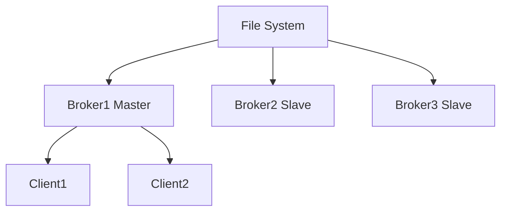
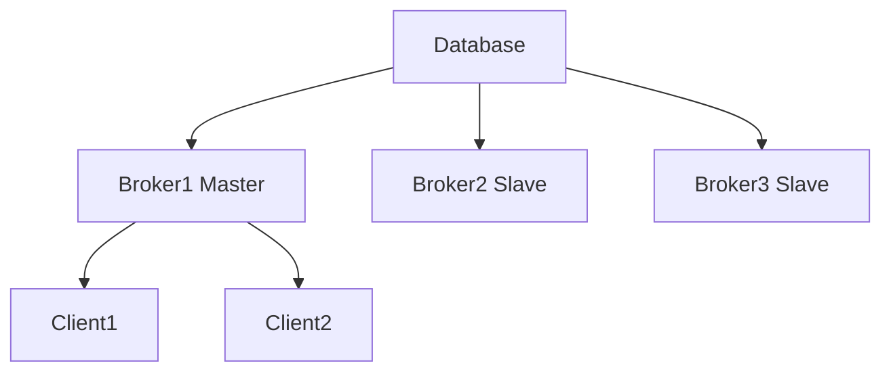
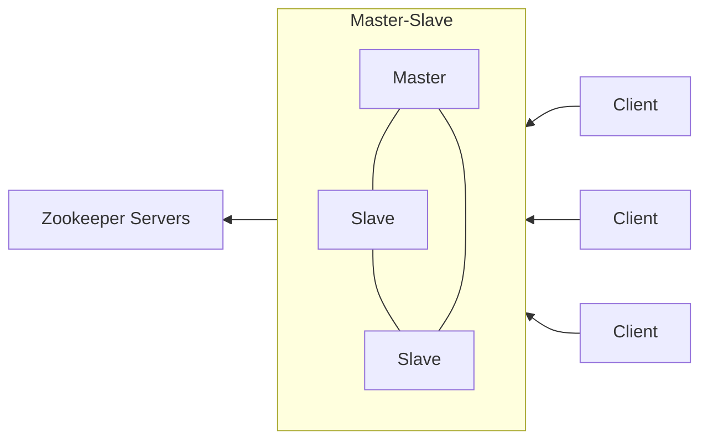
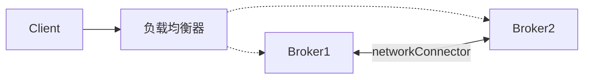
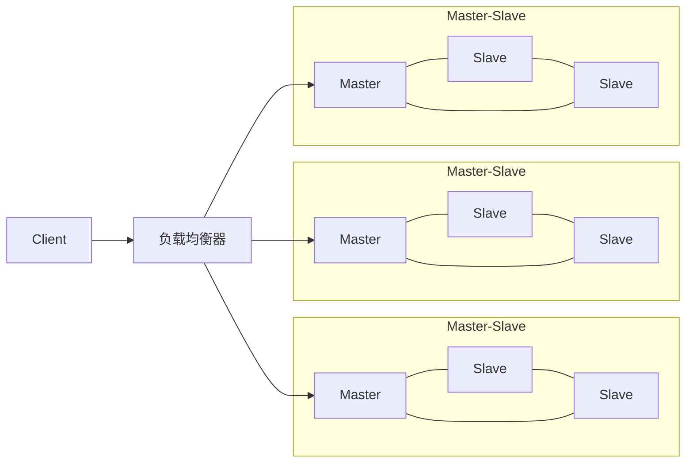

## 一 : ActiveMQ高可用集群方案

ActiveMQ 有哪些集群部署方式

1. Master-Slave部署方式
2. Broker-Cluster部署方式
3. Master-Slave与Broker-Cluster相结合的部署方式


## 二 : Master-Slave部署方式

### (一) Shared filesystem



### (二) Shared database



引入数据库驱动包

```shell
# 把mysql驱动包放在activemq目录下的/lib/extra下
mysql-connector-java-5.1.47.jar
```

配置数据源 : `conf/activemq.xml`

```xml
<!-- 配置数据源 -->
<bean id="mysql-ds" class="org.apache.commons.dbcp2.BasicDataSource" destroy-method="close">
    <property name="driverClassName" value="com.mysql.jdbc.Driver"/>
    <property name="url" value="jdbc:mysql://10.0.0.10:3306/test_activemq?relaxAutoCommit=true"/>
    <property name="username" value="root"/>
    <property name="password" value="123456"/>
    <property name="poolPreparedStatements" value="true"/>
</bean>
<!-- 开启持久化:persistent=true -->
<broker brokerName="localhost" persistent="true" xmlns="http://activemq.apache.org/schema/core">
    <persistenceAdapter>
        <!-- 持久化适配器引入数据源 -->
        <jdbcPersistenceAdapter dataSource="#mysql-ds" useDatabaseLock="false" transactionIsolation="4"/>
    </persistenceAdapter>
</broker>
```

**集群配置** : 多台服务器部署启动activemq服务，使用同一个数据库

客户端使用([官方文档](http://activemq.apache.org/failover-transport-reference.html)) : 

```java
// brokerURI 使用failover，故障自动切换方式
brokerUrl = "failover:(tcp://10.0.0.11:61616,tcp://10.0.0.12:61616)?initialReconnectDelay=100";
```

**基本原理 :** 

1. 数据库表自动创建
2. 多服务器争抢获取 Lock 表锁
3. 连接断开后, 客户端自动重连

### (三) Replicated LevelDB Store(弃用)

这种方案就是在数据库层面做主从同步, 但是从 5.9 版本已经弃用, 取代的是KahaDB, 而该方案扔在审核中...




## 三 : Broker-Cluster部署方式

### (一) 部署方式



通过网络连接, 将多个broker组合, 对外构成一个整体, 集群间共享队列和主题列表。

### (二) Static 部署配置

在 `${ACTIVEMQ_HOME}/conf/activemq.xml` 中静态指定Broker需要桥连接的其它Broker

1. 所有节点中添加 networkConnector 节点, uri地址为集群内其他节点信息。

   ```xml
   <networkConnectors>
       <networkConnector uri="static:(tcp://other-broker:port)"/>
   </networkConnectors>
   ```

2. 所有的broker都启动后, 可以在web管理界面的Network页面可以看到连接信息

### (三) Dynamic 部署配置

在 `${ACTIVEMQ_HOME]/conf/activemq.xml` 中静态指定Broker需要桥连接的其它Broker,由activemg启动后动态查找; 基于multicast技术, 确保网络互通

1. 首先在Broker节点中添加networkConnector节点

   ```xml
   <networkConnectors>
       <networkConnector uri="multicast://default"/>
   </networkConnectors>
   ```

2. 修改transportConnector, 增加discoveryUri属性, 并添加publishedAddressPolicy

   ```xml
   <transportConnector name="openwire" uri="tcp://0.0.0.0:61616?maximumConnections=1000&amp;wireFormat.maxFiameSize=104857600" discoveryUri="multicast://default">
       <publishedAddressPolicy>
           <publishedAddressPolicy publishedHostStrategy="IPADDRESS"></publishedAddressPolicy>
       </publishedAddressPolicy>
   </transportConnector>
   ```


## 四 : Master-Slave结合Broker-Cluster

### (一) 结构



### (二) 部署配置

修改 `${ACTIVEMQ_HOME}/conf/activemq.xml` 在Broker节点中添加多个networkConnector, 连接到多个broker集群

```xml
<networkConnectors>
    <networkConnector uri="masterslave:(tcp://other-cluster-1-master:61616,tcp://cluster-1-slave:61616)"/>
    <networkConnector uri="masterslave:(tcp://other-cluster-2-master:61616,tcp://cluster-2-slave:61616)"/>
</networkConnectors>
```


## 五 : 网络连接器配置说明

networkConnector配置属性

| 属性                                | 默认值 | 描述                                                         |
| ----------------------------------- | ------ | ------------------------------------------------------------ |
| name                                | bridge | 名称                                                         |
| dynamicOnly                         | false  | 如果为true,持久订阅被激活时才创建对应的持久订阅              |
| decreaseNetworkConsumerPriority     | false  | 如果为true,网络的消费者优先级降低为-5;如果为false,则默认跟本地消费者一样为0 |
| networkTTL                          | 1      | 消息和订阅在网络上通过的broker数量                           |
| conduitSubscriptions                | true   | 多个网络消费者是否被当做一个消费者来对待                     |
| excludedDestinations                | empty  | 不通过网络转发的destination                                  |
| dynamicallylncludedDestinations     | empty  | 通过网络转发的destinations,**注意空列表代表所有的都转发**    |
| staticallylncludedDestinations      | empty  | 匹配的都将通过网络转发-即使没有对应的消费者                  |
| duplex                              | false  | 如果为true, 则既可消费又可生产消息到网络broker               |
| prefetchSize                        | 1000   | 设置网络消费者的prefetch size参数; **必须大于0**,因为网络消费者不能自己轮询消息 |
| suppressDuplicateQueueSubscriptions | false  | 如果为true,重复的订阅关系一产生即被阻止(注意: 从5.3版本开始) |
| bridgeTempDestinations              | true   | 是否广播advisory messages来创建临时destination               |
| alwaysSyncSend                      | false  | 如果为true,非持久化消息也将使用request/reply方式代替oneway方式发送到远程broker(注意: 5.6版本开始) |
| staticBridge                        | false  | 如果为true,只有staticallylncludedDestinations中配置的destination可以被处理(注意: 5.6版本开始) |

