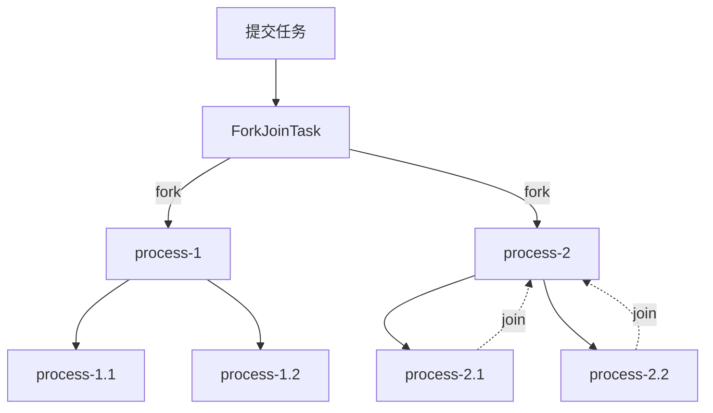

## 一 : 用来做什么

ForkJoinPool 是 ExecutorService 接口的实现, 它专为可以递归分解成小块的工作而设计; 

fork/join 框架将任务分配给线程池中的工作线程, 充分利用多处理器的优势, 提高程序性能

使用 fork/join 框架的第一步是编写执行一部分工作的代码; 类似的伪代码如下

```
如果(当前工作部分足够小)
	直接做这项工作
其他
	把当前工作分成两部分
	调用这两个部分并等待结果
```

将此代码包装在 ForkJoinTask 子类中, 通常是 RecursiveTask (可以返回结果) 或 RecursiveAction

## 二 : 意图梳理

关键点 :  : 分解任务fork出新任务, 汇集join任务执行结果




## 三 : 经典网关场景, 查询多个系统数据

移动互联网的情况
- 一个接口请求要获取很多信息
- 后端分布式系统, 拆分成多个子系统

后端接口执行(大概流程)
1. 收到一个请求
2. 调用多个服务接口获取其他系统的数据
3. 最后汇总返回

示例代码

```java
@Service
public class UserService {

    @Autowired
    private RestTemplate restTemplate;

    /**
     * 查询多个系统的数据，合并返回
     */
    public Object getUserInfo(String userId) {
        // 1. 先从调用获取用户基础信息的http接口
        long userinfoTime = System.currentTimeMillis();
        String value = restTemplate.getForObject("http://172.16.0.1/userinfo-api/get?userId=" + userId, String.class);
        JSONObject userInfo = JSONObject.parseObject(value);
        System.out.println("userinfo-api用户基本信息接口调用时间为" + (System.currentTimeMillis() - userinfoTime));

        // 2. 再调用获取用户积分信息的接口
        long integralApiTime = System.currentTimeMillis();
        String intergral = restTemplate.getForObject("http://172.16.0.1/integral-api/get?userId=" + userId,
                String.class);
        JSONObject intergralInfo = JSONObject.parseObject(intergral);
        System.out.println("integral-api积分接口调用时间为" + (System.currentTimeMillis() - integralApiTime));

        // 再调用一个接口 +n秒

        // 3. 合并为一个json对象
        JSONObject result = new JSONObject();
        result.putAll(userInfo);
        result.putAll(intergralInfo);

        return result;
    }

}
```

注意 : 代码逻辑涉及到串行的过程, 运行时间会发生累计, 随着需要调用的接口的数量的增多, 响应时间会越来越长

针对于**响应时间限制**, 通常开发公司会有明确规定, 例如 : 内部调用的核心接口的响应时间通常为10ms, 对外可以扩展到50ms

代码优化

```java
// 任务
public class HttpJsonRequest extends RecursiveTask<JSONObject> {

    RestTemplate restTemplate;
    ArrayList<String> urls;
    int start;
    int end;

    HttpJsonRequest(RestTemplate restTemplate, ArrayList<String> urls, int start, int end) {
        this.restTemplate = restTemplate;
        this.urls = urls;
        this.start = start;
        this.end = end;
    }

    // 就是实际去执行的一个方法入口(任务拆分)
    @Override
    protected JSONObject compute() {
        int count = end - start; // 代表当前这个task需要处理多少数据
        // 自行根据业务场景去判断是否是大任务,是否需要拆分
        if (count == 0) {
            String url = urls.get(start);
            // TODO 如果只有一个接口调用,立刻调用
            long userinfoTime = System.currentTimeMillis();
            String response = restTemplate.getForObject(url, String.class);
            JSONObject value = JSONObject.parseObject(response);
            System.out.println(Thread.currentThread() + " 接口调用完毕" + (System.currentTimeMillis() - userinfoTime) + " #" + url);
            return value;
        } else { // 如果是多个接口调用,拆分成子任务  7,8,   9,10
            System.out.println(Thread.currentThread() + "任务拆分一次");
            int x = (start + end) / 2;
            HttpJsonRequest httpJsonRequest = new HttpJsonRequest(restTemplate, urls, start, x);// 负责处理哪一部分?
            httpJsonRequest.fork();

            HttpJsonRequest httpJsonRequest1 = new HttpJsonRequest(restTemplate, urls, x + 1, end);// 负责处理哪一部分?
            httpJsonRequest1.fork();

            // join获取处理结果
            JSONObject result = new JSONObject();
            result.putAll(httpJsonRequest.join());
            result.putAll(httpJsonRequest1.join());
            return result;
        }
    }
}
```

```java
/**
 * 并行调用http接口
 */
@Service
public class UserServiceForkJoin {
    // 本质是一个线程池,默认的线程数量:CPU的核数
    ForkJoinPool forkJoinPool = new ForkJoinPool(10, ForkJoinPool.defaultForkJoinWorkerThreadFactory,
            null, true);
    @Autowired
    private RestTemplate restTemplate;

    /**
     * 查询多个系统的数据，合并返回
     */
    public Object getUserInfo(String userId) throws ExecutionException, InterruptedException {
        // fork/join
        // forkJoinPool.submit()
        ArrayList<String> urls = new ArrayList<>();
        urls.add("http://172.16.0.1/userinfo-api/get?userId=" + userId);
        urls.add("http://172.16.0.1/integral-api/get?userId=" + userId);

        HttpJsonRequest httpJsonRequest = new HttpJsonRequest(restTemplate, urls, 0, urls.size() - 1);
        ForkJoinTask<JSONObject> forkJoinTask = forkJoinPool.submit(httpJsonRequest);

        JSONObject result = forkJoinTask.get();
        return result;
    }
}
```


## 四 : 实现思路

每个 Worker 线程都维护一个任务队列, 即 ForkJoinWorkerThread 中的任务队列

任务队列是双向队列, 这样可以同时实现 LIFO(last in first out, 后进先出) 和 FIFO(first in first out, 先进先出)

子任务会被加入到原先任务所在 worker 线程的任务队列(workQueue); worker 线程用 LIFO 的方法取出任务, 后进队列的任务先取出来(子任务总是后加入队列, 但是需要先执行); **当任务队列为空, 会随机从其他的 worker 的队列中拿走一个任务执行**(工作窃取: steal work);

如果一个 worker 线程遇到了 join 操作, 而这时候, 正在处理其他任务, 会等到这个任务结束; 否则直接返回

如果一个 worker 线程窃取任务失败, 它会用 yield 或者 sleep 之类的方法休息一会儿, 再尝试(如果所有线程都是空闲状态, 即没有任务运行, 那么该线程也会进入阻塞状态等待新任务的到来)

## 五 : 适用

**使用尽可能少的线程池** : 再大多数情况下, 最好的决定是为每个应用程序或系统使用一个线程池

如果不需要特定调整, 请使用默认的公共线程池

使用合理的阈值将 ForkJoinTask 拆分为子任务

避免在 ForkJoinTask 中出现任何阻塞

**适用场景** : 数据处理, 结果汇总, 统计等; 

**java8实例 :** java.util.Arrays 类用于其 parallelSort() 方法就用到了 fork/join; 其目的是进行内存运算方面的操作, 因此**不适合**用于网络接口调用, 数据库查询, 文件操作等; 所以如果需要使用, 只定义一个 ForkJoinPool 就好, 线程数量尽量和 CPU 核数差不多, 主要进行非阻塞的代码处理

## 六 : 结语

总结 :

1. 本质上是一个线程池, 如果需要使用, 只需要定义一个 ForkJoinPool 即可
2. 线程数量尽量和 CPU 核心数差不多; 例如 8 核 CPU 就设置 8 个线程
3. 适用于非阻塞(non blocking)的代码处理; 如网络接口调用, 数据库查询, 文件操作等操作**并不适用**

工作窃取带来的性能提升偏理论, API 的复杂性高, 实际研发中可控性来说不如其他 API, **非内存操作并不适用**