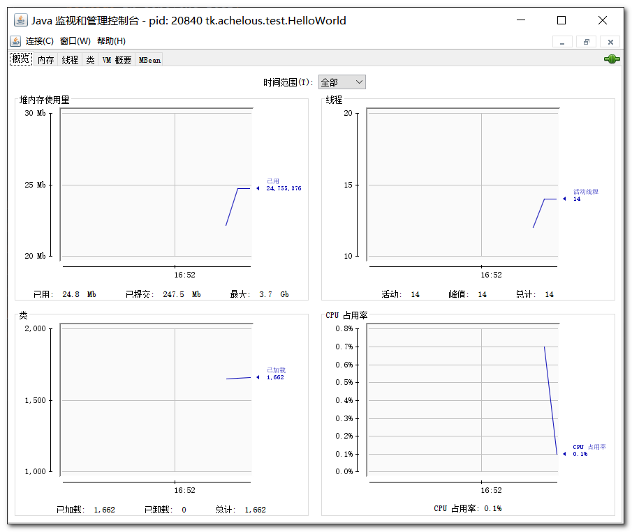
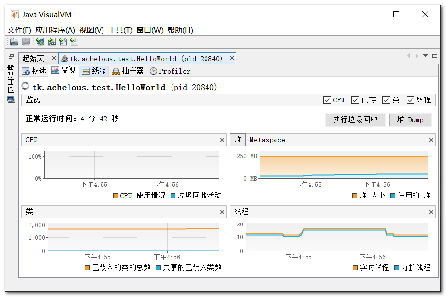

## 一 : javap(反编译)

java 反编译工具, 主要用于根据 java 字节码文件汇编为 java 源代码文件

```shell
# 帮助命令
[root@localhost ~]# javap
# 输出附加信息到文件
[root@localhost ~]# javap -v HelloWorld.class > HelloWorld.txt
```

> 官方文档 : https://docs.oracle.com/javase/8/docs/technotes/tools/


## 二 : jps(进程状态)

jps : java virtual machine process status tool, 显示当前所有 java 进程 pid 的命令 

```shell
# 运行的java进程
[root@localhost ~]# jps
# 帮助命令
[root@localhost ~]# jps -help
# 查看当前运行的java进程及jar包
[root@localhost ~]# jps -l
```


## 三 : jstat(统计)

jstat : Monitors Java Virtual Machine (JVM) statistics, 监视 java 虚拟机 (JVM) **统计信息**

```shell
# 帮助命令
[root@localhost ~]# jstat
# 参数
[root@localhost ~]# jstat -options
# 查看gc信息
[root@localhost ~]# jstat -gc 34977
# 每10行输出一次表头,每秒更新一次
[root@localhost ~]# jstat -gc -h10 34977 1000
```


## 四 : jcmd(命令)

jcmd : Sends diagnostic command requests to a running Java Virtual Machine (JVM), 发送**诊断指令**请求到运行的 JVM 

可以替代 jps 工具查看本地的 jvm 信息

```shell
# 当前运行的java进程及jar包
[root@localhost ~]# jcmd
# 帮助命令
[root@localhost ~]# jcmd -h
# 列出具体指令
[root@localhost ~]# jcmd 34977 help
# 查看堆内存信息
[root@localhost ~]# jcmd 34977 GC.heap_info
# 查看gc
[root@localhost ~]# jcmd 34977 VM.flags
```


## 五 : jinfo(配置信息)

jinfo : Generates configuration information, 生成**配置信息**

可以查看运行中 jvm 的全部参数, 还可以设置部分参数

```shell
# 帮助命令
[root@localhost ~]# jinfo
# 查看指定进程的参数
[root@localhost ~]# jinfo 34977
```


## 六 : jmap(映射信息)

Prints shared object memory maps or heap memory details for a process, core file, or remote debug server

打印出 java 进程内存中 Object 的情况; 或者将 VM 中的堆, 以二级制输出成文本

```shell
# 帮助命令
[root@localhost ~]# jmap
# 查看堆内存
[root@localhost ~]# jmap -heap 34977
# 内存快照: 以文件形式保存下来
[root@localhost ~]# jmap -dump:live,format=b,file=heap.bin 34977
```


## 七 : jhat(堆内存)

jhat(java head analyse tool) : Analyzes the Java heap, 分析 java 堆的命令, 可以将堆中的对象以 html 的形式显示出来, 支持对象查询语言 OQL

```shell
# 帮助命令
[root@localhost ~]# jhat -help
# 加载内存快照,以9001提供web服务
[root@localhost ~]# jhat -port 9001 heap.bin
```

这里需要注意的有 : 

* Show all members of the rootset
* Show heap histogram
* Execute Object Query Language (OQL) query


## 八 : jstack(栈内存)

**堆栈跟踪工具**; jstack 用于打印出给定的 java 进程 ID 或 core file 或远程调试服务的 java 堆栈信息, 如果是在 64 位机器上, 需要指定选项 "-J-d64"

```shell
# 查看帮助命令
[root@localhost ~]# jstack
# 查看指定进程的栈,-F为强制
[root@localhost ~]# jstack -F 34977
# 内容太多,文件保存
[root@localhost ~]# jstack -F 34977 > jstack.log
```


## 九 : Jconsole

java 监控和管理控制台

在测试和性能调试的时候可以用到

 

## 十 : JvisualVM

虚拟机工具, 可以看 GC, 内存, 堆栈

功能很全面啊

 