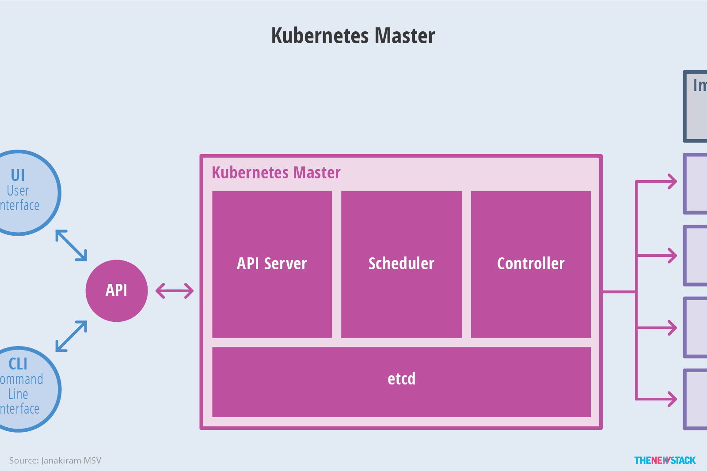

```
title: Kubernetes架构设计
excerpt: 了解k8s的设计理念和核心概念有助于轻松入门
date: 2021-04-09
categories: 容器化技术
tags: [k8s，k8s设计]
```


## 一 : 架构设计

与 docker swarm 类似，k8s 集群节点也可以分为管理节点(master)和工作节点(node)


还有一个 Container runtime 负责镜像管理以及 Pod 和容器的真正运行（CRI）；


## 二 : 整体架构

下图清晰表明了 Kubernetes 的架构设计以及组件之间的通信协议


可以更为抽象的理解为


## 三 : 核心概念

### (一) Master

k8s 中的 Master 指的是集群控制节点，每个 k8s 集群里需要有一个 Master 节点来负责整个集群的管理和控制，基本上 k8s 的所有控制命令都发给它，它来负责具体的执行过程，我们执行的所有命令基本都是在 Master 节点上运行的。

Master节点通常会占据一个独立的服务器（高可用部署建议用3台服务器），其主要原因是它太重要了，是整个集群的<u>首脑</u>，如果宕机或者不可用，那么对集群内容器应用的管理都将失效。




API Server : 提供了资源操作的唯一入口，并提供认证、授权、访问控制、API 注册和发现等机制

Scheduler : 负责资源的调度，按照预定的调度策略将 Pod 调度到相应的机器上

Controller : 负责维护集群的状态，比如故障检测、自动扩展、滚动更新等

etcd : 保存了整个集群的状态


### (二) Node

k8s 集群中的其他机器被称为 node 节点。与 master 一样，node 节点可以是一台物理主机，也可以是一台虚拟机。node 节点才是 k8s 集群中的工作负载节点，每个 node 都会被 master 分配一些工作负载（Docker容器），当某个 node 宕机时，其上的工作负载会被 master 自动转移到其他节点上去。


Docker : docker 引擎，负责本机的容器创建和管理工作

kubelet : 负责维护容器的生命周期，同时也负责 Volume（CSI）和网络（CNI）的管理

kube-proxy : 负责为 Service 提供 cluster 内部的服务发现和负载均衡

Fluentd : 从多个数据源采集日志，并将日志过滤和加工后分发到多种存储和处理系统


