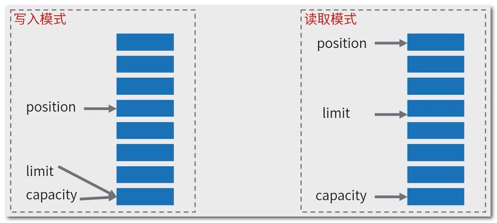
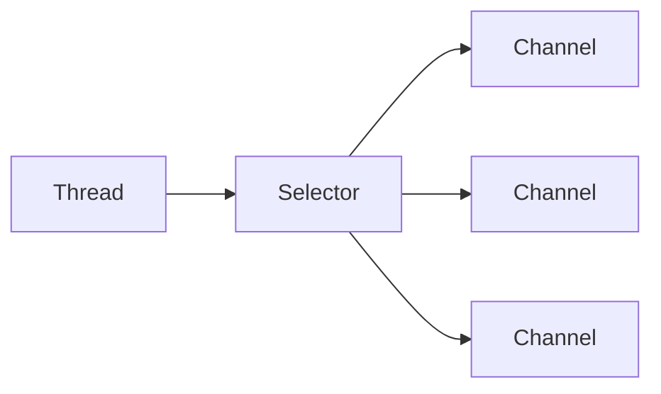
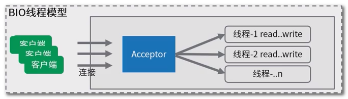
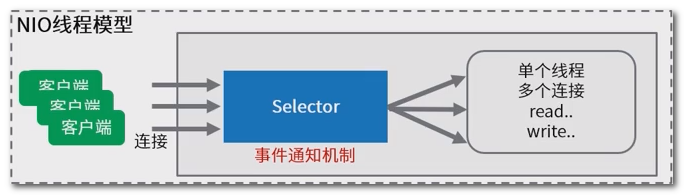
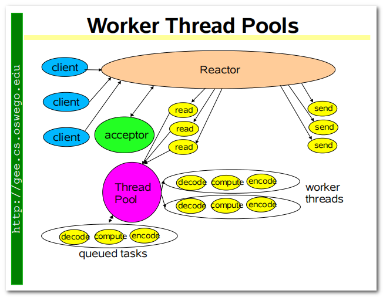
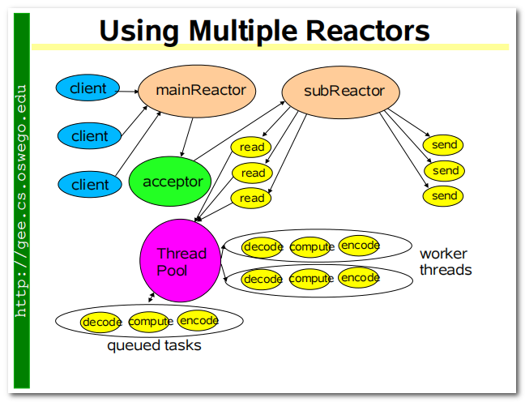

## 一 : java NIO

始于 java 1.4, 提供了新的 JAVA IO 操作非阻塞 API; 用意是替代 Java IO 和 Java Networking 相关的 API

NIO 中有三个核心组件 : Buffer, Channel, Selector

## 二 : Buffer 缓冲区

**缓冲区**本质上是一个可以写入数据的内存块(类似数组), 然后可以再次读取; 此内存块包含在 NIO Buffer 对象中, 该对象提供了一组方法, 可以更轻松地使用内存块; 

相比较直接对数组的操作, **Buffer API 更加容易操作和管理;** 

使用 Buffer 进行数据写入与读取, 需要进行如下**四个步骤** : 

1. 将数据写入缓冲区
2. 调用 `buffer.flip()`, 转换为读取模式
3. 缓冲区读取数据
4. 调用 `buffer.clear()` 或 `buffer.compact()` 清除缓冲区

代码示例

```java
public class BufferDemo {
    public static void main(String[] args) {
        // 构建一个byte字节缓冲区，容量是4
        ByteBuffer byteBuffer = ByteBuffer.allocate(4);
        // 默认写入模式，查看三个重要的指标
        System.out.println(String.format("初始化：capacity容量：%s, position位置：%s, limit限制：%s", byteBuffer.capacity(),
                byteBuffer.position(), byteBuffer.limit()));
        // 写入2字节的数据
        byteBuffer.put((byte) 1);
        byteBuffer.put((byte) 2);
        byteBuffer.put((byte) 3);
        // 再看数据
        System.out.println(String.format("写入3字节后，capacity容量：%s, position位置：%s, limit限制：%s", byteBuffer.capacity(),
                byteBuffer.position(), byteBuffer.limit()));

        // 转换为读取模式(不调用flip方法，也是可以读取数据的，但是position记录读取的位置不对)
        System.out.println("#######开始读取");
        byteBuffer.flip();
        byte a = byteBuffer.get();
        System.out.println(a);
        byte b = byteBuffer.get();
        System.out.println(b);
        System.out.println(String.format("读取2字节数据后，capacity容量：%s, position位置：%s, limit限制：%s", byteBuffer.capacity(),
                byteBuffer.position(), byteBuffer.limit()));

        // 继续写入3字节，此时读模式下，limit=3，position=2.继续写入只能覆盖写入一条数据
        // clear()方法清除整个缓冲区。compact()方法仅清除已阅读的数据。转为写入模式
        byteBuffer.compact(); // buffer : 1 , 3
        byteBuffer.put((byte) 3);
        byteBuffer.put((byte) 4);
        byteBuffer.put((byte) 5);
        System.out.println(String.format("最终的情况，capacity容量：%s, position位置：%s, limit限制：%s", byteBuffer.capacity(),
                byteBuffer.position(), byteBuffer.limit()));

        // rewind() 重置position为0
        // mark() 标记position的位置
        // reset() 重置position为上次mark()标记的位置

    }
}
```


### (一) Buffer 工作原理

Buffer **三个重要属性** 

| 名称     | 描述                                                         |
| -------- | ------------------------------------------------------------ |
| capacity | 作为一个内存块, Buffer 具有一定的固定大小, 也称为**容量**    |
| position | 写入模式时代表写数据的**位置**; 读取模式时代表读取数据的**位置** |
| limit    | 写入模式, **限制**等于 buffer 的容量; 读取模式下, limit 等于写入的数据量 |

读写模式

 

### (二) ByteBuffer 内存类型

ByteBuffer 为性能关键型代码提供了**直接内存(direct堆外)**和**非直接内存(heap堆)**两种实现

堆外内存获取的方式: 

```java
//堆内存(非直接内存)
ByteBuffer byteBuffer = ByteBuffer.allocate(4);
//直接内存(堆外内存)
ByteBuffer directByteBuffer = ByteBuffer.allocateDirect(4);
```

好处 : 

1. 进行网络 IO 或者文件 IO 时比 heapBuffer 少一次拷贝(file/socket => OS memory => jvm heap); GC 会移动对象内存, 在写 file 或 socket 的过程中, jvm 的实现中, 会先把数据复制到堆外, 再进行写入
2. GC 范围之外, 降低 GC 压力, 但实现了自动管理; DirectByteBuffer 中有一个 Cleaner 对象(PhantomReference), Cleaner 被 GC 前会执行 clean(), 触发 DirectByteBuffer 中定义的 Deallocator

**建议 :** 

1. 性能确实可观的时候才去使用; 分配给大型, 长寿命的对象或应用(网络传输, 文件读写场景)
2. 通过虚拟机参数 MaxDirectMemorySize 限制大小, 防止耗尽整个及其的内存

## 三 : Channel 通道

在 BIO 编程中一切网络操作是通过 socket + io 两者组合进行操作的, 也就是需要 io 包和 net 包; 


而在 NIO 中则只需要 nio 包即可


Channel 的 API 涵盖了 UDP/TCP 网络和文件 IO

- FileChannel
- **DatagramChannel**
- **SocketChannel**
- **ServerSocketChannel**

和标准 IO Stream 操作的区别

- 在一个通道内进行读取和写入
- stream 通常是单向的(inupt 或 ouput)
- 可以非阻塞读取和写入通道
- 通道始终读取或写入缓冲区

### (一) SocketChannel

SocketChannel 用于建立 TCP 网络连接, 类似 java.net.Socket; 

有两种创建 SocketChannel 形式 :

1. 客户端主动发起和服务器的连接
2. 服务端获取的新连接

代码示例

```java
public class NIOClient {

    public static void main(String[] args) throws Exception {
        // 客户端主动发起连接的方式
        SocketChannel socketChannel = SocketChannel.open();
        socketChannel.configureBlocking(false); // 设置为非阻塞模式
        socketChannel.connect(new InetSocketAddress("127.0.0.1", 8080));
        while (!socketChannel.finishConnect()) {
            // 没连接上,则一直等待
            Thread.yield();
        }
        Scanner scanner = new Scanner(System.in);
        System.out.println("请输入：");
        // 发送内容
        String msg = scanner.nextLine();
        ByteBuffer buffer = ByteBuffer.wrap(msg.getBytes());
        while (buffer.hasRemaining()) {
            // 发送请求数据 - 向通道写入数据
            socketChannel.write(buffer);
        }
        // 读取响应
        System.out.println("收到服务端响应:");
        ByteBuffer requestBuffer = ByteBuffer.allocate(1024);
        // 读取服务端返回 - 读取缓冲区的数据: int bytesRead = socketChannel.read(byteBuffer)
        while (socketChannel.isOpen() && socketChannel.read(requestBuffer) != -1) {
            // 长连接情况下,需要手动判断数据有没有读取结束 (此处做一个简单的判断: 超过0字节就认为请求结束了)
            if (requestBuffer.position() > 0) break;
        }
        requestBuffer.flip();
        byte[] content = new byte[requestBuffer.limit()];
        requestBuffer.get(content);
        System.out.println(new String(content));
        scanner.close();
        // 关闭连接
        socketChannel.close();
    }
}
```

- write 写 : write() 在尚未写入任何内容时就可能返回了; 需要在循环中调用 write()
- read 读 : read() 可能直接返回而根本不读取任何数据, 根据返回的 int 值判断读取了多少字节

### (二) ServerSocketChannel

ServerSocketChannel 可以监听新建的 TCP 连接通道, 类似 ServerSocket

```java
public class NIOServer {

    public static void main(String[] args) throws Exception {
        // 创建网络服务端
        ServerSocketChannel serverSocketChannel = ServerSocketChannel.open();
        serverSocketChannel.configureBlocking(false); // 设置为非阻塞模式
        serverSocketChannel.socket().bind(new InetSocketAddress(8080)); // 绑定端口
        System.out.println("启动成功");
        while (true) {
            SocketChannel socketChannel = serverSocketChannel.accept(); // 获取新tcp连接通道
            // tcp请求 读取/响应
            if (socketChannel != null) {
                System.out.println("收到新连接 : " + socketChannel.getRemoteAddress());
                socketChannel.configureBlocking(false); // 默认是阻塞的,一定要设置为非阻塞
                try {
                    ByteBuffer requestBuffer = ByteBuffer.allocate(1024);
                    while (socketChannel.isOpen() && socketChannel.read(requestBuffer) != -1) {
                        // 长连接情况下,需要手动判断数据有没有读取结束 (此处做一个简单的判断: 超过0字节就认为请求结束了)
                        if (requestBuffer.position() > 0) break;
                    }
                    if(requestBuffer.position() == 0) continue; // 如果没数据了, 则不继续后面的处理
                    requestBuffer.flip();
                    byte[] content = new byte[requestBuffer.limit()];
                    requestBuffer.get(content);
                    System.out.println(new String(content));
                    System.out.println("收到数据,来自："+ socketChannel.getRemoteAddress());

                    // 响应结果 200
                    String response = "HTTP/1.1 200 OK\r\n" +
                            "Content-Length: 11\r\n\r\n" +
                            "Hello World";
                    ByteBuffer buffer = ByteBuffer.wrap(response.getBytes());
                    while (buffer.hasRemaining()) {
                        socketChannel.write(buffer);// 非阻塞
                    }
                } catch (IOException e) {
                    e.printStackTrace();
                }
            }
        }
        /*
         * 这种低效的循环检查,会是NIO服务端的正确开发方式吗 ?
         * 用到了非阻塞的API,在设计上,和BIO可以有很大的不同,需要仅需改进
         * 其实可以有这样一种思路,如果有连接,则将连接存起来,在没有连接的时候进行数据的读取和处理
         */
    }
}
```

`serverSocketChannel.accept()`, 如果该通道处于非阻塞模式, 那么如果没有挂起的连接, 该方法将立即返回 null ; **必须检查**返回的 SocketChannel 是否为 null


## 四 : Selector 选择器

Selector 是一个 java NIO 组件, 可以检查一个或多个 NIO 通道, 并确定哪些通道已准备好进行读取或写入; **实现单个线程可以管理多个通道, 从而管理多个网络连接**



一个线程使用 Selector 监听多个 channel 的不同事件(四个事件分别对应 SelectionKey 四个常量) : 

| 名称       | 描述            | 常量                    |
| ---------- | --------------- | ----------------------- |
| OP_CONNECT | Connect 连接    | SelectionKey.OP_CONNECT |
| OP_ACCEPT  | Accept 准备就绪 | SelectionKey.OP_ACCEPT  |
| OP_READ    | Read 读取       | SelectionKey.OP_READ    |
| OP_WRITE   | Write 写入      | SelectionKey.OP_WRITE   |

实现一个线程处理多个通道的核心概念理解 : **事件驱动机制**

非阻塞的网络通道下, 开发者通过 Selector 注册对于通道感兴趣的事件类型, 线程通过监听事件来触发相应的代码执行

**拓展 : 更底层是操作系统的多路复用机制**

```java
Selector selector = Selector.open();
channel.configureBlocking(false);
// 注册感兴趣的事件
SelectionKey key = channel.register(selector, SelectionKey.OP_READ);
// 由 accept 轮询, 变成了事件通知的方式
while(true){
    // select 收到新的事件, 方法才会返回
    int readyChannels = selector.select();
    if(readyChannels == 0) continue;
    Set<SelectionKey> selectedKeys = selector.selectedKey();
    Iterator<SelectionKey> keyIterator = selectedKeys.iterator();
    while(keyIterator.hasNext()){
        SelectionKey key = keyIterator.next();
        // 判断不同的事件类型, 执行对应的逻辑处理
        // key.isAcceptable()
        // key.isConnectable()
        // key.isReadable()
        // key.isWritable()
        keyIterator.remove()
    }
}
```

代码示例(服务端)

```java
public class NIOServerV2 {

    public static void main(String[] args) throws Exception {
        // 1. 创建网络服务端ServerSocketChannel
        ServerSocketChannel serverSocketChannel = ServerSocketChannel.open();
        serverSocketChannel.configureBlocking(false); // 设置为非阻塞模式

        // 2. 构建一个Selector选择器,并且将channel注册上去
        Selector selector = Selector.open();
        // 将serverSocketChannel注册到selector
        SelectionKey selectionKey = serverSocketChannel.register(selector, 0, serverSocketChannel);
        // 对serverSocketChannel上面的accept事件感兴趣(serverSocketChannel只能支持accept操作)
        selectionKey.interestOps(SelectionKey.OP_ACCEPT); 

        // 3. 绑定端口
        serverSocketChannel.socket().bind(new InetSocketAddress(8080));

        System.out.println("启动成功");

        while (true) {
            // 不再轮询通道,改用下面轮询事件的方式.select方法有阻塞效果,直到有事件通知才会有返回
            selector.select();
            // 获取事件
            Set<SelectionKey> selectionKeys = selector.selectedKeys();
            // 遍历查询结果e
            Iterator<SelectionKey> iter = selectionKeys.iterator();
            while (iter.hasNext()) {
                // 被封装的查询结果
                SelectionKey key = iter.next();
                iter.remove();
                // 关注 Read 和 Accept两个事件
                if (key.isAcceptable()) {
                    ServerSocketChannel server = (ServerSocketChannel) key.attachment();
                    // 将拿到的客户端连接通道,注册到selector上面
                    SocketChannel clientSocketChannel = server.accept(); // mainReactor 轮询accept
                    clientSocketChannel.configureBlocking(false);
                    clientSocketChannel.register(selector, SelectionKey.OP_READ, clientSocketChannel);
                    System.out.println("收到新连接 : " + clientSocketChannel.getRemoteAddress());
                }

                if (key.isReadable()) {
                    SocketChannel socketChannel = (SocketChannel) key.attachment();
                    try {
                        ByteBuffer requestBuffer = ByteBuffer.allocate(1024);
                        while (socketChannel.isOpen() && socketChannel.read(requestBuffer) != -1) {
                            // 长连接情况下,需要手动判断数据有没有读取结束(此处做一个简单的判断:超过0字节就认为请求结束了)
                            if (requestBuffer.position() > 0) break;
                        }
                        if(requestBuffer.position() == 0) continue; // 如果没数据了, 则不继续后面的处理
                        requestBuffer.flip();
                        byte[] content = new byte[requestBuffer.limit()];
                        requestBuffer.get(content);
                        System.out.println(new String(content));
                        System.out.println("收到数据,来自：" + socketChannel.getRemoteAddress());
                        // TODO 业务操作 数据库 接口调用等等

                        // 响应结果 200
                        String response = "HTTP/1.1 200 OK\r\n" +
                                "Content-Length: 11\r\n\r\n" +
                                "Hello World";
                        ByteBuffer buffer = ByteBuffer.wrap(response.getBytes());
                        while (buffer.hasRemaining()) {
                            socketChannel.write(buffer);
                        }
                    } catch (IOException e) {
                        // e.printStackTrace();
                        key.cancel(); // 取消事件订阅
                    }
                }
            }
            selector.selectNow();
        }
    }
}
```

问题: 此处一个selector监听所有事件,一个线程处理所有请求事件. 会成为瓶颈! 要有多线程的运用

## 五 : NIO 对比 BIO

BIO 线程模型

 

- 阻塞 IO , 线程等待时间长
- 一个线程负责一个连接处理
- 线程多且利用率低

NIO 线程模型

 

- 非阻塞 IO , 线程利用率更高
- 一个线程处理多个连接事件
- 性能更强大

总结 : 如果你的程序需要支撑大量的连接, 使用 NIO 是最好的方式; Tomcat8 中, 已经完全取出 BIO 相关的网络处理代码, 默认采用 NIO 进行网络处理

## 六 : NIO 与多线程结合的改进方案

Doug Lea 的著名文章《Scalable IO in Java》; 地址 : http://gee.cs.oswego.edu/dl/cpjslides/nio.pdf

**Worker Thread Pools** : Reactor 线程接收请求 => 分发给线程池处理请求

 

**Using Multiple Reactors** : mainReactor 接收 => 分发给 subReactor 读写 => 具体业务逻辑分发给单独的线程池处理

 

代码示例 : NIO selector 多路复用reactor线程模型

```java
public class NIOServerV3 {
    /** 处理业务操作的线程 */
    private static ExecutorService workPool = Executors.newCachedThreadPool();

    /**
     * 封装了selector.select()等事件轮询的代码
     */
    abstract class ReactorThread extends Thread {

        Selector selector;
        LinkedBlockingQueue<Runnable> taskQueue = new LinkedBlockingQueue<>();

        /**
         * Selector监听到有事件后,调用这个方法
         */
        public abstract void handler(SelectableChannel channel) throws Exception;

        private ReactorThread() throws IOException {
            selector = Selector.open();
        }

        volatile boolean running = false;

        @Override
        public void run() {
            // 轮询Selector事件
            while (running) {
                try {
                    // 执行队列中的任务
                    Runnable task;
                    while ((task = taskQueue.poll()) != null) {
                        task.run();
                    }
                    selector.select(1000);

                    // 获取查询结果
                    Set<SelectionKey> selected = selector.selectedKeys();
                    // 遍历查询结果
                    Iterator<SelectionKey> iter = selected.iterator();
                    while (iter.hasNext()) {
                        // 被封装的查询结果
                        SelectionKey key = iter.next();
                        iter.remove();
                        int readyOps = key.readyOps();
                        // 关注 Read 和 Accept两个事件
                        if ((readyOps & (SelectionKey.OP_READ | SelectionKey.OP_ACCEPT)) != 0 || readyOps == 0) {
                            try {
                                SelectableChannel channel = (SelectableChannel) key.attachment();
                                channel.configureBlocking(false);
                                handler(channel);
                                if (!channel.isOpen()) {
                                    key.cancel(); // 如果关闭了,就取消这个KEY的订阅
                                }
                            } catch (Exception ex) {
                                key.cancel(); // 如果有异常,就取消这个KEY的订阅
                            }
                        }
                    }
                    selector.selectNow();
                } catch (IOException e) {
                    e.printStackTrace();
                }
            }
        }

        private SelectionKey register(SelectableChannel channel) throws Exception {
            // 为什么register要以任务提交的形式，让reactor线程去处理？
            // 因为线程在执行channel注册到selector的过程中，会和调用selector.select()方法的线程争用同一把锁
            // 而select()方法实在eventLoop中通过while循环调用的，争抢的可能性很高，为了让register能更快的执行，就放到同一个线程来处理
            FutureTask<SelectionKey> futureTask = new FutureTask<>(() -> channel.register(selector, 0, channel));
            taskQueue.add(futureTask);
            return futureTask.get();
        }

        private void doStart() {
            if (!running) {
                running = true;
                start();
            }
        }
    }

    private ServerSocketChannel serverSocketChannel;
    // 1、创建多个线程 - accept处理reactor线程 (accept线程)
    private ReactorThread[] mainReactorThreads = new ReactorThread[1];
    // 2、创建多个线程 - io处理reactor线程  (I/O线程)
    private ReactorThread[] subReactorThreads = new ReactorThread[8];

    /**
     * 初始化线程组
     */
    private void newGroup() throws IOException {
        // 创建IO线程,负责处理客户端连接以后socketChannel的IO读写
        for (int i = 0; i < subReactorThreads.length; i++) {
            subReactorThreads[i] = new ReactorThread() {
                @Override
                public void handler(SelectableChannel channel) throws IOException {
                    // work线程只负责处理IO处理，不处理accept事件
                    SocketChannel ch = (SocketChannel) channel;
                    ByteBuffer requestBuffer = ByteBuffer.allocate(1024);
                    while (ch.isOpen() && ch.read(requestBuffer) != -1) {
                        // 长连接情况下,需要手动判断数据有没有读取结束 (此处做一个简单的判断: 超过0字节就认为请求结束了)
                        if (requestBuffer.position() > 0) break;
                    }
                    if (requestBuffer.position() == 0) return; // 如果没数据了, 则不继续后面的处理
                    requestBuffer.flip();
                    byte[] content = new byte[requestBuffer.limit()];
                    requestBuffer.get(content);
                    System.out.println(new String(content));
                    System.out.println(Thread.currentThread().getName() + "收到数据,来自：" + ch.getRemoteAddress());

                    // TODO 业务操作 数据库、接口...
                    workPool.submit(() -> {
                    });

                    // 响应结果 200
                    String response = "HTTP/1.1 200 OK\r\n" +
                            "Content-Length: 11\r\n\r\n" +
                            "Hello World";
                    ByteBuffer buffer = ByteBuffer.wrap(response.getBytes());
                    while (buffer.hasRemaining()) {
                        ch.write(buffer);
                    }
                }
            };
        }

        // 创建mainReactor线程, 只负责处理serverSocketChannel
        for (int i = 0; i < mainReactorThreads.length; i++) {
            mainReactorThreads[i] = new ReactorThread() {
                AtomicInteger incr = new AtomicInteger(0);

                @Override
                public void handler(SelectableChannel channel) throws Exception {
                    // 只做请求分发，不做具体的数据读取
                    ServerSocketChannel ch = (ServerSocketChannel) channel;
                    SocketChannel socketChannel = ch.accept();
                    socketChannel.configureBlocking(false);
                    // 收到连接建立的通知之后，分发给I/O线程继续去读取数据
                    int index = incr.getAndIncrement() % subReactorThreads.length;
                    ReactorThread workEventLoop = subReactorThreads[index];
                    workEventLoop.doStart();
                    SelectionKey selectionKey = workEventLoop.register(socketChannel);
                    selectionKey.interestOps(SelectionKey.OP_READ);
                    System.out.println(Thread.currentThread().getName() + "收到新连接 : " + socketChannel.getRemoteAddress());
                }
            };
        }
    }

    /**
     * 初始化channel,并且绑定一个eventLoop线程
     *
     * @throws IOException IO异常
     */
    private void initAndRegister() throws Exception {
        // 1、 创建ServerSocketChannel
        serverSocketChannel = ServerSocketChannel.open();
        serverSocketChannel.configureBlocking(false);
        // 2、 将serverSocketChannel注册到selector
        int index = new Random().nextInt(mainReactorThreads.length);
        mainReactorThreads[index].doStart();
        SelectionKey selectionKey = mainReactorThreads[index].register(serverSocketChannel);
        selectionKey.interestOps(SelectionKey.OP_ACCEPT);
    }

    /**
     * 绑定端口
     *
     * @throws IOException IO异常
     */
    private void bind() throws IOException {
        //  1、 正式绑定端口，对外服务
        serverSocketChannel.bind(new InetSocketAddress(8080));
        System.out.println("启动完成，端口8080");
    }

    public static void main(String[] args) throws Exception {
        NIOServerV3 nioServerV3 = new NIOServerV3();
        // 1.创建main和sub两组线程
        nioServerV3.newGroup(); 
        // 2.创建serverSocketChannel，注册到mainReactor线程上的selector上
        nioServerV3.initAndRegister();
        // 3.为serverSocketChannel绑定端口
        nioServerV3.bind(); 
    }
}
```


## 七 : 小结

NIO 为开发者提供了功能丰富及强大的 IO 处理 API, 但是在应用于网络应用开发的过程中, 直接使用 JDK 提供的 API, 比较繁琐; 而且要想将性能进行提升, 光有 NIO 还不够, 还需要将多线程技术与之结合起来

因为网络编程本身的复杂性, 以及 JDK API 开发的使用难度较高, 所以在开源社区中, 捅出来很多 JDK NIO 进行封装, 增强后的网络编程框架, 例如 : Netty, Mina等 

