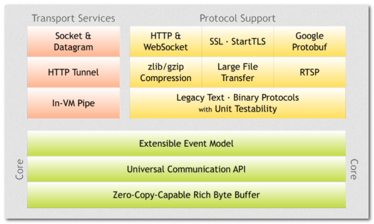
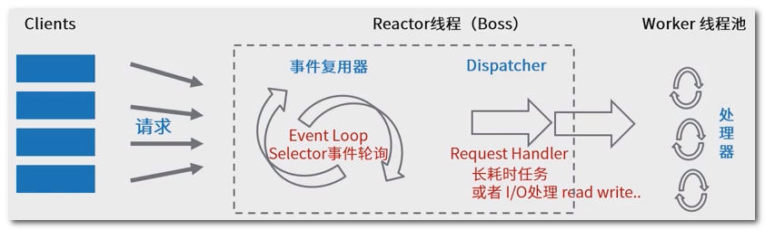
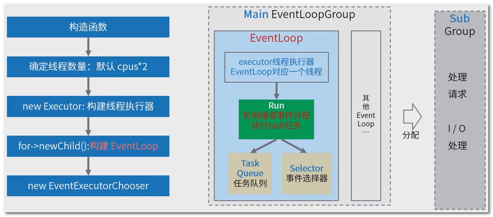
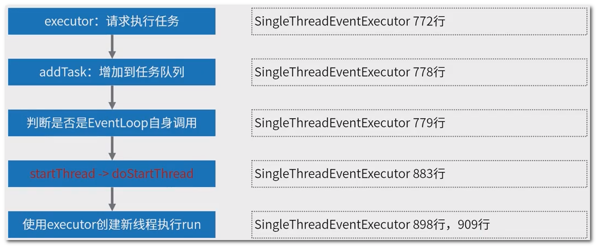
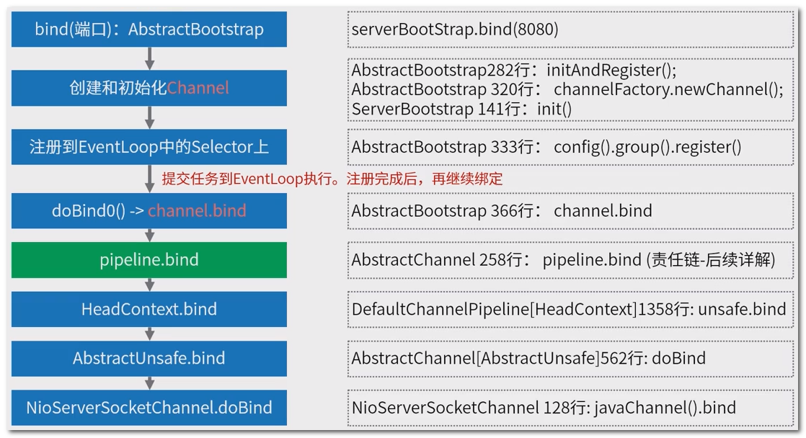

## 一 : Netty 简介

Netty 是一个高性能, 高可扩展性的异步事件驱动的**网络应用程序框架**, 它极大地简化了 TCP 和 UDP 客户端和服务器开发等网络编程

官网 : https://netty.io/

Netty 重要的四个内容

1. Reactor 线程模型 : 一种高性能的多线程程序设计思路
2. Netty 中自己定义的 Channel 概念 : 增强版的通道概念
3. ChannelPipeline 责任链设计模式 : 事件处理机制
4. 内存管理 : 增强的 ByteBuffer 缓冲区


## 二 : Netty 整体结构

 

可以看出包含三大块 

1. 支持 Socket 等多种传输方式
2. 提供了多种协议的编解码实现
3. 核心设计包含**事件处理模型, API的使用, ByteBuffer 的增强**


## 三 : Netty 线程模型

为了让 NIO 处理更好的利用多线程特性, Netty 实现了 Reactor 线程模型

 

Reactor 模型中有四个核心概念 : 

1. Resources 资源(请求/任务)
2. Synchronous Event Demutiplexer 同步事件复用器
3. Dispatcher 分配器
4. Request Handler 请求处理器


## 四 : EventLoopGroup 初始化过程

如图所示, 两组 EventLoopGroup (Main&Sub) 处理不同通道的事件

 

源码示例 : example

```java
public final class EchoServer {

    static final int PORT = Integer.parseInt(System.getProperty("port", "8007"));

    public static void main(String[] args) throws Exception {
        // Configure SSL.
        final SslContext sslCtx = ServerUtil.buildSslContext();

        // Configure the server.
        // 创建EventLoopGroup: accept线程组 NioEventLoop
        EventLoopGroup bossGroup = new NioEventLoopGroup(1);// 指定线程数量,否则采用默认值
        // 创建EventLoopGroup: I/O线程组
        EventLoopGroup workerGroup = new NioEventLoopGroup();
        final EchoServerHandler serverHandler = new EchoServerHandler();
        try {
            // 服务端启动引导工具类
            ServerBootstrap b = new ServerBootstrap();
            // 配置服务端处理的reactor线程组以及服务端的其他配置
            b.group(bossGroup, workerGroup)
                .channel(NioServerSocketChannel.class)
                .option(ChannelOption.SO_BACKLOG, 100)
                .handler(new LoggingHandler(LogLevel.INFO))
                .childHandler(new ChannelInitializer<SocketChannel>() {
                    @Override
                    public void initChannel(SocketChannel ch) throws Exception {
                        ChannelPipeline p = ch.pipeline();
                        if (sslCtx != null) {
                            p.addLast(sslCtx.newHandler(ch.alloc()));
                        }
                        //p.addLast(new LoggingHandler(LogLevel.INFO));
                        p.addLast(serverHandler);
                    }
                });

            // Start the server. 通过bind启动服务
            ChannelFuture f = b.bind(PORT).sync();

            // Wait until the server socket is closed. 阻塞主线程,知道网络服务被关闭
            f.channel().closeFuture().sync();
        } finally {
            // Shut down all event loops to terminate all threads. 关闭线程组
            bossGroup.shutdownGracefully();
            workerGroup.shutdownGracefully();
        }
    }
}
```


## 五 : EventLoop 的启动

EventLoop 自身实现了 Executor 接口, 当调用 executor 方法提交任务时, 则判断是否启动, 未启动则调用内置的 executor 创建新线程来触发 run() 执行

 


## 六 : Bind 绑定端口过程

如图所示

  


## 七 : Channel 概念

netty 中的 Channel 是一个抽象的概念, 可以理解为对 JDK NIO Channel 的增强和拓展; 

增强了很多属性和方法, 完整信息可以看源码, 下面罗列几个常见的属性和方法

```java
public abstract class AbstractChannel extends DefaultAttributeMap implements Channel {
    // 通道内时间处理链路
    private final DefaultChannelPipeline pipeline; 
    // 绑定的EventLoop,用于执行操作
    private volatile AbstractChannel.PausableChannelEventLoop eventLoop;
    // 提供IO相关操作的封装
    private final Unsafe unsafe;

    // 父类方法,返回通道配置信息
    ChannelConfig config();
    // 开始读数据,触发读取链路调用
    @Override
    public Channel read() {
        pipeline.read();
        return this;
    }
    // 写数据,触发链路调用
    @Override
    public ChannelFuture write(Object msg) {
        return pipeline.write(msg);
    }
    // 绑定
    @Override
    public ChannelFuture bind(SocketAddress localAddress) {
        return pipeline.bind(localAddress);
    }

}
```


## 八 : 小结

毕竟抽象的设计模式, 在学习过程中会有难懂的地方, 所以着重需要结合代码理解

这里的目的有两个 : 领会 Reactor 的理念, 掌握代码示例中具体的写法

**重点关注服务端开发,** 因为服务端要应对海量连接, 难度大, 而客户端仅仅是一个连接

**Reactor 多线程模式的设计, 是 Netty 高性能很重要的一个原因**