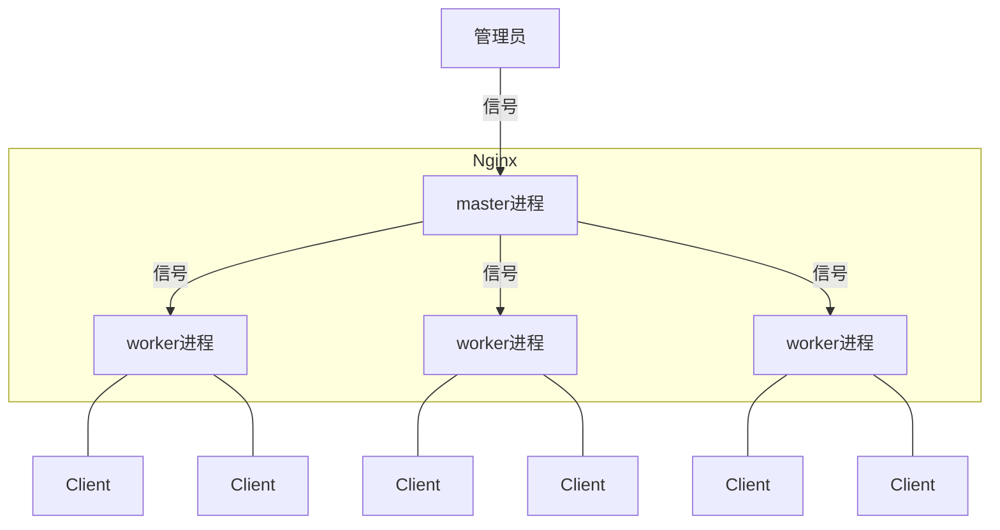

## 一 : ngx_lua 模块

**Nginx 模块**需要用 C 开发，而且必须符合一系列复杂的规则，最重要的用C开发模块必须要熟悉 Nginx 的源代码，使得开发者对其望而生畏。
**ngx_lua 模块**通过将 lua 解释器集成进 Nginx，可以采用 lua 脚本实现业务逻辑。

该模块具备以下**特性** :

1. 高并发、非阻塞的处理各种请求。
2. Lua内建协程，这样就可以很好的将异步回调转换成顺序调用的形式
3. 每个协程都有一个独立的全局环境 (变量空间)，继承于全局共享的、只读的"comman data"

得益于 Lua 协程的支持，ngx_lua 在处理 10000 个并发请求时只需要很少的内存。根据测试 ngx_lua 处理每个请求只需要 2KB 的内存，如果使用 LuaJIT 则会更少。**ngx_lua 非常适合用于实现可扩展的、高并发的服务**

## 二 : 协程(Coroutine)

**协程类似一种多线程，与多线程的区别有 :**

1. 协程并非os线程，所以创建、切换开销比线程相对要小。
2. 协程与线程一样有自己的栈、局部变量等，但是协程的栈是在用户进程空间模拟的，所以创建、切换开销很小。
3. 多线程程序是多个线程并发执行，也就是说在一瞬间有多个控制流在执行。而协程强调的是一种多个协程间协作的关系，只有当一个协程主动放弃执行权，另一个协程才能获得执行权，所以在某一瞬间，多个协程间只有一个在运行。
4. 由于多个协程时只有一个在运行，所以对于临界区的访问不需要加锁，而多线程的情况则必须加锁。
5. 多线程程序由于有多个控制流，所以程序的行为不可控，而多个协程的执行是由开发者定义的, 所以是可控的。

Nginx 的每个 Worker 进程都是在 epoll 或 kqueue 这样的事件模型之上，封装成协程，每个请求都有一个协程进行处理。这正好与 Lua 内建协程的模型是一致的，所以即使 ngx_lua 需要执行 Lua，相对 C 有一定的开销，但依然能**保证高并发能力**。


## 三 : Nginx进程模型

**Nginx 采用多进程模型**，单Master多Worker，Master进程主要用来管理Worker进程。

**Worker进程**采用单线程、非阻塞的事件模型(Event Lop，事件循环)来实现端口的监听及客户端请求的处理和响应同时Worker还要处理来自Master的信号。Worker进程个数一般设置为机器CPU核数。

Master进程具体包括如下4个主要功能:

1. 接收来自外界的信号
2. 向各worker进程发送信号
3. 监控worker进程的运行状态
4. 当worker进程退出后(异常情况下)，会自动重新启动新的worker进程

架构图




## 四 : HTTP请求处理

| 阶段           | 说明                                                         |
| -------------- | ------------------------------------------------------------ |
| post-read      | 读取请求内容阶段，nginx读取并解析完请求头之后就立即开始运行  |
| server-rewrite | server请求地址重写阶段                                       |
| find-config    | 配置查找阶段，用来完成当前请求与location配重块之间的配对工作 |
| rewrite        | location请求地址重写阶段，当ngx_rewrite指令用于location中，就是在这个阶段运行的 |
| post-rewrite   | 请求地址重写提交阶段，当nginx完成rewrite阶段所要求的内部跳转动作, 如果rewrite阶段有这个要求的话 |
| preaccess      | 访问权限检查准备阶段，ngx_limit_req和ngx_limit_zone在这个阶段运行ngx_limit_req可以控制请求的访问频率，ngx_limit_zone可以控制访问的并发度 |
| access         | 权限检查阶段，ngx_access在这个阶段运行，配置指令多是执行访问控制相关的任务，如检查用户的访问权限，检查用户的来源IP是否合法 |
| post-access    | 访问权限检查提交阶段                                         |
| try-files      | 配置项try_files处理阶段                                      |
| content        | 内容产生阶段，是所有请求处理阶段中最为重要的阶段，因为这个阶段的指令通常是用来生成HTTP响应内容的 |
| log            | 日志模块处理阶段                                             |


## 五 : ngx_lua指令

ngx_lua属于nginx的一部分，它的执行指令都包含在nginx的11个步骤之中了，相应的处理阶段可以做插入式处理即可插拔式架构，不过ngx_lua并不是所有阶段都会运行的;另外指令可以在http、server、server if、location、locationif几个范围进行配置:

| 指令                                               | 所处处理阶段         | 使用范围                              | 解释                                                         |
| -------------------------------------------------- | -------------------- | ------------------------------------- | ------------------------------------------------------------ |
| init_by_lua<br/>init_by_lua_file                   | loading-config       | http                                  | nginx Master进程加载配置时执行;<br/>通常用于初始化全局配置/预加载Lua模块 |
| init_worker_by_lua<br/>init_worker_by_lua file     | starting-worker      | http                                  | 每个NginxWorker进程启动时调用的计时器，如果Master进程不允许则只会在init_by_lua之后调用;通常用于定时拉取配置/数据、或者后端服务的健康检查 |
| set_by_lua<br/>set_by_lua_file                     | rewrite              | server,server if,location,location if | 设置nginx变量，可以实现复杂的赋值逻辑;此处是阻塞的，Lua代码要做到非常快; |
| rewrite_by_lua<br/>rewrite_by_lua_file             | rewrite tail         | http,server,location,location if      | rrewrite阶段处理，可以实现复杂的转发/重定向逻辑;             |
| access_by_lua<br/>access_by_lua_file               | access tail          | http,server,location,location if      | 请求访问阶段处理，用于访问控制                               |
| content_by_lua<br/>content_by_lua file             | content              | location，location if                 | 内容处理器，接收请求处理并输出响应                           |
| header_filter_by_lua<br/>header_filter_by_lua_file | output-header-filter | http，server，location， location if  | 设置header和cookie                                           |
| body_filter_by_lua<br/>body_filter_by_lua_file     | output-body-filter   | http，server，location，location if   | 对响应数据进行过滤，比如截断、替换                           |
| log_by_lua<br/>log_by_lua_file                     | log                  | http，server，location， location if  | log阶段处理，比如记录访问量/统计平均响应时间                 |


## 六 : OpenResty

**概念** : OpenResty 是一个基于 Nginx与 Lua 的高性能 Web 平台，其内部集成了大量精良的 Lua 库、第三方模块以及大多数的依赖项。用于方便地搭建能够处理超高并发、扩展性极高的动态 Web 应用、Web 服务和动态网关。

**工作原理** : OpenResty 通过汇聚各种设计精良的 Nginx 模块(主要由 OpenResty 团队自主开发)，从而将 Nginx 有效地变成一个强大的通用 Web 应用平台。这样，Web 开发人员和系统工程师可以使用 Lua 脚本语言调动 Nginx支持的各种 C 以及 Lua 模块，快速构造出足以胜任 10K 乃至 1000K 以上单机并发连接的高性能 Web 应用系统。

**目标** : OpenResty 的目标是让你的Web服务直接跑在 Nginx 服务内部，充分利用 Nginx 的非阻塞 I/O 模型，不仅仅对 HTTP 客户端请求甚至于对远程后端诸如 MySOL、PostgreSOL、Memcached 以及 Redis 等都进行一致的高性能响应.


## 七 : ngx_lua 示例

content_by_lua:内容处理器，接收请求处理并输出响应

该指令工作在 Nginx 处理流程的 content 阶段，即内容产生阶段是所有请求处理阶段中最为重要的阶段，因为这个阶段的指令通常是用来生成HTTP响应内容的;

配置示例

```nginx
user www-data;
worker_processes auto;
pid /run/nginx.pid;
error_log logs/error.log;

events {
    worker_connections 1024;
}
http {
    server {
        listen 8080;
        location / {
            default_type text/html;
            content_by_lua '
                ngx.say("<p>Hello, world!</p>")
            ';
        }
    }
}
```

输出

```sh
$ curl http://127.0.0.1/
$ Hello, world
```

