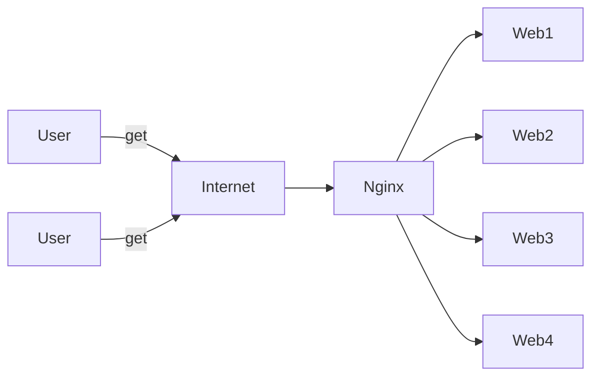

## 一 : Ngnix缓存简介

nginx 的 http_proxy 模块, 可以实现类似于 Squid 的缓存功能。

Nginx对客户已经访问过的内容在 Nginx 服务器本地建立副本, 这样在一段时间内再次访问该数据, 就不需要通过 Nginx 服务器再次向后端服务器发出请求, 所以能够减少 Nginx 服务器与后端服务器之间的网络流量, 减轻网络拥塞, 同时还能减小数据传输延迟, 提高用户访问速度。

同时, 当后端服务器宕机时, Nginx 服务器上的副本资源还能够回应相关的用户请求, 这样能够提高后端服务器的鲁棒性(健壮性)。



## 二 : Ngnix缓存工作原理

对于缓存, 我们大概会有以下问题

1. 缓存文件放在哪儿?
2. 如何指定哪些请求被缓存?
3. 缓存的有效期是多久?
4. 对于某些请求, 是否可以不走缓存?

解决这些问题后, nginx的缓存也就基本配置完成了


## 三 : Ngnix缓存配置

### (一) 缓存文件放在哪儿?

配置参数

| 参数             | 作用                        |
| ---------------- | --------------------------- |
| proxy_cache_path | Nginx使用该参数指定缓存位置 |
| proxy_cache      | 该参数为之前指定的缓存名称  |

proxy_cache_path 有两个必填参数

* 第一个参数为缓存目录。
* 第二个参数 `keys_zone` 指定缓存名称和占用内存空间的大小。

配置示例

```nginx
user nginx;
worker_processes auto;
error_log /var/log/nginx/error.log;
pid /run/nginx.pid;

http {
    # 定义缓存位置,缓存名称和源数据大小
	proxy_cache_path /tmp/nginx/cache keys_zone=one:10m max_size=10g;	# max_size为总量大小
    
    upstream info4z.tk {
        server 127.0.0.1:8881;
        server 127.0.0.1:8882;
        server 127.0.0.1:8883;
    }
    
    server {
        listen 80;
        proxy_cache one;
        server_name info4z.tk;
        
        location / { 
            proxy_pass http://info4z.tk;
            proxy_set_header Host $host;
            proxy_set_header X-Real-IP $remote_addr;
        }
    }
}
```

* 示例中的10m是对内存中缓存内容元数据信息大小的限制, 如果想限制缓存总量大小, 需要用 max_size 参数。

### (二) 如何指定哪些请求被缓存?

Nginx **默认会缓存所有 get 和 head 方法的请求结果**, 缓存的 key 默认使用请求字符串。

配置参数

| 参数                 | 作用                                                         |
| -------------------- | ------------------------------------------------------------ |
| proxy_cache_key      | 自定义 key                                                   |
| proxy_cache_min_uses | 指定请求至少被发送了多少次以上时才缓存, 可以防止低频请求被缓存 |
| proxy_cache_methods  | 指定哪些方法的请求被缓存                                     |

配置示例

```nginx
user nginx;
worker_processes auto;
error_log /var/log/nginx/error.log;
pid /run/nginx.pid;

http {
	proxy_cache_path /data/nginx/cache keys_zone=one:10m;
    
    upstream info4z.tk {
        server 127.0.0.1:8881;
        server 127.0.0.1:8882;
        server 127.0.0.1:8883;
    }
    
    server {
        listen 80;
        proxy_cache one;
        server_name info4z.tk;
        
        location / { 
            proxy_pass http://info4z.tk;
            proxy_set_header Host $host;
            proxy_set_header X-Real-IP $remote_addr;
            # 指定key
            proxy_cache_key	$host$request_uri$cookie_user;
            # 至少5次才会被缓存
            proxy_cache_min_uses 5;
            # 缓存的请求方式
            proxy_cache_methods GET HEAD POST;
        }
    }
}
```


### (三) 缓存的有效期是多久?

默认情况下, 缓存内容是长期存留的, 除非缓存的总量超出限制, 可以指定缓存有效时间

配置参数 : `proxy_cache_valid`

| 示例                            | 作用                              |
| ------------------------------- | --------------------------------- |
| `proxy_cache_valid 200 302 10m` | 响应状态码为200 302时, 10分钟有效 |
| `proxy_cache_valid any 5m`      | 对应任何状态码, 5分钟有效         |

配置示例

```nginx
user nginx;
worker_processes auto;
error_log /var/log/nginx/error.log;
pid /run/nginx.pid;

http {
	proxy_cache_path /data/nginx/cache keys_zone=one:10m;
    
    upstream info4z.tk {
        server 127.0.0.1:8881;
        server 127.0.0.1:8882;
        server 127.0.0.1:8883;
    }
    
    server {
        listen 80;
        proxy_cache one;
        server_name info4z.tk;
        
        location / { 
            proxy_pass http://info4z.tk;
            proxy_set_header Host $host;
            proxy_set_header X-Real-IP $remote_addr;
            proxy_cache_valid 200 302 10m;
        }
    }
}
```


### (四) 对于某些请求, 是否可以不走缓存?

配置参数

| 参数               | 作用                               |
| ------------------ | ---------------------------------- |
| proxy_cache_bypass | 该指令响应来自原始服务器而不是缓存 |

例如

```nginx
proxy_cache_bypass $cookie_nocache $arg_nocache$arg_comment;
# 如果任何一个参数值,不为空或者不等于0,nginx就不会查找缓存,直接进行代理转发
```

配置示例

```nginx
user nginx;
worker_processes auto;
error_log /var/log/nginx/error.log;
pid /run/nginx.pid;

http {
	proxy_cache_path /data/nginx/cache keys_zone=one:10m;
    
    upstream info4z.tk {
        server 127.0.0.1:8881;
        server 127.0.0.1:8882;
        server 127.0.0.1:8883;
    }
    
    server {
        listen 80;
        proxy_cache one;
        server_name info4z.tk;
        
        location / { 
            proxy_pass http://info4z.tk;
            proxy_set_header Host $host;
            proxy_set_header X-Real-IP $remote_addr;
            proxy_cache_bypass $cookie_nocache $arg_nocache$arg_comment;
        }
    }
}
```

## 四 : 关于网页的缓存

网页的缓存是由 HTTP 消息头中的 "Cache-control" 来控制的, 常见的取值有 private, no-cache, max-age, must-revalidate 等, 默认为 private。其作用根据不同的重新浏览方式分为以下几种情况 : 

| Cache-directive                      | 说明                                                         |
| ------------------------------------ | ------------------------------------------------------------ |
| public                               | 所有内容都将被缓存(客户端和代理服务器都可缓存)               |
| private                              | **默认值**, 内容只缓存到私有缓存中(仅客户端可以缓存, 代理服务器不可缓存) |
| no-cache                             | 必须先与服务器确认返回的响应是否被更改, 然后才能使用该响应来满足后续对同一个网址的请求。因此, 如果存在合适的验证令牌(ETag), no-cache会发起往返通信来验证缓存的响应, 如果资源未被更改, 可以避免下载。 |
| no-store                             | 所有内容都不会被缓存到缓存或 internet 临时文件中             |
| must-revalidation/proxy-revalidation | 如果缓存的内容失效, 请求必须发送到服务器/代理以进行重新验    |
| max-age=xxx                          | 缓存的内容将在xxx秒后失效这个选项只在HTTP1.1可用, 并如果和Last-Modified一起使用时, 优先级较高 |

实验测试 : 查看 Cache-Control 不同的取值对请求结果的影响

```nginx
location /h5 {
    # html不缓存
    if ($request_filename ~* .*\.(?:html|htm)$) {
        add_header Cache-Control "private, no-store, no-cache, must-revalidate, proxy-revalidate";
    }
    # 图片缓存30天
    if ($request_filename ~* .*\.(?:gif|jpg|jpeg|png|bmp|swf)$) {
        expires 30d;
    }
    # js和css缓存12h
    if ($request_filename ~* .*\.(?:js|css)$) {
        expires 12h;
    }
    alias /opt/web/h5/dist;
}
```


