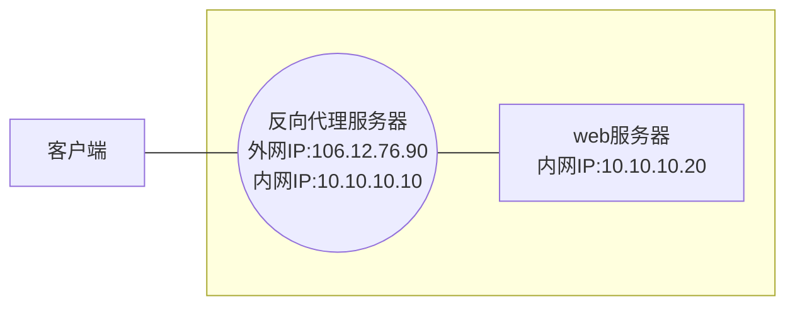
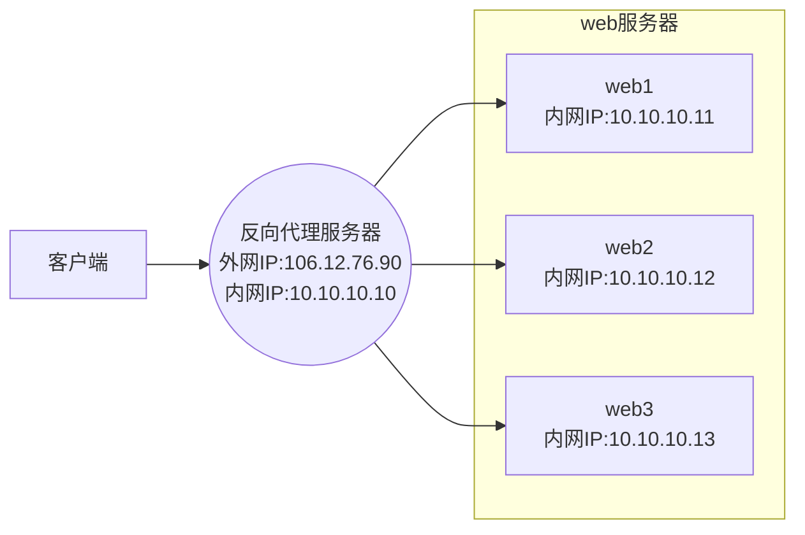

## 一 : Nginx简介

Nginx(发音同 engine x)是一款轻量级的 Web 服务器/反向代理服务器及电子邮件(MAP/POP3) 代理服务器, 并在一个 BSD协议下发行, 可以在 UNIX、GNU/Linux、BSD、Mac OS 、Solaris, 以及 MicrosoftWindows等操作系统中运行。

Nginx 由俄罗斯的程序设计师 lgor Sysoev 所开发, 最初供俄国大型的入口网站及搜寻引擎 Rambler (俄文:Pam6nep)使用。其特点是占有内存少, 并发能力强(用于解决 C10K 问题), 事实上 Nginx 的并发能力确实在同类型的网页服务器中表现较好。

Nginx做为一个强大的Web服务器软件, 具有**高性能、高并发性和低内存占用**的特点。此外, 其也能够提供**强大的反向代理功能**。俄罗斯大约有超过20%的虚拟主机采用Nginx作为反向代理服务器, 在国内也有腾讯、新浪、网易等多家网站在使用Nginx作为反向代理服务器。据Netcraft统计, 世界上最繁忙的网站中有11.48%使用Nginx作为其服务器或者代理服务器。

基于反向代理的功能, Nginx作为负载均衡的**主要理由** : 高并发连接、内存消耗少、配置文件非常简单、成本低廉、支持Rewrite重写规则、内置的健康检查功能、节省带宽、稳定性高。


## 二 : 正向代理和反向代理

### (一) 正向代理

正向代理类似一个跳板机, 代理访问外部资源。


### (二) 反向代理 (Reverse Proxy)

实际运行方式是指以代理服务器来接受internet上的连接请求然后将请求转发给内部网络上的服务器, 并将从服务器上得到的结果返回给internet上请求连接的客户端, 此时代理服务器对外就表现为一个服务器。



**反向代理的作用 :**

1. 保证内网的安全, 可以使用反向代理提供WAF功能, 阻止web攻击。大型网站, 通常将反向代理作为公网访问地址Web服务器是内网
2. 负载均衡, 通过反向代理服务器来优化网站的负载。


## 三 : 负载均衡原理

负载均衡, 单从字面上的意思来理解就可以解释N台服务器平均分担负载, 不会因为某台服务器负载高宕机和某台服务器闲置的情况。那么负载均衡的前提就是要2台以上服务器才能实现。



Nginx负载均衡有4种方案配置

| 方案        | 说明       | 描述                                                         |
| ----------- | ---------- | ------------------------------------------------------------ |
| Round Robin | 轮询       | 根据 Nginx 配置文件中的**顺序**, 依次把客户端的 Web 请求分发到不同的后端服务器上 |
| least_conn  | 最少连接   | Web 请求会被转发到连接数最少的服务器上                       |
| ip_hash     | IP地址哈希 | 同一客户端连续的Web请求都会被分发到同一服务器进行处理        |
| weight      | 权重       | 把请求更多地分发到高配置的后端服务器上, 把相对较少的请求分发到低配服务器 |


## 四 : 负载均衡配置

### (一) 轮询

配置基于 Round Robin 轮询的负载均衡**需要注意以下几点**

1. 缺省配置就是轮询策略:
2. nginx 负载均衡支持 http 和 https 协议，只需要修改 proxy_pass 后协议即可
3. nginx 支持 FastCGl, uwsgi, SCGl, memcached 的负载均衡, 只需将 proxy_pass 改为 fastcgi_pass, uwsgi_pass, scgi_pass, memcached_pass 即可
4. 此策略适合服务器配置相当，无状态且短平快的服务使用。

配置示例

```nginx
user nginx;
worker_processes auto; # 以cpu核心数作为worker的数量
error_log /var/log/nginx/error.log;
pid /run/nginx.pid;

# 基于事件的网络IO
events {
    use epoll; # 多路复用
    worker_connections 65535;
}

http {
    
    upstream info4z.tk {
        server 127.0.0.1:8881;
        server 127.0.0.1:8882;
        server 127.0.0.1:8883;
    }
    
    server {
        listen 80;
        server_name info4z.tk;
        
        location / { 
            proxy_pass http://info4z.tk;
            proxy_set_header	Host			$host;
            proxy_set_header	X-Real-IP		$remote_addr;
            proxy_set_header	X-Forwarded		$proxy_add_x_forwarded_for;
        }
    }
}
```

### (二) 最少连接

配置基于 least_conn 的负载均衡, 需要注意以下几点

1. 最少链接负载均衡通过 least_conn 指令定义;
2. 此负载均衡策略适合请求处理时间长短不一造成服务器过载的情况;

配置示例

```nginx
user nginx;
worker_processes auto;
error_log /var/log/nginx/error.log;
pid /run/nginx.pid;

# 基于事件的网络IO
events {
    use epoll; # 多路复用
    worker_connections 65535;
}

http {
    
    upstream info4z.tk {
        least_conn;
        server 127.0.0.1:8881;
        server 127.0.0.1:8882;
        server 127.0.0.1:8883;
    }
    
    server {
        listen 80;
        server_name info4z.tk;
        
        location / { 
            proxy_pass http://info4z.tk;
            proxy_set_header	Host			$host;
            proxy_set_header	X-Real-IP		$remote_addr;
            proxy_set_header	X-Forwarded		$proxy_add_x_forwarded_for;
        }
    }
}
```


### (三) IP地址哈希

前述的两种负载均衡方案中, 同一客户端连续的Web请求可能会被分发到不同的后端服务器进行处理, 因此如果涉及到会话Session, 那么会话会比较复杂。常见的是基于数据库的会话持久化。要克服上面的难题, 可以使用基于IP地址哈希的负载均衡方案这样的话, 同一客户端连续的Web请求都会被分发到同一服务器进行处理。

配置基于 ip_hash 的负载均衡, 需要注意以下几点:

1. ip哈希负载均衡使用 ip_hash 指令定义
2. nginx使用请求客户端的ip地址进行哈希计算，确保使用同一个服务器响应请求
3. 此策略适合有状态服务，比如session;

配置示例

```nginx
user nginx;
worker_processes auto;
error_log /var/log/nginx/error.log;
pid /run/nginx.pid;

# 基于事件的网络IO
events {
    use epoll; # 多路复用
    worker_connections 65535;
}

http {
    
    upstream info4z.tk {
        ip_hash;
        server 127.0.0.1:8881;
        server 127.0.0.1:8882;
        server 127.0.0.1:8883;
    }
    
    server {
        listen 80;
        server_name info4z.tk;
        
        location / {
            proxy_pass http://info4z.tk;
            proxy_set_header	Host			$host;
            proxy_set_header	X-Real-IP		$remote_addr;
            proxy_set_header	X-Forwarded		$proxy_add_x_forwarded_for;
        }
    }
}
```


### (四) 基于权重 

配置基于权重的负载均衡, 需要注意以下几点:

1. 权重负载均衡需要使用 weight 指令定义;
2. 权重越高分配到需要处理的请求越多;
3. 此策略可以与最少链接负载和ip哈希策略结合使用
4. 此策略比较适合服务器的硬件配置差别比较大的情况

配置示例

```nginx
user nginx;
worker_processes auto;
error_log /var/log/nginx/error.log;
pid /run/nginx.pid;

# 基于事件的网络IO
events {
    use epoll; # 多路复用
    worker_connections 65535;
}

http {
    
    upstream info4z.tk {
        server 127.0.0.1:8881 weight=3;
        server 127.0.0.1:8882 weight=2;
        server 127.0.0.1:8883 weight=1;
    }
    
    server {
        listen 80;
        server_name info4z.tk;
        
        location / {
            proxy_pass http://info4z.tk;
            proxy_set_header	Host			$host;
            proxy_set_header	X-Real-IP		$remote_addr;
            proxy_set_header	X-Forwarded		$proxy_add_x_forwarded_for;
        }
    }
}
```

