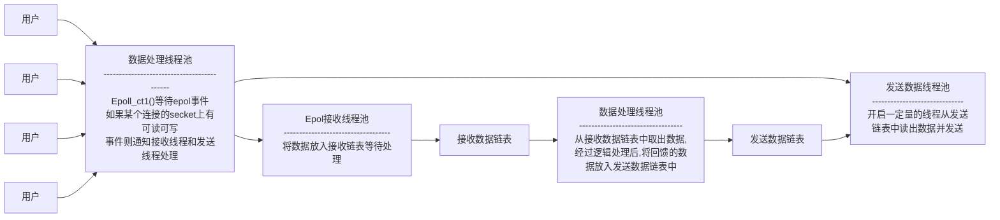

## 一 : Ngnix监听端口

基本语法

```nginx
listen address:port
# 默认 listen 80;
```

**作用 :** listen 参数决定 Nginx 服务器如何监听端口。在listen后可以加IP地址, 端口和主机名, 非常灵活。

示例

```nginx
listen 127.0.0.1:8000;
listen 127.0.0.1; # 默认80端口
listen 8000;
listen *:8000;
listen localhost:8000;
```


扩展语法

```nginx
listen address:port [default(deprecated in in 0.8.21)|default_server|[backlog=num|rcvbuf=size|sndbuf=size|accept_filter=filter|deferred|bind|ipv6only=[on|off]ssl]];
```

参数

| 参数          | 描述                                                         |
| ------------- | ------------------------------------------------------------ |
| default       | 将所在得server设为整个web服务的默认server块。如果没有这个设置, 那么会以在nginx.conf中找到的第一个server作为默认server。 (default_server:同上) |
| backlog=num   | 表示 TCP 中 backlog 队列的大小                               |
| rcvbuf=size   | 设置监听句柄的SO_RECVBUF参数                                 |
| sndbuf=size   | 设置监听句柄的SOSNDBUF参数                                   |
| accept_filter | 设置accept过滤器, 支队FreeBSD有用                            |
| deferred      | 在设置参数后, 若用户发起建立请求, 并且完成了TCP的三次握手, 内核也不会为这次连接调度worker进程来处理, 只有用户真的发送数据时(内核已经在网卡中收到请求包), 内核才会唤醒worker进程处理这个请求 |
| bind          | 绑定当前端口、地址对。只有同时对一个端口监听多个地址时才会生效 |
| ssl           | 在当前监听的端口上建立的连接必须基于SSL协议                  |


## 二 : Nginx虚拟主机

| 类别   | 主机名                 | server_names_hash_bucket_size                                |
| ------ | ---------------------- | ------------------------------------------------------------ |
| 语法   | server_name name [...] | server_names_hash_bucket_size size;                          |
| 默认   | server name "";        | server_names_hash_bucket_size 32\|64\|128;                   |
| 配置块 | server;                | http,server,location                                         |
| 作用   | 实现虚拟主机的关键     | 为了快速找到相应的server name的能力, Nginx使用散列表来存储server name<br>这个**设置了桶的大小** |


## 三 : Nginx配置location

location会尝试根据用户请求中的uri来匹配上面的uri表达式, 如果可以匹配, 就选择Icoation块中的配置来处理用户请求。

语法

```nginx
location [=|~*|^~|@]/uri/[...]
```

配置块 : server

匹配方式

| 匹配方式 | 描述                                                         |
| -------- | ------------------------------------------------------------ |
| = /uri   | 表示完全匹配                                                 |
| ~ /uri   | 表示匹配URI时时大小写敏感的                                  |
| ~* /uri  | 表示匹配URI时忽略大小写                                      |
| ^~ /uri  | 表示匹配URI时只需要其前半部分匹配即可                        |
| /uri     | 不带任何修饰符, 也表示前缀匹配, 但是在正则匹配之后           |
| /        | 通用匹配, 任何未匹配到其它location的请求都会匹配到, 相当于switch中的default |


## 四 : Nginx常规配置

| 配置项(语法)                    | 作用                                                         |
| ------------------------------- | ------------------------------------------------------------ |
| evn VAR\|VAR=VALUE              | 用户可以直接设置操作系统上的环境变量,例如 `evn TESTPATH=/tmp;` |
| include /path/file;             | 可以把其他配置文件引入进来, 路径可以使绝对路径也可以是相对路径, 还可以含有通配符`*` |
| pid path/file;                  | 保存master进程ID的pid文件存放路径, 默认`pid logs/nginx.pid;` |
| user username[groupname];       | master进程fork出的进程在哪个用户和用户组下,默认`user nobody nobody;` |
| worker_rlimit_nofile limit;     | 设置一个worker可以打开的最大句柄数                           |
| worker_rlimit_sigpending limit; | 设置每个用户发往Nginx的信号队列的大小。<br>也就是说, 当某个用户的信号队列满了, 这个用户再发送的信号量就会被丢掉。 |


## 五 : Nginx高性能配置

Nginx worker 进程个数

| 配置项(语法)             | 描述                                                         |
| ------------------------ | ------------------------------------------------------------ |
| worker_processes number; | 在master worker运行方式下, 定义worker进程的个数; worker进程的数量会直接影响性能; 每个worker都是单线程的进程, 他会调用各个模块来实现各种功能; 如果确定这些模块不会出现堵塞式调用, 那么进程数可以和CPU核心数一样, 反之, 则稍少一些; 默认: `worker_processes 1;` |

绑定Nginx worker进程到指定的CPU内核

| 配置项                                   | 描述                                                         |
| ---------------------------------------- | ------------------------------------------------------------ |
| worker_cpu_affinity cpumask [cpumask···] | 假设每个worker都是很繁忙的, 如果多个进程都在抢同一个CPU, 那么就会出现同步问题。反之, 如果每个worker进程独享一个CPU, 就实现了完全的并发。举例:`worker_processes 4;worker_cpu_affinity 1000 0100 0010 0001:` |

SSL硬件加速

| 配置项             | 描述                                                         |
| ------------------ | ------------------------------------------------------------ |
| ssl_engine device; | 如果服务器上有SSL硬件加速设备, 那么就可以进行配置以加快SSL协议的处理速度。用户可以用OpenSSL提供的命令来查看是否有SSL硬件加速设备: `openssl engine-t` |

Nginx worker进程优先级设置

| 配置项                | 描述                                                         |
| --------------------- | ------------------------------------------------------------ |
| worker_priority nice; | 在Linux和Unix中, 当许多进程都处于可执行状态时, 按照优先级来决定本次内核选择哪一个进程执行。进程分配的CPU时间片大小也与优先级有关, 优先级越高, 时间片越长(例如, 在默认情况下, 最小时间片是5ms, 最大则有800ms)。优先级由静态优先级和内核根据进程的执行情况所做的动态调整(目前只有+-5的调整)共同决定。nice是进程的优先级, 他的取值范围是-20~+19, -20是最高优先级, +19是最低优先级。不建议把nice的值设为比内核进程(t通常为-5) 还要小。默认: `worker_priority 0;` |


## 六 : Nginx事件配置

是否打开accept锁

| 配置项                | 描述                                                         |
| --------------------- | ------------------------------------------------------------ |
| accept_mutex [on of]; | accept_mutex是Nginx的负载均衡锁。这把锁可以让多个worker进程轮流的, 序列化的与新的客户端建立TCP连接。accept锁默认是打开的, 如果关闭它, 那么建立TCP连接的耗时会更短, 但不利于负载均衡, 因此不建议关闭。默认: `accept_mutex on;` |


使用accept锁后到真正建立连接之间的延迟时间

| 配置项                  | 描述                                                         |
| ----------------------- | ------------------------------------------------------------ |
| accept_mutex_delay Nms; | 在使用accept锁后, 同一时间只有一个worker进程能够取到accept锁。这个accept锁不是堵案锁, 如果取不到会立刻返回。如果只有一个worker进程试图取锁而没有取到, 他至少要等待accept mutex delav定义的时间才能再次试图取锁。默认: `accept_mutex_delay 500ms;` |

批量建立新连接

| 配置项                | 描述                                                         |
| --------------------- | ------------------------------------------------------------ |
| multi_accept[on off]; | 当事件模型有新连接时, 尽可能的对本次调度中客户端发起的所有TCP请求都建立连接。默认: `multi_acceptoff;` |

选择事件模型

| 配置项                                                    | 描述                                                         |
| --------------------------------------------------------- | ------------------------------------------------------------ |
| use [kqueue rtsig epoll /dev/poll select pollleventport]; | 对于Linux系统, 可供选择的事件驱动模型有: poll,select,epoll三种, 一般来说, epoll是性能最高的。默认: Nginx会选出最合适的事件模型 |

每个worker的最大连接数

| 配置项                     | 描述                                       |
| -------------------------- | ------------------------------------------ |
| worker_connections number; | 定义每个worker进程可以同时处理的最大连接数 |

## 七 : Nginx事件模型

epoll 是 Linux 内核为处理大批量文件描述符而作了改进的poll，是Linux下多路复用IO接口select/poll的增强版本，它能显著提高程序在大量并发连接中只有少量活跃的情况下的系统CPU利用率。



优点

* 支持一个进程打开大数目的socket描述符。
* IO效率不随FD数目增加而线性下降。
* 使用mmap加速内核与用户空间的消息传递。

