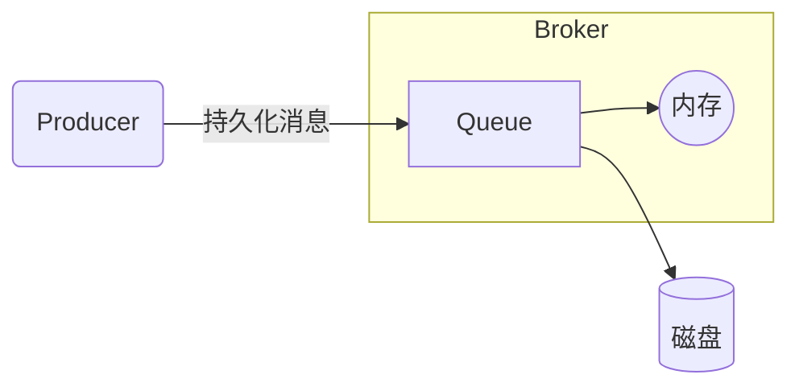
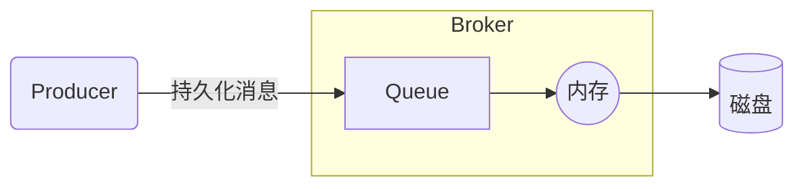

# 一 : 持久化机制

RabbitMQ 的持久化分为**队列持久化**、**消息持久化**和**交换器持久化**。不管是持久化的消息还是非持久化的消息都可以被写入到磁盘。

持久化消息会自动写入磁盘, 重启后数据也不会丢失



非持久化数据在**内存不足**的情况下也会写入磁盘, 但重启后数据会丢



## (一) 队列持久化

队列的持久化是在定义队列时的durable参数来实现的, durable为true时, 队列才会持久化。

```java
Connection connection = connectionFactory.newConnection();Channel channel = connection.createChannel();
//第二个参数设置为true, 即durable=true
channel.queueDeclare("queue1", true, false, false, null); 
```

持久化的队列在管理界面的 Features 列可以看到有个 `D` 的标识

## (三) 消息持久化

消息持久化通过消息的属性 deliveryMode 来设置是否持久化, 在发送消息时通过 basicPublish 的参数传入。

```java
//通过传入MessageProperties.PERSISTENT_TEXT_PLAIN 就可以实现消息持久化
channel.basicPublish("", "queue1", MessageProperties.PERSISTENT_TEXT_PLAIN, "persistent_test_message".getBytes());
```

## (四) 交换器持久化

同队列一样, 交换器也需要在定义时设置持久化标识, 否则在Broker重启后将丢失

```java
// durable为true则开启持久化
Exchange.DeclareOk exchangeDeclare(String exchange, String type, boolean durable) throws IOException;
```


# 二 : 内存控制

## (一) 内存告警

当内存使用超过配置的阈值或者磁盘剩余空间低于配置的阈值时, RabbitMQ 会暂时阻塞客户端的连接, 并停止接收从客户端发来的消息, 以此避免服务崩溃, 客户端与服务端的心跳检测也会失效。

## (二) 内存控制

当出现内存告警时, 可以通过管理命令临时调整内存大小

```sh
rabbitmqctl set_vm_memory_high_watermark <fraction>
```

* `<fraction>`为内存阈值, RabbitMQ 默认值为 `0.4`, 表示当 RabbitMQ 使用的内存超过 40% 时,就会产生告警并阻塞所有生产者连接。
* 通过此命令修改的阈值在Broker重启后将会失效, 通过修改配置文件的方式设置的阈值则不会在重启后消失, 但需要重启Broker才会生效。

配置文件地址: /etc/rabbitmq/rabbitmq.conf

```properties
vm_memory_high_watermark.relative = 0.4
#vm_memory_high_watermark.absolute = 1GB
```

RabbitMQ 提供 relative 或absolute 两种配置方式

* **relative :** 相对值, 即前面的 fraction, 建议取值在 `0.4~0.66`之间, 不建议超过 `0.7`

* **absolute :** 绝对值, 单位为KB、MB、GB, 对应的命令是

  ```sh
  rabbitmqctl set_vm_memory_high_watermark absolute <value>
  ```

## (三) 内存换页

在某个 Broker 节点触及内存并阻塞生产者之前, 它会尝试将队列中的消息换页到磁盘以释放内存空间。持久化和非持久化的消息都会被转储到磁盘中, 其中持久化的消息本身就在磁盘中有一份副本, 这里会将持久化的消息从内存中清除掉。

**默认情况下, 在内存到达内存阈值的 50% 时会进行换页动作。**也就是说, 在默认的内存阈值为 `0.4` 的情况下, 当内存超过 `0.4×0.5=0.2` 时会进行换页动作。

可以通过在配置文件中配置 `vm_memory_high_watermark_paging_ratio` 项来修改此值

```properties
vm_memory_high_watermark.relative =0.4
vm_memory_high_watermark_paging_ratio = 0.75
# 以上配置将会在 RabbitMQ 内存使用率达到30%(0.4*0.75=0.3)时进行换页动作, 并在40%时阻塞生产者
```

当 `vm_memory_high_watermark_paging_ratio` 的值大于1时, 相当于**禁用**了换页功能。


# 三 : 磁盘控制

## (一) 磁盘告警

当磁盘剩余空间低于确定的阈值时, RabbitMQ 同样会阻塞生产者, 这样可以避免因非持久持续换页而耗尽磁盘空间导致服务崩溃。

**默认情况下, 磁盘阈值为50MB;** 表示当磁盘剩余空间低于 50MB 时会阻塞生产者并停止内存中消息的换页动作。

这个阈值的设置可以减小，但不能完全消除因磁盘耗尽而导致崩溃的可能性。比如在两次磁盘空间检测期间内，磁盘空间从大于50MB被耗尽到0MB。

**一个相对谨慎的做法是将磁盘阈值设置为与操作系统所显示的内存大小一致;** 比如内存大小为 8G, 那磁盘剩余空间就设置为 8G

## (二) 磁盘限制

通过命令可以临时调整磁盘阈值

```sh
rabbitmqctl set_disk_free_limit <disk_limit>
rabbitmqctl set_disk_free_limit mem_relative <fraction>
# disk_limit 为固定大小，单位为KB、MB、GB; fraction为相对比值，建议的取值为1.0~2.0之间
```

对应的配置如下:

```properties
disk_free_limit.relative = 2.0
# disk_free_limit.absolute = 50mb
```


