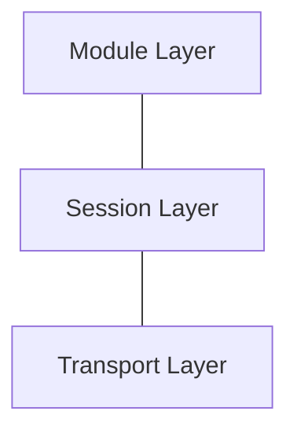
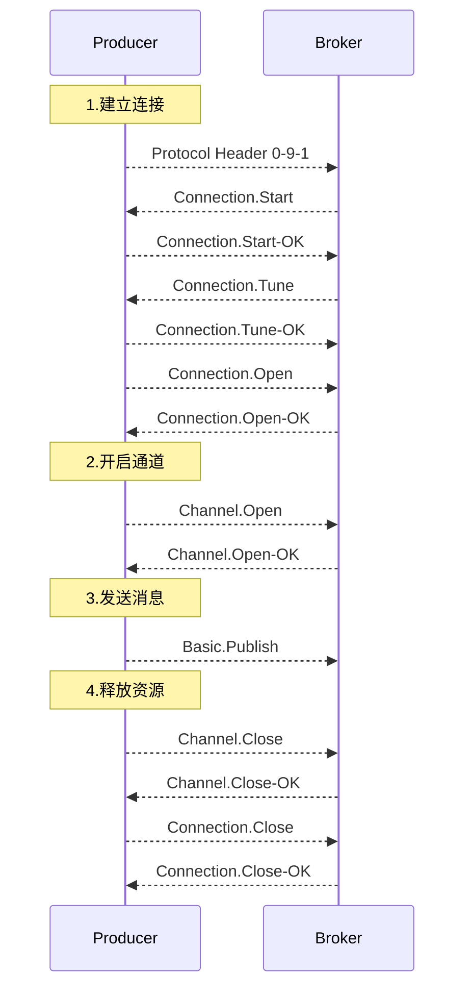
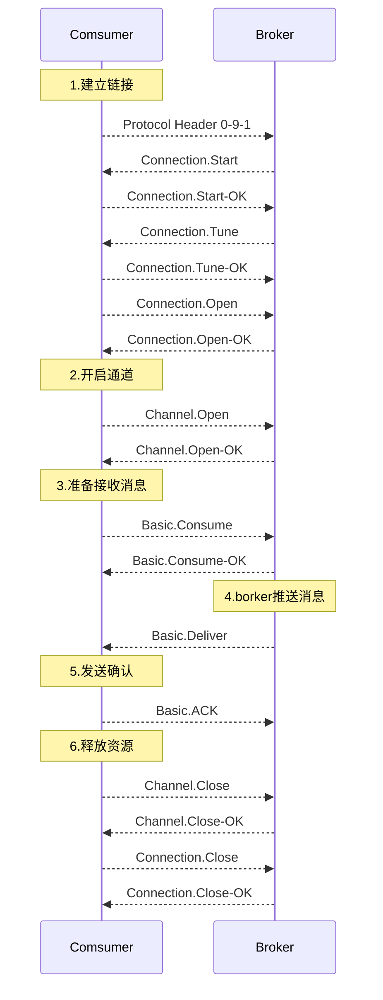
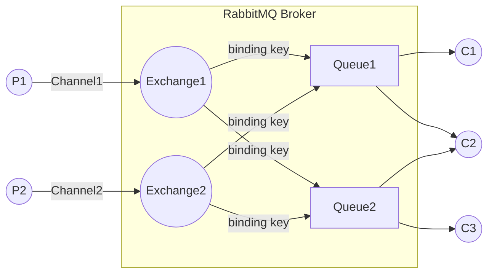
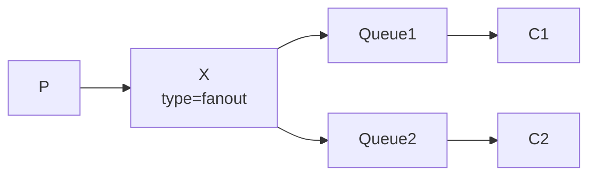
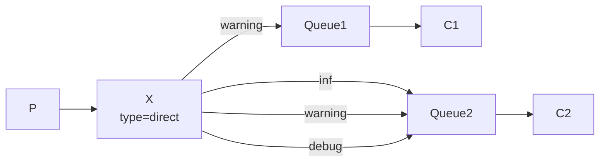
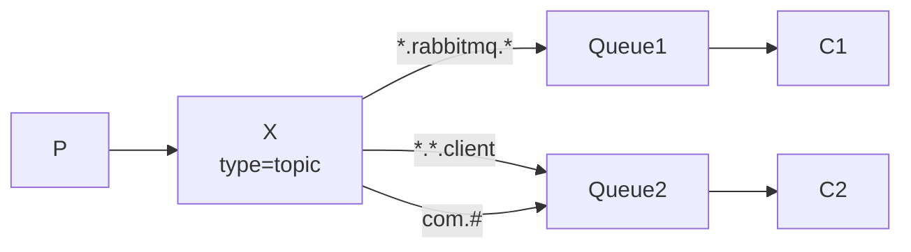
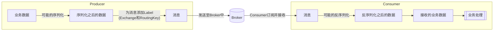
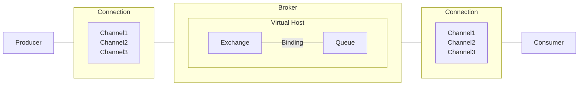

## 一 : AMQP 协议

AMQP (Advanced Message Queuing Protocol)高级消息队列协议, 是应用层协议的一个开放标准, 为面向消息的中间件设计。

### (一) AMQP 结构

AMQP 也有类似 OSI 的分层结构概念, 从下往上分别为 : Transport Layer, Session Layer, Module Layer

| 名称            | 位置       | 作用                                                         |
| --------------- | ---------- | ------------------------------------------------------------ |
| Module Layer    | 位于最高层 | 主要定义了一些供客户端调用的命令 客户端可以利用这些命令实现自己的业务逻辑 |
| Session Layer   | 位于中间层 | 负责将客户端的命令发送给服务器,再将服务器的应答返回给客户端 主要为客服端与服务器之间的通信提供可靠性同步机制和错误处理 |
| Transport Layer | 位于最低层 | 主要传输二进制数据流 提供帧的处理、信道复用、错误检测和数据表示等 |

### (二) 生产者流转过程

### (三) 消费者流转过程

## 二 : 核心概念

### (一) 模型架构

### (二) 核心概念

| 角色         | 描述       | 说明                                                         |
| ------------ | ---------- | ------------------------------------------------------------ |
| Producer     | 生产者     | 生产者创建消息, 然后发布到RabbitMQ中 消息一般可以包含两个部分 : 消息体和附加信息 **消息体 (payload) :** 在实际应用中, 一般是一个带有业务逻辑结构的数据, 比如一个JSON字符串当然可以进一步对这个消息体进行序列化操作 **附加信息 :** 用来表述这条消息, 比如目标交换器的名称、路由键和一些自定义属性等等 |
| Channel      | 频道或信道 | 是建立在 Connection 连接之上的一种轻量级的连接, 大部分的操作是在Channel这个接口中完成的 包括定义队列的声明 queueDeclare、交换机的声明 exchangeDeclare、队列的绑定 queueBind、发布消息 basicPublish、消费消息 basicConsume 等 |
| RoutingKey   | 路由键     | 生产者将消息发给交换器的时候, 一般会指定一个RoutingKey, 用来指定这个消息的路由规则 **RoutingKey 需要与交换器类型和绑定键(Bindingkey)联合使用** 在交换器类型和绑定键(BindingKey)固定的情况下, 生产者可以在发送消息给交换器时, 通过指定 RoutingKey 来决定消息流向哪里 |
| Exchange     | 交换器     | 生产者将消息发送到 Exchange (交换器, 通常也可以用大写的“X”来表示), 由交换器将消息路由到一个或者多个队列中, 如果路由不到, 或返回给生产者, 或直接丢弃。 |
| Queue        | 队列       | 是RabbitMQ的内部对象,用于存储消息                            |
| Binding      | 绑定       | RabbitMQ 中通过绑定将交换器与队列关联起来, 在绑定的时候一般会指定一个**绑定键(BindingKey)**, 这样 RabbitMQ 就知道如何正确地将消息路由到队列了 |
| Virtual Host | 虚拟主机   | 表示一批交换器、消息队列和相关对象, 虚拟主机是共享相同的身份认证和加密环境的独立服务器域 每个 vhost 本质上就是一个 mini 版的 RabbitMQ 服务器, 拥有目己的队列、交换器、绑定和权限机制 vhost 是 AMQP 概念的基础, 必须在连接时指定, RabbitMQ 默认的 vhost 是 `/` |
| Broker       | 服务节点   | 一个 RabbitMQ Broker 可以简单地看作一个 RabbitMQ 服务节点, 或者 RabbitMQ 服务实例, 也可以将一个 RabbitMQ Broker 看作一台 RabbitMQ 服务器 |
| Consumer     | 消费者     | 就是接收消息的一方; 消费者连接到RabbitMQ 服务器, 并订**阅到队列上** 当消费者消费一条消息时, 只是消费消息的**消息体(payload)**; 在消息路由的过程中, 消息的标签会丢弃, 存入到队列中的消息只有消息体, 消费者也只会消费到消息体, 也就不知道消息的生产者是谁,当然也不需要知道 |

## 三 : Exchange 类型

RabbitMQ 常用的交换器类型有 fanout、direct、topic、headers 这四种

### (一) fanout

扇型交换机 : 它会把所有发送到该交换器的消息路由到所有与该交换器绑定的队列中; **类似于广播, 用的不多**

### (二) direct

直连交换机 : 它会把消息路由到那些 BindingKey 和 RoutingKey 完全匹配的队列中

### (三) topic

主题交换机 : 与direct类似, 但它可以通过通配符进行模糊匹配; **常用**

### (四) headers

头交换机 : 不依赖于路由键的匹配规则来路由消息,而是根据发送的消息内容中的headers属性进行匹配

**headers 类型的交换器性能很差, 而且也不实用。**

## 四 : 运转流程

### (一) 流转过程

### (二) 架构图

### (三) 生产者发送消息的过程

1. 生产者连接到RabbitMQ Broker, 建立一个连接(Connection), 开启一个信道(Channel)

2. 生产者声明一个交换器, 并设置相关属性, 比如交换机类型、是否持久化等

3. 生产者声明一个队列井设置相关属性, 比如是否排他、是否持久化、是否自动删除等

4. 生产者通过路由键将交换器和队列绑定起来

5. 生产者发送消息至RabbitMQ Broker, 其中包含路由键、交换器等信息

6. 相应的交换器根据接收到的路由键查找相匹配的队列

7. 如果找到, 则将从生产者发送过来的消息存入相应的队列中

8. 如果没有找到, 则根据生产者配置的属性选择丢弃还是回退给生产者

9. 关闭信道、关闭连接

### (四) 消费者接收消息的过程

1. 生产者连接到RabbitMQ Broker, 建立一个连接(Connection), 开启一个信道(Channel)

2. 消费者向RabbitMQ Broker请求相应队列中的消息, 可能会设置相应的回调函数, 以及做一些准备工作

3. 等待RabbitMQ Broker回应并投递相应队列中的消息, 消费者接收消息

4. 消费者确认(ack)接收到的消息

5. RabbitMQ从队列中删除相应己经被确认的消息

6. 关闭信道、关闭连接