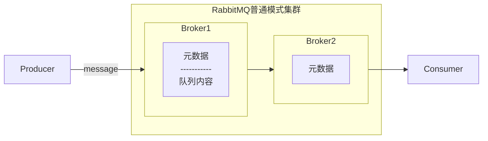
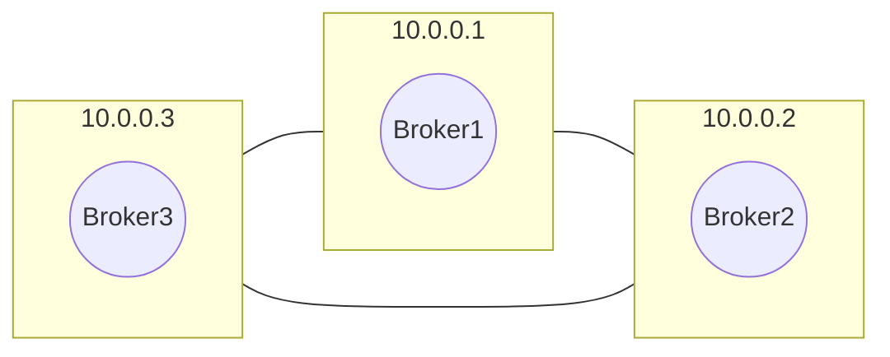
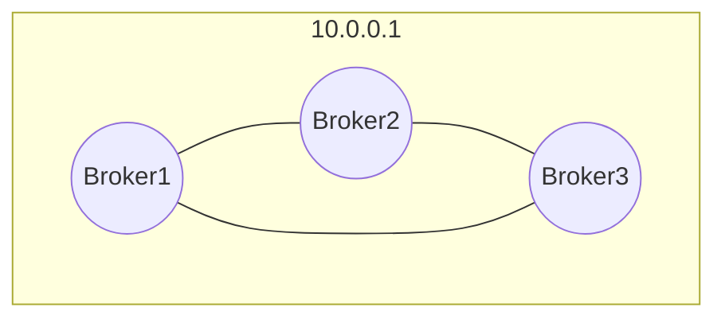
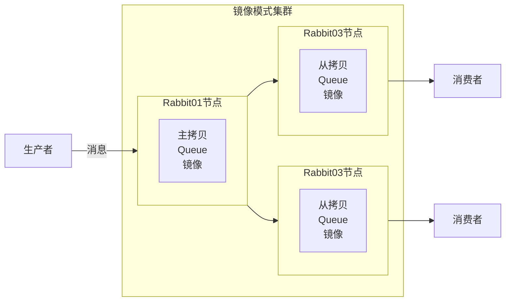
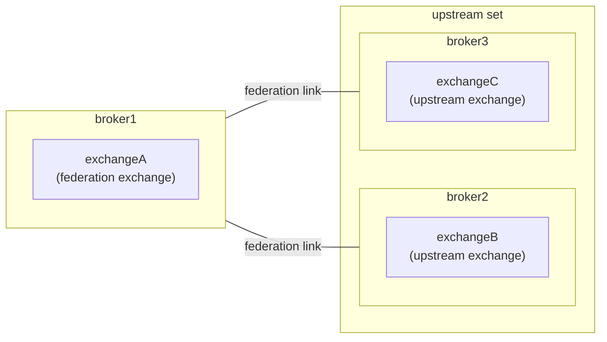
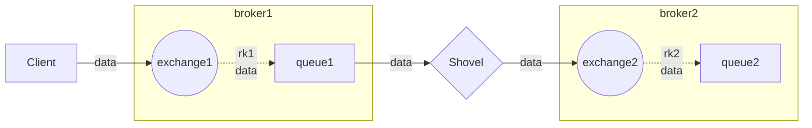

## 一 : Cluster 实现

* RabbitMQ 的 Cluster 模式分为**普通模式**和**镜像模式**两种

### (一) 普通模式



元数据包含以下内容:

| 元素           | 描述                                                         |
| -------------- | ------------------------------------------------------------ |
| 队列元数据     | 队列的名称及属性                                             |
| 交换器         | 交换器的名称及属性                                           |
| 绑定关系元数据 | 交换器与队列或者交换器与交换器                               |
| vhost元数据    | 为vhost内的队列、交换器和绑定提供命名空间及安全属性之间的绑定关系 |

### (二) 普通模式-多机多节点

架构图



修改三台机器的 `/etc/hosts` 文件，添加IP地址与节点名的映射信息

```sh
10.10.1.41 nodel
10.10.1.42 node2
10.10.1.43 node3
```

编辑 RabbitMQ 的 `/var/lib/rabbitmq/.erlang.cookie` 文件

```sh
# 确保各个节点的 cookie 文件使用的是同一个值, 可以从一个节点复制到其它节点
scp /var/lib/rabbitmq/.erlang.cookie root@node2:/var/lib/rabbitmq/
scp /var/lib/rabbitmq/.erlang.cookie root@node3:/var/lib/rabbitmq/
```

将三个节点的端口添加到防火墙

```sh
firewall-cmd --zone=public --add-port=5672/tcp --permanent
firewall-cmd --zone=public --add-port=15672/tcp --permanent
firewall-cmd --zone=public --add-port=25672/tcp --permanent
firewall-cmd --reload
```

启动三个节点的RabbitMQ服务

```sh
[root@node1 ~]# rabbitmq-server -detached
[root@node2 ~]# rabbitmq-server -detached
[root@node3 ~]# rabbitmq-server -detached
```

以node1为基准，将node2和node3加入nodel节点的集群中。在node2和node3分别执行以下命令:

```shell
rabbitmqctl stop_app
rabbitmqctl reset
rabbitmqctl join_cluster rabbit@node1 --ram
rabbitmqctl start_app
```

### (三) 普通模式-单机多节点

由于某些因素的限制，有时候不得不在单台物理机器上去创建一个多RabbitMQ服务节点的集群。或者只想要实验性地验证集群的某些特性，也不需要浪费过多的物理机器去实现。



为方便后续命令操作，在`/etc/rabbitmq/rabbitmq-env.conf` 修改默认的节点名称为rabbit1

```properties
NODENAME=rabbit1
```

为每个 RabbitMQ 服务节点设置不同的端口号和节点名称来启动相应的服务

```sh
# 前面设置了默认节点名，而且也有默认端口5672，所以rabbit1可以直接启动，而rabbit2和rabbit3要指定名称和端口
rabbitmq-server -detached
RABBITMQ_NODE_PORT=5673 RABBITMQ_NODENAME=rabbit2 rabbitmq-server-detached
RABBITMQ_NODE_PORT=5674 RABBITMQ_NODENAME=rabbit3 rabbitmq-server-detached
```

如果启用的插件有端口(比如rabbitmq_management)，则需要增加启动参数，修改插件的端口号，否则会启动失败。

```sh
# rabbit2的Web管理端口改为15673
RABBITMQ_NODE_PORT=5673 RABBITMQ_SERVER_START_ARGS="-rabbitmq_management listenerport,15673}]" RABBITMQ_NODENAME=rabbit2 rabbitmq-server -detached

# rabbit3的Web管理端口改为15674
RABBITMQ_NODE_PORT=5674 RABBITMQ_SERVER_START_ARGS="-rabbitmq_management listener{port,15674]]" RABBITMQ_NODENAME=rabbit3 rabbitmq-server -detached
```


### (四) 镜像模式

架构图



* 镜像模式的集群是在普通模式的基础上，通过policy来实现，使用镜像模式可以实现RabbitMQ的高可用方案。可以在控制台直接配置

  * Name : policy 的名称
  * Pattern : 匹配表达式
  * Apply to : 规则应用到哪个目标
  * Priority : 优先级
  * Definition : 规则的定义，对于镜像队列的配置来说, 只需要包含3个部分: ha-mode、ha-params 和 ha-sync-mode。

* **ha-mode** : 指明镜像队列的模式，有效值为all、exactly 、nodes，默认为all

  | ha-mode | ha-params | 说明                                                         |
  | ------- | --------- | ------------------------------------------------------------ |
  | all     | (empty)   | 队列镜像到集群类所有节点                                     |
  | exactly | count     | 队列镜像到集群内指定数量的节点。如果集群内节点数少于此值，队列将会镜像到所有节点。如果大于此值，而且一个包含镜像的节点停止，则新的镜像不会在其它节点创建。 |
  | nodes   | nodename  | 队列镜像到指定节点，指定的节点不在集群中不会报错。当队列申明时，如果指定的节点不在线，则队列会被创建在客户端所连接的节点上。 |

* **ha-sync-mode** : 队列中消息的同步方式，有效值为automatic和manual，默认是automatic o


## 二 : 插件实现

### (一) Federation 

Federation 插件的设计目标是使 RabbitMQ 在不同的 Broker 节点之间进行消息传递而无须建立集群, 该功能在以下场景下非常有用

* 各个节点运行在不同版本的Erlang和RabbitMQ上。
* 网络环境不稳定，比如广域网当中。

架构图



### (二) Shovel 

Shovel 与 Federation 具备的数据转发功能类似, Shovel 能够可靠、持续地从一个 Broker 中的队列(作为源端，即source)拉取数据并转发至另一个Broker中的交换器(作为目的端，即destination)。

Shovel可以翻译为“铲子”，是一种比较形象的比喻。这个"铲子"可以将消息从一方"挖到"另一方

Shovel的主要优势:

* **松耦合**，Shovel 可以移动位于不同管理域中的 Broker 或者集群上的消息，这些 Broker 或者集群可以包含不同的用户和 vhost，也可以使用不同的 RabbitMQ 和 Erlang 版本。
* **支持广域网**，Shovel 插件同样基于 AMQP 协议在 Broker 之间进行通信，被设计成可以容忍时断时续的连通情形，并且能够保证消息的可靠性。
* **高度定制**，当Shovel 成功连接后，可以对其进行配置以执行相关的 AMQP 命令。


Shovel 的作用



## 三 : Federation/Shovel与Cluster的比较

| Federation/Shovel                                            | cluster                                                      |
| ------------------------------------------------------------ | ------------------------------------------------------------ |
| 各个Broker节点之间逻缉分离                                   | 逻辑上是个Broker节点                                         |
| 各个Broker节点之间可以运行不同版本的Erlang和RabbitMQ         | 各个Broker节点之间必须运行相同版本的Erlang和RabbitMQ         |
| 各个Broker节点之间可以在广域网中相连，当然必须要授予适当的用户和权限 | 各个Broker节点之间必须在可信赖的局域网中相连,通过Erlang内部节点传递消息，但节点问需要有相同的Erlang cookie |
| 各个Broker节点之间能以任何拓扑逻辑部署，连接可以是单向的或者是双向的 | 所有Broker节点都双向连续所有其他节点                         |
| 从CAP理论中选择可用性和分区耐受性，即AP                      | 从CAP理论中选择一致性和可用性,即CA                           |
| 一个Broker中的交换器可以是Federation生成的或者是本地的       | 集群中所有Broker节点中的交换器都是一样的,要么全有要么全无    |
| 客户端所能看到它所连接的Broker节点上的队列                   | 客户端连接到集群中的任何Broker节点都可以看到所有的队列       |


