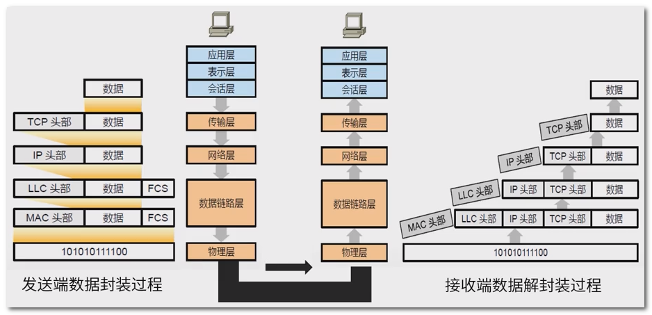
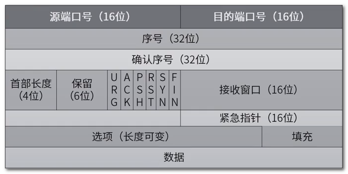
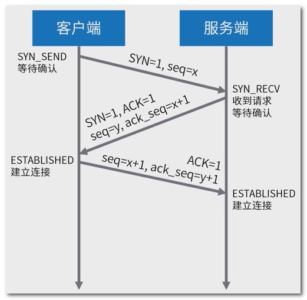
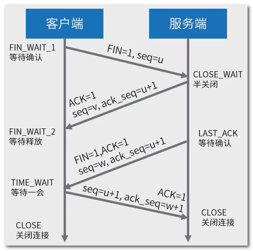
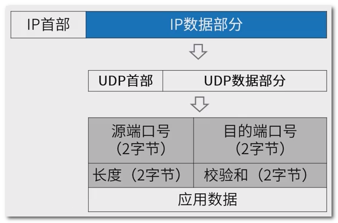

## 一 : OSI 网络七层模型

为使不同计算机厂家的计算机能够互相通信, 以便在更大的范围内建立计算机网络, 有必要建立一个国际范围的网络体系结构标准

 

也就是说 101010111100 中包含的数据内容为 : MAC 头部 + LLC 头部 + IP 头部 + TCP 头部 + 数据


## 二 : 各层的主要功能

**低三层** 

- 物理层 : 使原始的数据比特流能在物理介质上传输
- 数据链路层 : 通过校验, 确认和反馈重发等手段, 形成稳定的数据链路(01010101)
- 网络层 : 进行路由选择和流量控制(IP 协议)

**中间层**

* 传输层 : 提供可靠的端口到端口的数据传输服务(TCP/UDP协议)

**高三层**

- 会话层 : 负责建立 , 管理和终止进程之间的会话和数据交换
- 表示层 : 负责数据格式转换, 数据加密与解密, 压缩与解压缩等
- 应用层 : 为用户的应用进程提供网络服务


## 三 : 传输控制协议 TCP

传输控制协议(TCP) 使 Internet 一个重要的传输层协议; TCP 提供面向连接, 可靠, 有序, 字节流传输服务; 应用程序在使用 TCP 之前, 必须先建立 TCP 连接

 

标志位说明

| 标志位  | 说明             |
| ------- | ---------------- |
| URG     | 紧急指针         |
| **ACK** | 确认序号         |
| PSH     | 有 DATA 数据传输 |
| RST     | 连接重置         |
| **SYN** | 建立连接         |
| **FIN** | 关闭连接         |


## 四 : TCP 握手机制

三次握手过程

  

四次挥手过程

 


## 五 : 用户数据报协议 UDP

用户数据报协议 UDP 是 Internet 传输层协议; 提供无连接, 不可靠, 数据报尽力传输服务

 

开发应用人员在 **UDP 上构建应用, 关注以下几点 :** 

1. 应用进程更容易控制发送什么数据以及何时发送
2. 无需建立连接
3. 无连接状态
4. 首部开销小


## 六 : UDP 和 TCP 比较

| TCP            | UDP        |
| -------------- | ---------- |
| 面向连接       | 无连接     |
| 提供可靠性保证 | 不可靠     |
| 慢             | 快         |
| 资源占用多     | 资源占用少 |

什么时候会用到UDP呢? 对数据可靠性要求不高的情况, 例如音视频聊天, 物联网数据上报之类; 也就是说我们的关注点是现在发生了什么而不是过去发生了什么


## 七 : Socket 编程

Internet 中应用最广泛的网络应用编程接口, 实现与 3 种底层协议接口:

- 数据报类型套接字 SOCK_DGRAM (面向 UDP 接口)
- 流式套接字 SOCK_STREAM (面向 TCP 接口)
- 原始套接字 SOCK_RAW (面向网络层协议接口 IP, ICMP 等)

主要 socket API 及其调用过程 :

```
创建套接字 => 端点绑定 => 发送数据 => 接收数据 => 释放套接字
```

Socket API 函数定义

- listen(), accept() 函数只能用于服务器端
- connect() 函数只能用于客户端
- socket(), bind(), send(), recv(), sendto(), recvfrom(), close()