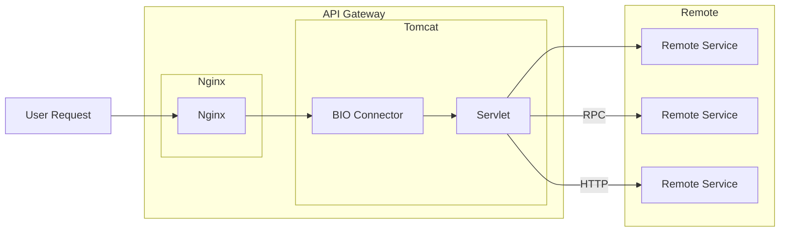
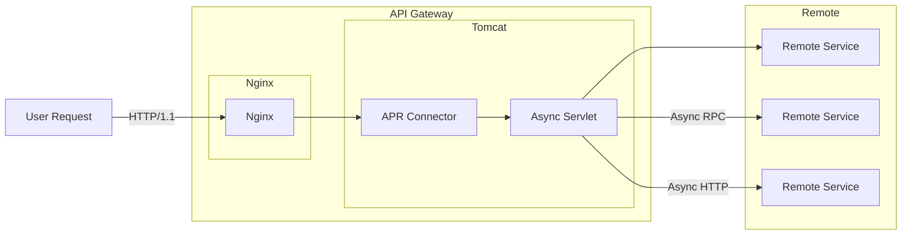
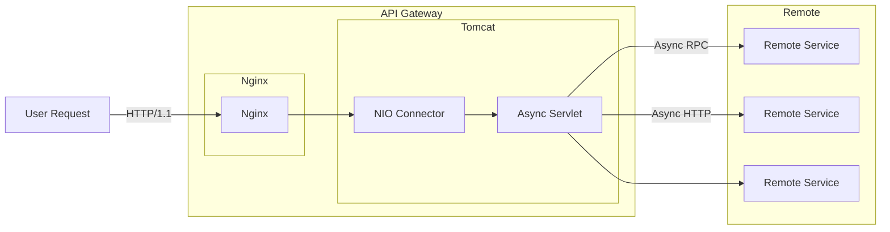
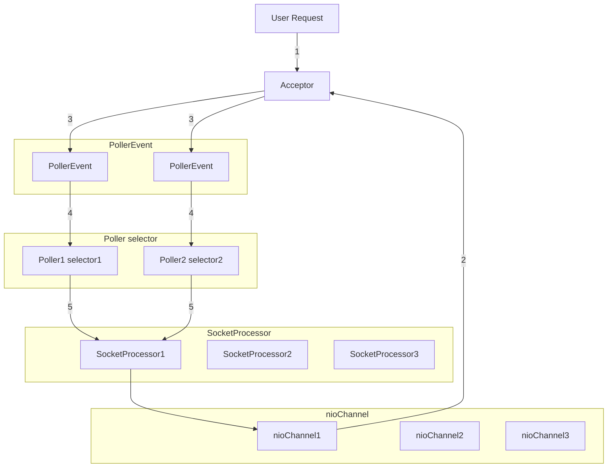

## 一 : BIO + 同步 Servlet

一个请求，一个工作线程，CPU利用率低。

新版本中不再使用

## 二 : APR + 异步 Servlet

APR(Apache Portable Runtime/Apache可移植运行库)，是Apache HTTP服务器的支持库

JNI(Java Native Interface)的形式调用Apache HTTP服务器的核心动态链接库来处理文件读取或网络传输操作

Tomcat默认监听指定路径，如果有APR安装，则自动启用

## 三 : NIO + 异步 Servlet

Tomcat8开始，默认NIO方式

非阻塞读取请求信息，非阻塞处理下一个请求，完全异步

## 四 : NIO 处理流程

1. 接受器接受套接字
2. 接受器从缓存中检索niochannel对象
3. Pollerthread将nioChannel注册到它的选择器I0事件
4. 轮询器将nioChannel分配给一个work线程来处理请求
5. SocketProcessor完成对请求的处理和返回

### 