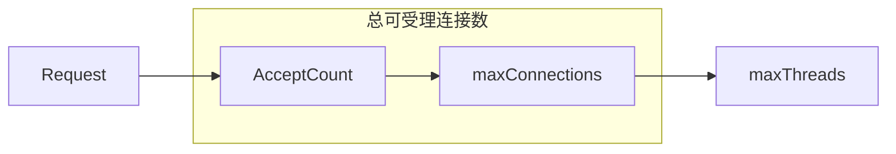
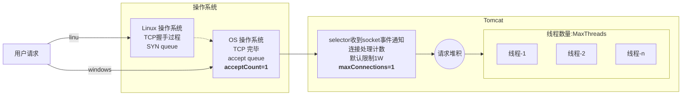
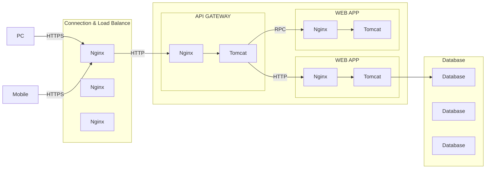

## 一 : 参数调优

| 配置项               | 解释                         | 默认            | 建议 | 注意                                                  |
| -------------------- | ---------------------------- | --------------- | ---- | ----------------------------------------------------- |
| ConnectionTimeout    | 连接超时时间                 | 20s             | 减少 |                                                       |
| maxThreads           | 处理连接的最大线程数         | 200             | 增加 | 不是越大越好                                          |
| acceptCount(backlog) | 等待接受accept的请求数量限制 | 100             | 增加 | socket参数, min(accept, /proc/sys/net/core/somaxconn) |
| maxConnections       | 最大连接处理数               | nio:1w/apr:8192 | 不变 |                                                       |

maxConnections : tomcat能够处理的最大连接数

acceptCount(backlog) : 当请求数超过 `maxConnections` 将会进入操作系统的等待区域 `acceptCount`, 这个值会取 `accept` 和 `/proc/sys/net/core/somaxconn` 中的最小值



### (一) 连接数调整

总共连接数 = acceptCount+ connections

connections： Tomcat能接收的请求限制；

acceptCount： 超过Tomcat能接收的请求数以后，堆积在操作系统的数量(windows 和 linux 略有不同);



**什么时候需要调整connections？如何调整？**

* connections小于maxThread的时候；需要调大；最好是比预期的最高并发数要大20%；例如 MaxThreads = 5000, 则 MaxConnections = 6000
* 反正是堆积到tomcat的work处理线程池中(堆积占内存)；

**什么时候需要调整acceptCount？**

* 想受理更多用户请求，却又不想堆积在tomcat中，利用操作系统来高效的堆积，可以调整为最高并发数 ­ connections；

* 实际上不需要调整，tomcat默认100，linux默认128；最好是把连接控制交给应用程序，这样方便管理。

启动方式： 

```shell
java -jar xxx.jar --server.tomcat.max-connections=1 --server.tomcat.max-thread=1 --server.tomcat.acceptCount=1
```

### (二) 并发处理线程数调整

线程太少，CPU利用率过低，程序的吞吐量变小，资源浪费，容易堆积。

线程太多，上下文频繁切换，性能反而变低。

场景代入：服务器配置2核，不考虑内存问题。收到请求，java代码执行耗时50ms，等待数据返回50ms

那么, **线程数调为多少合适？**

* **理想**的线程数量= (1 + 代码阻塞时间/代码执行时间) * cpu数量

* **实际情况**是跑起代码，压测环境进行调试。不断调整线程数，将CPU打到80~90%的利用率。

启动方式

```shell
java -jar web-demo-1.1.0.jar --server.tomcat.max-threads=500
```


## 二 : 整体架构



如有需要 : 每台机器可以是nginx+tomcat，Nginx负责限流+日志记录


