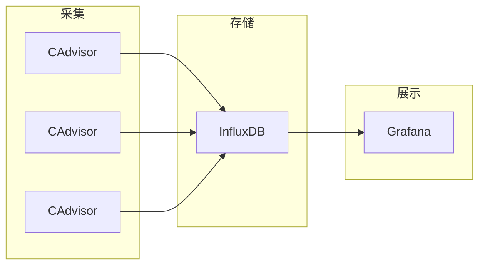

## 一 : 容器监控方案选择

对于容器的监控方案可谓多种多样, 本身自带命令 `docker stats` 命令, Scout, Data Dog, Sysdig Cloud, Sensu Monitoring Framework, CAdvisor 等

通过 `docker stats` 命令可以很方便的看到当前宿主机上所有容器的 CPU, 内存以及网络流量等数据; 但是 `docker stats` 命令的缺点就是统计的只是当前宿主机的所有容器, 而获取的监控数据是实时的, 没有地方存储, 也没有报警功能

```shell
$ docker stats
CONTAINER ID	NAME		CPU %	MEM USAGE / LIMIT		MEM %	NET I/O		BLOCK I/O		PIDS
d0be455d1aed	web			0.41%	109.3MiB / 972.3MiB		11.24%	656B / 0B	0B / 0B			26
a5d8be7fc2e7	redis		0.27%	2.004MiB / 972.3MiB		0.21%	656B / 0B	0B / 0B			5
1eb1fe100c4f	registry	0.07%	6.047MiB / 972.3MiB		0.62%	656B / 0B	39.3MB / 0B		3
```

而 Scout, Sysdig Cloud, Data Dog 虽然都提供了较完善的服务, 但是它们都是托管的服务而且都收费; Sensu Monitoring Framework 集成度较高, 也免费, 但是部署过于复杂; 综合考虑, 我们选择了 CAdvisor 做容器监控工具

CAdvisor 谷歌出品, **优点**是开源产品, 监控指标齐全, 部署方便, 而且有官方的 docker 镜像; **缺点**是集成度不高, 默认只在本地保存 2 分钟数据, 不过可以加上 **InfluxDB** 存储数据, 对接 **Grafana** 展示图表, 比较便利地搭建好了容器监控系统, 数据收集和图标展示效果良好, 对系统性能也几乎没有什么影响




### (一) cAdvisor

CAdvisor 是一个**容器资源监控**工具, 包括容器的内存, CPU, 网络IO, 磁盘IO等监控, 同时提供了一个 WEB 页面用于查看容器的实时运行状态; CAdvisor 默认存储 2 分钟的数据, 而只是针对单物理机; 不过, CAdvisor 提供了很多数据集成接口, 支持 InfluxDB, Redis, Kafka, Elasticsearch 等集成, 可以加上对应配置将监控数据发往这些数据库存储起来

主要功能 :
1. 展示 Host 和 容器两个层次的监控数据
2. 展示历史变化数据

### (二) InfluxDB

InfluxDB 是用 Go 语言编写的一个开源分布式时序, 事件和指标数据库, 无需外部依赖; 由于 CAdvisor 默认只在本地保存最近 2 分钟的数据, 为了持久化存储数据和统一收集展示监控数据, 需要将数据存储到 InfluxDB 中; InfluxDB 是一个**时序数据库**, 专门用于存储时序相关数据, 很适合存储 CAdvisor 的数据; 而且, CAdvisor 本身已经提供了 InfluxDB 的集成方案, 在启动容器时指定配置即可

主要功能 : 
1. 基于时间序列, 支持与事件有关的相关函数(如最大,最小,求和等)
2. 可度量性 : 可以实时对大量数据进行计算
3. 基于事件 : 它支持任意的事件数据

主要特点 :
1. 无结构(无模式)
2. 可以是任意数量的列
3. 可拓展的
4. 支持 min, max, sum, count, mean, median 等一系列函数, 方便统计
5. 原生的 HTTP 支持, 内置 HTTP API
6. 强大的类 SQL 语法
7. 自带管理界面, 方便使用

### (三) Grafana

grafana 是一个开源的数据监控分析可视化平台, 支持多种数据源配置(支持的数据源包括 InfluxDB, MySQL, Elasticsearch, OpenTSDB, Graphite等)和丰富的插件及摹本功能, 支持图表权限控制和报警

主要特性 : 
1. 灵活丰富的图形化选项
2. 可以混合多种风格
3. 支持白天和夜间模式
4. 多个数据源


## 二 : 安装部署

### (一) 部署 InfluxDB

可以使用官方镜像

```shell
$ docker run -d -p 8086:8086 \
-v $PWD/data:/var/lib/influxdb2 \
-v $PWD/config:/etc/influxdb2 \
-e DOCKER_INFLUXDB_INIT_MODE=setup \
-e DOCKER_INFLUXDB_INIT_USERNAME=my-user \
-e DOCKER_INFLUXDB_INIT_PASSWORD=my-password \
-e DOCKER_INFLUXDB_INIT_ORG=my-org \
-e DOCKER_INFLUXDB_INIT_BUCKET=my-bucket \
-e DOCKER_INFLUXDB_INIT_RETENTION=1w \
-e DOCKER_INFLUXDB_INIT_ADMIN_TOKEN=my-super-secret-auth-token \
influxdb
```

当然也可以使用 tutum 提供的镜像

```shell
$ docker run -d -p 8083:8083 -p 8086:8086 \
--volume=/var/influxdb:/data \
-e ADMIN_USER="root" -e INFLUXDB_INIT_PWD="somepassword" -e PRE_CREATE_DB="db1;db2;db3" \
tutum/influxdb
```

### (二) 部署 cAdvisor

谷歌的 cadvisor 可以用于收集 Docker 容器的时序信息, 包括容器运行过程中的资源使用情况和性能数据

```sh
$ docker run -d				# 后台运行此容器
--volume=/:/rootfs:ro \		# 把宿主机的项目目录绑定到容器中, 这些目录都是cadvisor需要采集的目录文件和监控内容
--volume=/var/run:/var/run:ro \
--volume=/sys:/sys:ro \
--volume=/var/lib/docker/:/var/lib/docker:ro \
--volume=/dev/disk/:/dev/disk:ro \
--publish=8080:8080 		# 映射端口 8080
--detach=true \
--privileged=true \
--name=cadvisor \			# 启动容器分配名字cadvisor
google/cadvisor:latest \
-storage_driver=influxdb \	# 需要指定cadvisor的存储驱动,数据库主机,数据库名
-storage_driver_host=influxdb:8086 -storage_driver_db=test \
-storage_driver_user=root -storage_driver_password=root
```

这里说一下储存驱动的参数, [参考文档](https://github.com/google/cadvisor/blob/master/docs/runtime_options.md)

```yaml
--storage_driver="": Storage driver to use. Data is always cached shortly in memory, this controls where data is pushed besides the local cache. Empty means none. Options are: <empty>, bigquery, elasticsearch, influxdb, kafka, redis, statsd, stdout
--storage_driver_buffer_duration="1m0s": Writes in the storage driver will be buffered for this duration, and committed to the non memory backends as a single transaction (default 1m0s)
--storage_driver_db="cadvisor": database name (default "cadvisor")
--storage_driver_host="localhost:8086": database host:port (default "localhost:8086")
--storage_driver_password="root": database password (default "root")
--storage_driver_secure=false: use secure connection with database
--storage_driver_table="stats": table name (default "stats")
--storage_driver_user="root": database username (default "root")
```


访问地址: http://ip:8080, 启动后稍等一会儿在访问, 需要初始化一些配置, 会有点慢

### (三) 部署 Grafana

grafana 一款开源的时序数据分析工具, 而且界面专业易用

```shell
docker run -d --name=grafana -p 3000:3000 grafana/grafana
```

通过 IP + 3000 端口来访问 grafana 的 web 服务, 第一次访问需要修改 admin 的用户密码, 默认用户名/密码为 : admin/admin


## 三 : docker-compose 

### (一) 快速部署

编写 docker-compose.yml

```yaml
version: '3'

volumes:
  grafana_data: {}

networks:
  overlay:

services:
  influxdb:
    image: tutum/influxdb
    environment:
      - ADMIN_USER=root
      - INFLUXDB_INIT_PWD=root
      - PRE_CREATE_DB=cadvisor
    ports:
      - 8083:8083
      - 8086:8086
    volumes:
      - ./data/influxdb:/data
    networks:
      - overlay
  cadvisor:
    image: google/cadvisor
    command: -storage_driver=influxdb -storage_driver_db=cadvisor -storage_driver_host=influxdb:8086
    ports:
      - 8080:8080
    volumes:
      - /:/rootfs:ro
      - /var/run:/var/run:ro
      - /sys:/sys:ro
      - /var/lib/docker/:/var/lib/docker:ro
      - /dev/disk/:/dev/disk:ro
    networks:
      - overlay
  grafana:
    image: grafana/grafana
    ports:
      - 3000:3000
    volumes:
      - grafana_data:/var/lib/grafana
    networks:
      - overlay
```

启动

```shell
$ docker-compose up -d
```

### (二) 使用示例

登录 grafana

| 选项 | 内容             |
| ---- | ---------------- |
| 地址 | http://{IP}:3000 |
| 账号 | admin            |
| 密码 | admin            |

配置 influxdb

| 选项     | 内容                 |
| -------- | -------------------- |
| URL      | http://influxdb:8086 |
| Database | cadvisor             |
| User     | root                 |
| Password | root                 |

配置仪表盘

| 选项        | 内容                              |
| ----------- | --------------------------------- |
| Data Source | InfluxDB                          |
| FROM        | memory_usage                      |
| WHERE       | container_name=monitor-cadvisor-1 |
| ALIAS       | cadvisor 内存使用情况             |

