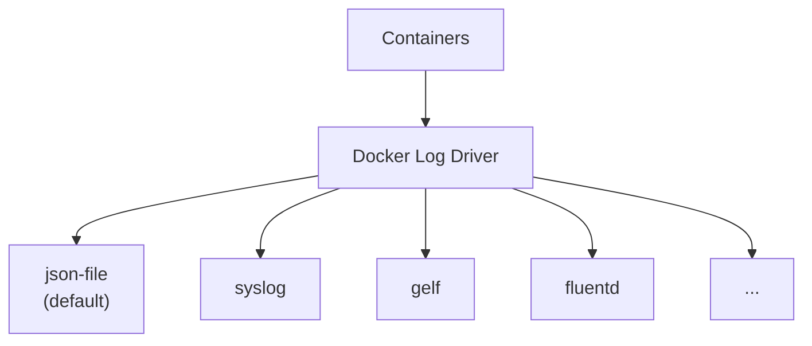

## 一 : Docker 日志

### (一) 日志处理机制

当启动一个容器的时候, 它其实是 docker daemon 的一个子进程, docker daemon 可以拿到你容器里面进程的标准输出, 拿到标准输出后, 它会通过自身的一个 LogDriver 模块来处理, LogDriver 支持的方式很多, 可以写到本地的文件(默认方式), 可以发送到 syslog 等。



Docker 会默认收集容器的标准输出存储到一个 json.log 文件中, 文件格式如下所示

```json
{"log":"Log line is here\n","stream":"stdout","time":"2019-01-01T11:11:11.111111111Z"}
```

以一行一个作为一条 JSON 数据存储; Docker 的这种日志存储方式是可以配置的, 具体参数可以在执行 run 启动容器的时候通过 log-driver 进行配置, 具体配置请参考 [log-driver](https://docs.docker.com/config/containers/logging/configure/#supported-logging-drivers)。

Docker 默认使用了 json-file 作为 log driver, 而 gelf 则是我们需要使用的 log driver。

### (二) gelf 驱动

gelf 驱动是一个被许多工具理解的实用格式, 例如 Graylog, Logstash 和 Fluentd。许多工具都使用这种格式。

可以通过 daemon.json 进行配置使用

```json
{
  "log-driver": "gelf",
  "log-opts": {
    "gelf-address": "udp://1.2.3.4:12201"
  }
}
```

也可以通过命令行进行配置

```sh
$ docker run \
--log-driver gelf --log-opt gelf-address=udp://1.2.3.4:12201 \
alpine echo hello world
```

**注意 :** gelf-address 为 gelf 服务的地址, **必填**; tcp 和 udp 是唯一支持的标识符; 同时必须指定端口号。


## 二 : Graylog

### (一) 概述

当容器多了, 或者是采用类似 swarm 集群部署 Docker 的时候, 各种日志分散存在各个 json.log 文件中, 当查找问题或者进行相关统计的时候, 分散的日志对我们来说是非常不友好的; 我们需要一个能够集中管理 Docker 日志的工具。

相信大部分的人都用过或者听说过 ELK 这个强大的日志栈架构, 我们要用的 graylog 和 ELK 非常的相似, 算是后起之秀。

**为什么**要选择 graylog 来作为 Docker 的日志收集平台呢 ? 

* Docker 原生支持 graylog 协议, 直接将日志发送到 graylog (通过 gelf 协议)
* graylog 官方提供了将本身部署在 Docker 的支持

### (二) 安装部署

在这个 Docker Hub 中, 搜索 graylog 即可看到 graylog/graylog 的镜像, 也可以查看 graylog 的[官方文档](https://go2docs.graylog.org/5-0/downloading_and_installing_graylog/docker_installation.htm)。

当然只有 graylog 是不够的, 还需要 MongoDB, Elasticsearch 配合使用, 官方提供了 docker-compose.yml 模板, 复制下来即可

```yaml
version: '3'
services:
  # MongoDB: https://hub.docker.com/_/mongo/
  mongo:
    image: mongo:5.0.13
    networks:
      - graylog
  # Elasticsearch: https://www.elastic.co/guide/en/elasticsearch/reference/7.10/docker.html
  elasticsearch:
    image: docker.elastic.co/elasticsearch/elasticsearch-oss:7.10.2
    environment:
      - http.host=0.0.0.0
      - transport.host=localhost
      - network.host=0.0.0.0
      - "ES_JAVA_OPTS=-Dlog4j2.formatMsgNoLookups=true -Xms512m -Xmx512m"
    ulimits:
      memlock:
        soft: -1
        hard: -1
    deploy:
      resources:
        limits:
          memory: 1g
    networks:
      - graylog
  # Graylog: https://hub.docker.com/r/graylog/graylog/
  graylog:
    image: graylog/graylog:5.0
    environment:
      # CHANGE ME (must be at least 16 characters)!
      - GRAYLOG_PASSWORD_SECRET=somepasswordpepper
      # Password: admin
      - GRAYLOG_ROOT_PASSWORD_SHA2=8c6976e5b5410415bde908bd4dee15dfb167a9c873fc4bb8a81f6f2ab448a918
      - GRAYLOG_HTTP_EXTERNAL_URI=http://127.0.0.1:9000/
      # 默认UTC,需要修改时区Etc/GMT-8,不然时间对不上
      - GRAYLOG_ROOT_TIMEZONE=Etc/GMT-8
    entrypoint: /usr/bin/tini -- wait-for-it elasticsearch:9200 -- /docker-entrypoint.sh
    networks:
      - graylog
    restart: always
    depends_on:
      - mongo
      - elasticsearch
    ports:
      # Graylog web interface and REST API
      - 9000:9000
      # Syslog TCP
      - 1514:1514
      # Syslog UDP
      - 1514:1514/udp
      # GELF TCP
      - 12201:12201
      # GELF UDP
      - 12201:12201/udp
networks:
  graylog:
    driver: bridge
```

启动容器

```sh
$ docker-compose up
```

访问 : http://{IP}:9000, 会看到 graylog 的 web 界面, 使用 admin/admin 来登录后台, 至此部署完成

### (三) 自定义配置

有时候需要修改 graylog 的参数, 可以使用 配置环境变量或者是修改配置文件, 详情参考[官方文档](https://go2docs.graylog.org/5-0/downloading_and_installing_graylog/docker_installation.htm#Configuration)。推荐挂载配置文件

下载配置文件

```sh
# 创建目录
$ mkdir -p ./graylog/config
# 进入目录下载配置文件
cd ./graylog/config
wget https://raw.githubusercontent.com/Graylog2/graylog-docker/5.0/config/graylog.conf
wget https://raw.githubusercontent.com/Graylog2/graylog-docker/5.0/config/log4j2.xml
```

修改配置文件

```sh
# 修改root_timezone为GMT+0800中国时区
$ vim graylog.conf
root_timezone=Etc/GMT-8
```

挂载配置文件所在文件夹

```yaml
graylog:
  image: graylog/graylog:5.0
	# Other settings [...]
  volumes:
	# Mount local configuration directory into Docker container
    - ./graylog/config:/usr/share/graylog/data/config
```

### (四) 数据持久化

为了把记录数据进行持久化, 可以通过外部数据卷来进行存储数据, 当容器重新启动后, 可以继续使用之前的数据, 详情参考[官方文档](https://go2docs.graylog.org/5-0/downloading_and_installing_graylog/docker_installation.htm#PersistingData)。

```yaml
mongodb:
  volumes:
    - mongo_data:/data/db
elasticsearch:
  volumes:
    - es_data:/usr/share/elasticsearch/data
graylog:
  volumes:
    - graylog_data:/usr/share/graylog/data

volumes:
  mongo_data:
    driver: local
  es_data:
    driver: local
  graylog_data:
    driver: local
```


## 三 : 使用实例

### (一) graylog 配置

1. graylog 的日志收集通过定义 input 对象来完成, 在 graylog 的 web 管理界面进入 System => inputs 对象配置
2. 选择 GELF UDP 协议, Launch new input
3. 随便起个名字填到 Title 里即可

### (二) docker 配置

如果 docker 通过命令行启动, 可以在 run 命令中加如下参数 :

```sh
# docker run --log-driver=gelf \
# --log-opt gelf-address=udp://{graylog服务器地址}:12201 \
# --log-opt tag=<当前容器服务标签,用来共graylog查询的时候进行分类> <image> <运行命令>
$ docker run -d \
--log-driver=gelf \
--log-opt gelf-address=udp://localhost:12201 \
--log-opt tag="{{.ImageName}}/{{.Name}}/{{.ID}}" \
busybox \
sh -c 'while true;do echo "Hello World !";sleep 10; done;'
```

如果通过 docker-compose 命令, 则可以在 docker-compose.yml 中加入相关配置, 以下用 nginx 容器举例 :

```yaml
version: '2'
services:
  nginx:
    image: nginx:latest
    ports:
      - "80:80"
    logging:
      driver: "gelf"
      options:
        gelf-address: "udp://localhost:12201"
        tag: front-nginx
```

