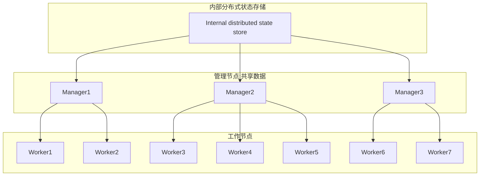
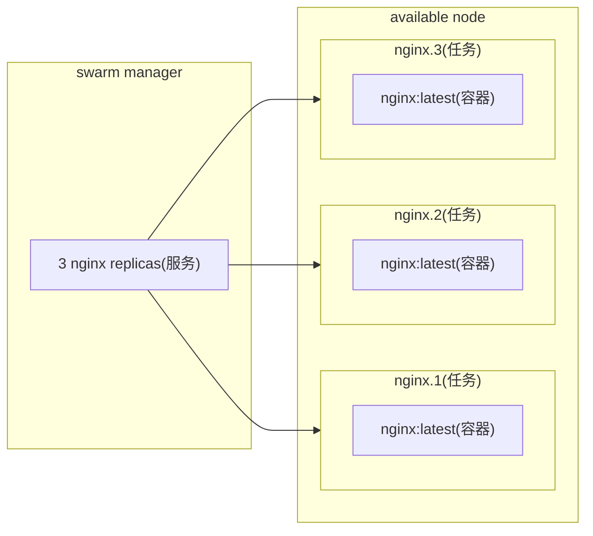

## 一 : Swarm 概述

Docker Swarm 是 Docker 官方三剑客项目之一, 提供 Docker 容器集群服务, 是 Docker 官方对容器云生态进行支持的核心方案。

使用它, 用户可以将多个 Docker 主机封装为单个大型的虚拟 Docker 主机, 快速打造一套容器云平台。

注意 : Docker 1.12.0+ Swarm mode 已经内嵌入 Docker 引擎, 成为了 docker 子命令 docker swarm, 绝大多数用户已经开始使用 Swarm mode, Docker 引擎 API 已经删除 Docker Swarm。

Swarm 是使用 SwarmKit 构建的 Docker 引擎内置(原生)的集群管理和编排工具, 使用 Swarm 集群之前需要了解以下几个概念

### (一) 节点

运行 Docker 的主机可以主动初始化一个 Swarm 集群或者加入一个已存在的 Swarm 集群, 这样这个运行 Docker 的主机就成为一个 Swarm 集群的节点(node)

节点分为管理(manager)节点和工作(worker)节点
* **管理节点 :** 用于 Swarm 集群的管理, docker swarm 命令基本只能在管理节点执行
* **工作节点 :** 是任务执行节点, 管理节点将服务(service)下发至工作节点执行

集群中管理节点与工作节点的关系



### (二) 服务和任务

**任务(Task) :** 是 Swarm 中的最小的调度单位, 目前来说就是一个单一的容器

**服务(Services) :** 是指一组任务的集合, 服务定义了任务的属性; 服务有两种模式, 通过 docker service create 的 `--mode` 参数指定

* replicated services : 按照一定规则在各个工作节点上运行指定个数的任务
* global services : 每个工作节点上运行一个任务

容器, 任务, 服务的关系




## 二 : Swarm 使用

### (一) 创建 swarm 集群

>  目标 : 创建一个最小 swarm 集群(包含1个管理节点和2个工作节点)

**1: 集群初始化,** 执行docker swarm init命令的节点自动成为<u>管理节点</u>

```shell
# 如果你的Docker主机有多个网卡,拥有多个IP,必须使用--advertise-addr指定 IP
$ docker swarm init --advertise-addr 10.0.0.20
# 初始化完成后会输出加入工作节点的指令,也可以使用命令查看
$ docker swarm join-token worker
```

**2: 增加工作节点,** 在另外两条服务器上执行上一步创建管理节点时候的输出的加入 swarm 集群的命令

```shell
$ docker swarm join \
--token SWMTKN-1-28fc7j6gm3q6nyw8oepkjqszxd3kighqdqnn18e0gr260ejo1b-7xos9uw9zcrxg44wk5dmdg88d \
10.0.0.20:2377
```

**3: 查看集群,** 在管理节点使用 docker node ls 来查看集群

```shell
$ docker node ls
```


### (二) 部署服务

>  使用 docker service 命令来管理 Swarm 集群中的服务, 该命令只能在管理节点运行

**1: 新建服务,** 在创建好的 Swarm 集群中运行一个名为 nginx 服务

```shell
$ docker service create --replicas 3 -p 80:80 --name nginx nginx:latest
# 短格式可能不会监听ipv4的端口,用长格式[mode=host],published=<externport>,target=<internport>
# 这里说明一下mode的取值: mode=[ingress|host]
## ingress把端口映射到整个swarm的网络,从而访问swarm网络的任何一台主机都可以,即使这台主机没有容器运行
## host只把端口映射到service的container所在运行的主机，其他主机就不能访问
$ docker service create -p mode=host,published=8888,target=80 --replicas 3 --name nginx nginx
# 访问http://{输入任意节点IP},即可看到 nginx 默认页面
```

**2: 查看服务**

```sh
# 查看当前Swarm集群运行的服务
$ docker service ls
# 查看某个服务的详情
$ docker servcie ps nginx
# 查看某个服务的日志
$ docker service logs nginx
```

**3: 删除服务**

```shell
# 移除某个服务
$ docker service rm nginx
```


## 三 : portainer 

Swarm 可以快速搭建一个最小集群, 也可以在集群上部署服务, 但并没有提供统一入口查看节点的资源使用情况; portainer 提供了一个图形化管理工具来帮我们管理 swarm 集群。

Portainer 是 Docker 的**图形化管理工具**, 提供状态显示面板, 应用模块快速部署, 容器镜像网络数据卷的基本操作(包括上传下载镜像, 创建容器等操作), 事件日志显示, 容器控制台操作, swarm 集群和服务等集中管理和操作, 登录用户管理和控制等功能, 功能十分全面, 基本能满足中小型单位对容器管理的全部需求。

### (一) portainer 集群运行

在管理节点下载 portainer 镜像

```shell
$ docker search portainer
$ docker pull portainer/portainer
```

安装 portainer

```shell
$ docker run -d -p 9000:9000 \
--name portainer \
--restart=always \
-v /var/run/docker.sock:/var/run/docker.sock \
portainer/portainer
```

### (二) portainer 配置

访问地址: http://{ip}:9000

需要初始化账号密码

```yaml
账号: admin
密码: Admin@123456
```

点击菜单栏 Home 即可查看本机环境, 选择 Environments 中的 local 项, 在选择左侧菜单中的 Swarm 选项, 即可查看服务情况


## 四 : 快速扩容

### (一) 命令方式

在创建好的 Swarm 集群中运行一个名为 nginx 服务, 并使用 `--replicas` 参数指定启动的副本数

```shell
$ docker service create --replicas 3 -p 80:80 --name nginx nginx:latest
```

其实还可以先创建服务, 然后再进行扩容

```shell
# 创建服务
$ docker service create -p 80:80 --name nginx nginx:latest
# 扩容为3个
$ docker service scale nginx=3
# 查看副本情况
docker service ls 
```


### (二) portainer 方式

在左侧菜单栏中的 Service 选项可以创建服务且更改副本数量, 只需要简单填写一下信息即可, 例如:

| 项目         | 内容                |
| ------------ | ------------------- |
| Name         | nginx               |
| Image        | nginx:latest        |
| Replicas     | 3                   |
| Port mapping | 8888 => 80 TCP HOST |

至于调整副本数量就更简单了在 Service 列表中的 Scheduling Mode 列点击 `Scale` 即可, 例如将副本数改成 1 个, 分别访问可以发现只有一个服务可以被访问到