## 一 : 消息中间件概述

单体架构

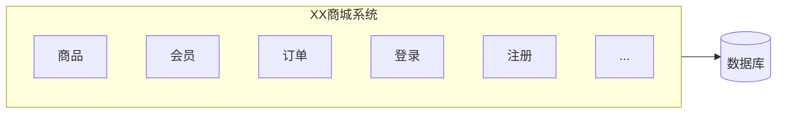

分布式系统架构 : 一个请求后台多系统协同处理

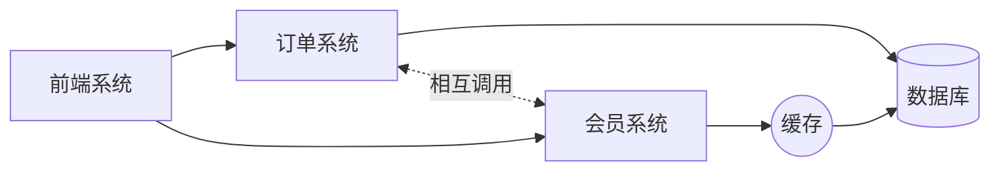

基于消息中间件的分布式系统架构

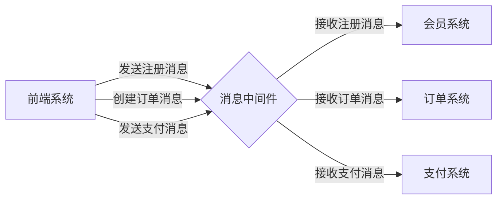

### (一) 什么是消息中间件

什么是消息中间件
- 利用高效可靠的消息传递机制进行平台无关的数据交流;
- 并基于数据通信来进行分布式系统的集成;
- 通过提供消息传递和消息排队模型, 它可以在分布式环境下扩展进程间的通信

消息中间件的应用场景
- 跨系统数据传递
- 高并发流量削峰
- 数据异步处理...等等

常用的消息中间件

- ActiveMQ, RabbitMQ, kafka, RocketMQ

### (二) 消息中间件核心设计

- 本质
  - 一种具备接收请求, 保存数据, 发送数据等功能的网络应用
  - 和一般网络应用程序的区别是它主要负责数据的接收和传递, 所以性能一般都高于普通程序
- 5大核心组成
  - 协议
  - 持久化机制
  - 消息分发机制
  - 高可用设计
  - 高可靠设计

## 二 : 协议

### (一) 协议是什么

协议是计算机之间通信时共同遵从的一组约定, 都遵守相同的约定, 计算机之间才能相互交流; 

是对数据格式和计算机之间交换数据时必须遵守的规则的正式描述

**协议三要素 :** 

1. 语法 : 即数据与控制信息的结构或格式
2. 语义 : 即需要发出何种控制信息, 完成何种动作以及做出何种响应
3. 时许(同步) : 即事件实现顺序的详细说明

**举例 : Http 协议** 

1. 语法 : http 规定了请求报文和响应报文的具体格式
2. 语义 : 客户端主动发起的操作称为请求
3. 时序 : 一个请求对应一个响应

### (二) 消息中间件常见协议

**OpenWire :** Apache的一种跨语言的协议, 允许从不同的语言和平台访问ActiveMQ, 是ActiveMQ 4.x以后的版本默认的传输协议。

**AMQP :** Advanced Message Queuing Protocol, 高级消息队列协议, 2004 年 JPMorgan Chase (摩根大通集团)联合其他公司共同设计

* **特性 :** 事务支持, 持久化支持, 出生金融行业, 在可靠性消息处理上具备天然的优势
* 代表产品 : ActiveMQ, RabbitMQ

**MQTT :** Message Queuing Telemrtry Transport, 消息队列遥测传输, 是IBM开发的一个即时通讯协议, 物联网系统架构中的重要组成部分

- **特性 :** 轻量, 结构简单, 传输快, 没有事务支持, 没有持久化相关设计
- **应用场景 :** 适用于计算能力有限, 低带宽, 网络不稳定的场景
- 代表产品 : ActiveMQ, RabbitMQ

**Kafka :** 基于 TCP 的二进制协议; 消息内部是通过长度来分割, 由一些基本数据类型组成

- **特性 :** 结构简单, 解析快, 无事务设计, 有持久化设计

**OpenMessage :** 近一两年由阿里发起, 与雅虎, 滴滴出行, Streamlio 等公司共同参与创立的分布式消息中间件, 流处理领域的应用开发标准; 是**国内首个**在全球范围内发起的分布式消息领域国际标准

- **特性 :** 结构简单, 解析快, 有事务设计, 有持久化设计
- 代表产品 : Apache RocketMQ

### (三) 问题 

**为什么消息中间件不直接使用 Http 协议 ?**

1. 首先 http 的内容很多,请求报文和响应报文很复杂
2. http 大部分情况都是短连接, 不利于消息中间件的场景, 消息中间件要求客户端长期的获取信息或者是往消息中间件中发送数据

## 三 : 消息分发

### (一) 为什么要有消息分发策略

**业务场景一 :** 前台系统创建订单, 然后传递数据到消息中间件, 那这条消息要给后端的哪个系统呢? 因为一个消息中间件会有多个子系统进行连接, 这个时候就**需要有消息分发策略, 根据什么策略将消息分发给一个正确的系统**; 例如订单系统要接收订单消息, 而购物车系统和用户系统就不需要接收

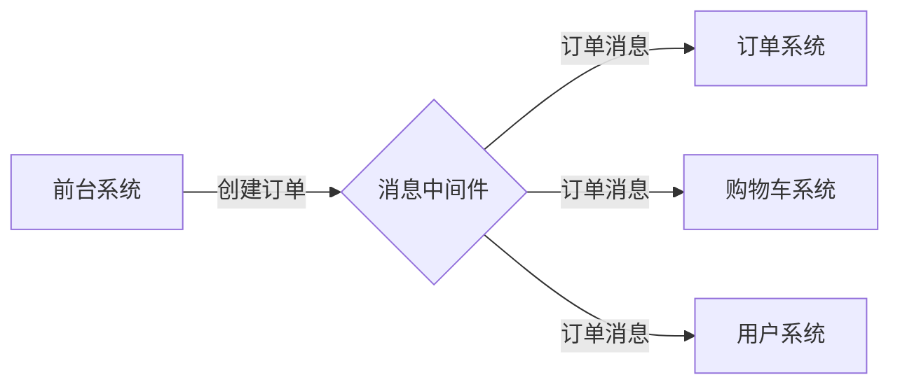

**业务场景二 :** 下了订单要支付, 支付会有一个支付成功或者失败的消息, 支付失败之后, 可能由于支付系统处理发生失败, 这个时候需要有重试的机制, 我们要求**不仅可以正确的分发, 还要求能够支持重发**

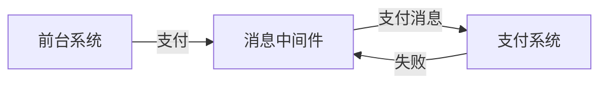

### (二) 常用的消息中间件分发策略

发布订阅, 轮询分发, 公平分发, 重发, 消息拉取

|          | ActiveMQ | RabbitMQ | Kafka | RocketMQ |
| -------- | -------- | -------- | ----- | -------- |
| 发布订阅 | 支持     | 支持     | 支持  | 支持     |
| 轮询分发 | 支持     | 支持     | 支持  | /        |
| 公平分发 | /        | 支持     | 支持  | /        |
| 重发     | 支持     | 支持     | /     | 支持     |
| 消息拉取 | /        | 支持     | 支持  | 支持     |

## 四 : 持久化

### (一) 持久化是什么

简单来说就是数据存入磁盘, 而不是存在内存中随服务重启而消失, 使数据能够永久保存叫做持久化

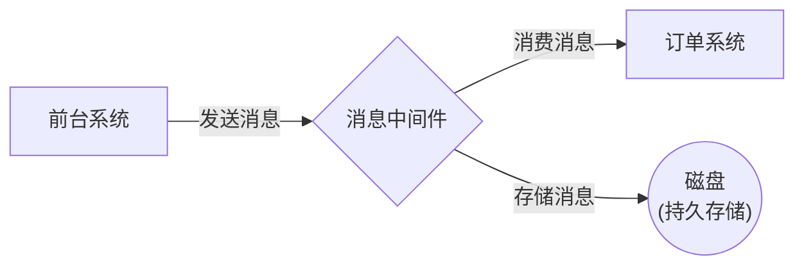

### (二) 常用持久化方式

文件系统和数据库, 举例说明

|          | ActiveMQ | RabbitMQ | Kafka | RocketMQ |
| -------- | -------- | -------- | ----- | -------- |
| 文件系统 | 支持     | 支持     | 支持  | 支持     |
| 数据库   | 支持     | /        | /     | /        |

## 五 : 高可用

### (一) 高可用机制

**高可用性**是指产品在规定的条件和规定的时刻或时间区间内处于可执行规定功能状态的能力

当业务量大时, 一台消息中间件服务器可能无法满足需求, 所以需要消息中间件能够集群部署, 来达到高可用的目的

### (二) 实现方式

Master-Slave 主从共享数据的部署方式

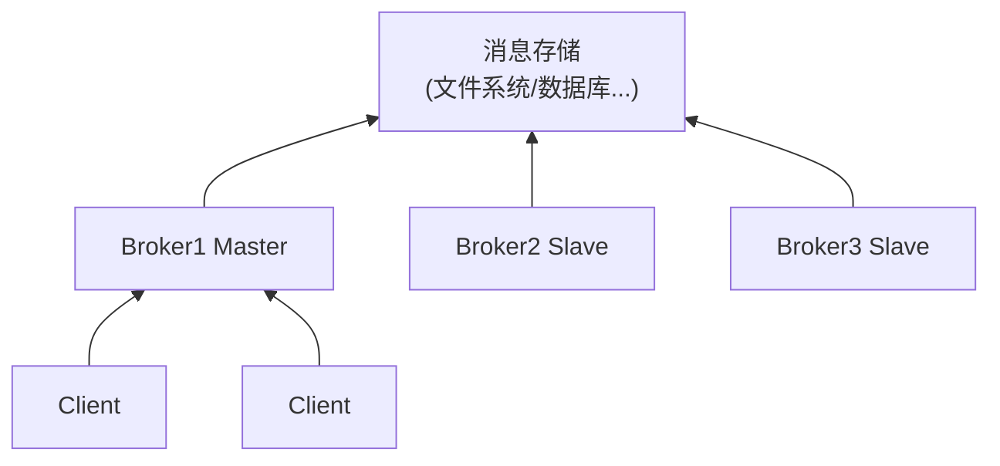

Master-Slave 主从同步部署方式

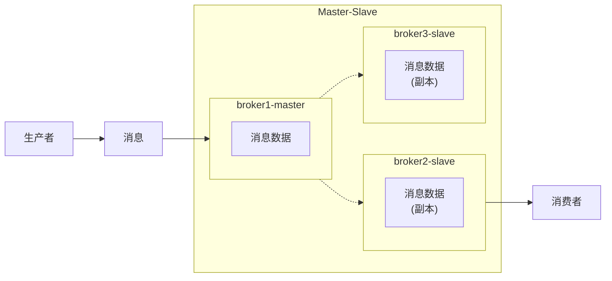

Broker-Cluster 多主集群同步部署方式

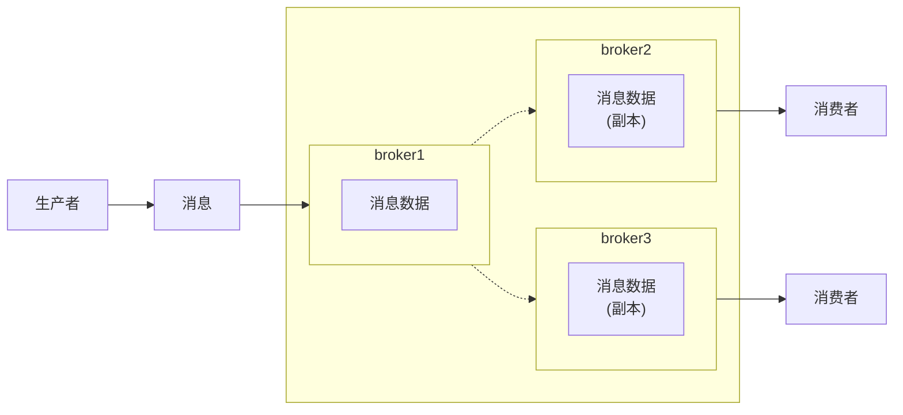

Broker-Cluster 多主集群转发部署方式

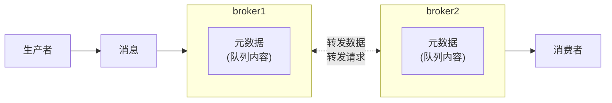

Master-Slave 与 Broker-Cluster 结合

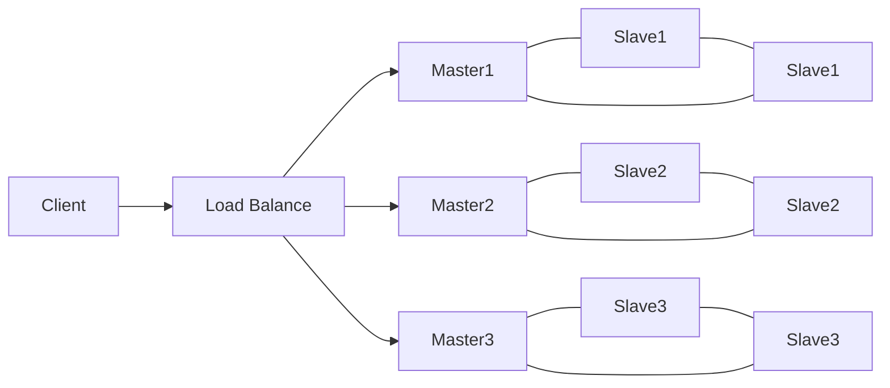

## 六 : 高可靠

**高可靠性**是指系统可以无故障持续运行; 比如一个系统从来不崩溃, 报错, 或者崩溃, 报错的几率极低, 那就是高可靠

在高并发业务场景下, 如果不能保证系统的高可靠, 那造成的损失将会非常严重

保证消息中间件的高可靠性, 可以从以下几方面考虑 : 
- **消息传输可靠 :** 通过协议来保证系统间数据解析的正确性
- **消息存储可靠 :** 通过持久化来保证消息的存储可靠性

