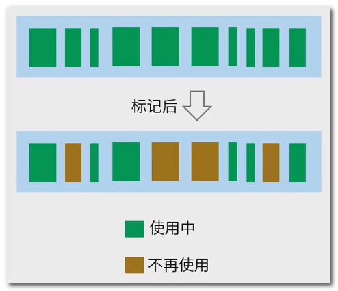
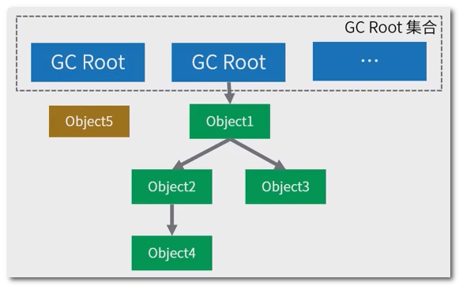
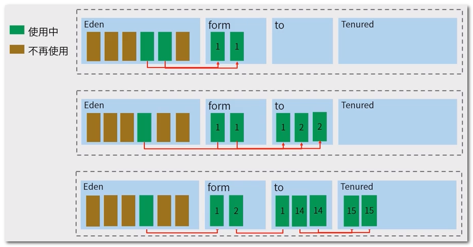
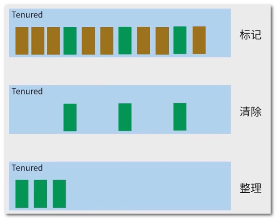
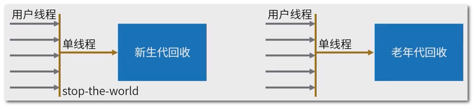
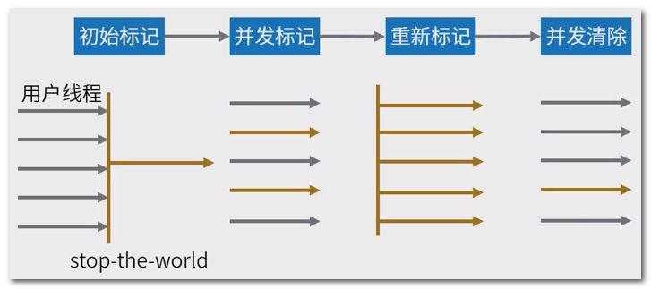
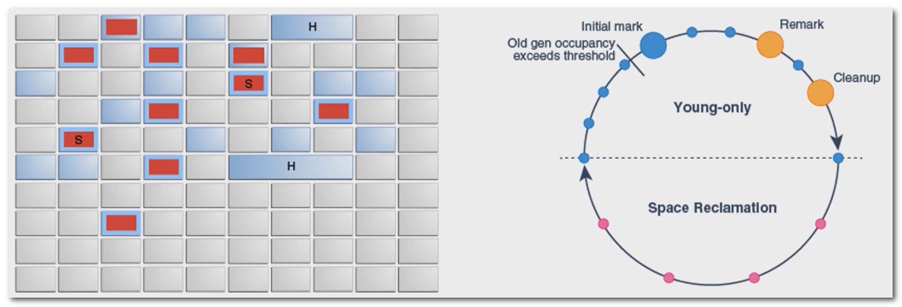
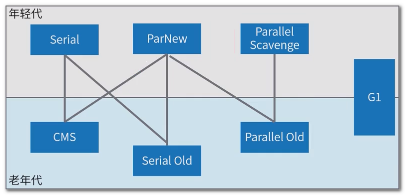

## 一 : 自动垃圾收集

自动垃圾收集是查看堆内存, 识别哪些对象**正在使用**以及哪些对象**未被删除**以及**删除**未使用对象的过程

使用中的对象或引用的对象意味着程序的某些部分仍然维护指向该对象的指针; 程序的任何部分都不再引用未使用的对象或未引用的对象, 因此可以回收未引用对象使用的内存

例如 : 像 C 这样的编程语言中, 分配和释放内存是一个**手动过程**; 在 java 中, 解除分配内存的过程由**垃圾收集器**自动处理

## 二 : 如何确定内存需要被回收

该过程的第一步称为**标记**; 这是垃圾收集器识别哪些内存正在使用而哪些不在使用的地方

 

**不同类型内存的判断方法**

- 对象回收 : <u>引用计数</u>, 简单来说就是引用一次就加1, 用完之后就减1, java中很少用, 会造成循环引用的问题
- 对象回收 : **可达性算法**
- 方法区回收

## 三 : 可达性分析算法

简单来说, 将对象及其引用关系看作一个图, 选定**活动的对象**作为 GC Roots, 然后跟踪引用链条, 如果一个对象和 GC Roots 之间不可达, 也就是不存在引用, 那么即可认为是可回收对象

 

**可以作为 GC Root 的对象 :**

1. 虚拟机栈中正在引用的对象
2. 本地方法栈中正在引用的对象
3. 静态属性引用的对象
4. 方法区常量引用的对象

## 四 : 引用类型和可达性级别

**引用类型**

1. 强引用(StrongReference) : 最常见的普通对象(new Object())引用, 只要还有强引用指向一个对象, 就不会回收
2. 软引用(SoftReference) : JVM 认为内存不足时, 才会去试图回收软引用指向的对象(缓存场景)
3. 弱引用(WeakReference) : 虽然是引用, 但随时可能被回收掉
4. 虚引用(Phantom) : 不能通过它访问对象, 关联对象被 finalized 以后, 执行指定逻辑的机制(Cleaner)

**可达性级别**

1. 强可达(Strongly Reachable) : 一个对象可以有一个或多个线程可以不通过各种引用访问到的情况
2. 软可达(Softly Reachable) : 就是当我们只能通过软引用才能访问到对象的状态
3. 弱可达(Weakly Reachable) : 只能通过弱引用访问时的状态; 当弱引用被清除的时候, 就符合销毁条件
4. 幻象可达(Phantom Reachable) : 不存在其他引用, 并且 finalize 过了, 只有幻象引用指向这个对象
5. 不可达(unreachable) : 意味着对象可以被清楚了

## 五 : 垃圾收集算法

**标记-清除 (Mark-Sweep) 算法** : 

* 首先标识出所有要回收的对象, 然后进行清除; 
* 标记清除过程效率有限, 有内存碎片化问题, 不适合特别大的堆; 
* 收集算法基本基于**标记-清除**的思路进行改进

**复制 (Copying) 算法 :** 

* 划分两块同等大小的区域, 收集时将活着的对象复制到另一块区域; 原区域清空
* 拷贝过程中将对象顺序放置, 就可以避免内存碎片化; 
* 复制 + 预留内存, 有一定的浪费

**标记整理(Mark-Compact) :** 

* 类似于**标记-清除**, 但为避免<u>内存碎片化</u>, 它会在清理过程中将**对象移动**, 以确保移动后的对象占用连续的内存空间
* 避免内存碎片化

## 六 : 分代收集

根据对象的存活周期, 将内存划分为几个区域(Eden, form, to, Tenured), 不同区域菜哦也能够合适的垃圾收集算法

新对象会分配到 Eden, 如果超过`-XX:+PrentenureSizeThreshold:` 设置大对象直接进入老年代(Tenured)的阈值

新生代采用**复制算法** : Eden 中的对象经过一次 GC 后, 如果未回收则 Copy 进入 form; 第二次 GC 后, 将 Eden 和 form 中的对象统一 Copy 到 to; 第三次 GC 后, 将 Eden 和 to 中的对象 Copy 到 form 中; GC 一定次数未回收对象移动到老年代 `(-XX:MaxTenuringThreshold)`

 

老年代采用**标记整理** : 标记 => 清除 => 整理

 

## 七 : 垃圾收集器

### (一) 串行收集器 

**Serial GC :** `-XX:+UseSerialGC`

- 单个线程来执行所有垃圾收集工作, 适合单处理器设备
- **Client 模式下 JVM 的默认选项**

**Serial Old GC :** `-XX:+UseSerialOldGC`

- 可以在老年代使用, 它采用了标记整理(Mark-Compact)算法, 区别于新生代的复制算法



### (二) 并行收集器

**Parallel GC :** `-XX:+UseParallelGC`

**Parallel Old GC :** `-XX:+UseParallelOldGC`

<u>server 模式 JVM 的默认 GC 选项</u>, 整体算法和 Serial 比较相似, 区别是新生代和老年代 GC 都是并行进行; 可以设置 GC 时间或吞吐量等值, 可以自动进行适应性调整 Eden, Survivor 大小和 MaxTenuringThreshold 的值

也称为吞吐量优先的 GC : 吞吐量 = 用户代码运行时间/(用户代码运行时间 + GC 停顿时间)

```shell
-XX:ParallelGCThreads : 设置用于垃圾回收的线程数;通常情况下可以和CPU数量相等
-XX:MaxGCPauseMills : 设置最大垃圾收集停顿时间;它的值是一个大于0的整数;只能尽量满足这个值
-XX:GCTimeRatio : 设置吞吐量大小,它的值是一个0~100之间的整数
-XX:+UseAdaptiveSizePolicy : 打开自适应GC策略;以达到在堆大小,吞吐量和停顿时间之间的平衡点;默认开启
```

### (三) 并发收集器

**CMS (Concurrent Mark Sweep) GC :** `-XX:+UseConcMarkSweepGC`

- 专用**老年代**, 基于标记清除(Mark-Sweep)算法, 设计目标是尽量减少停顿时间
- 采用的标记清除算法, 存在着内存碎片化问题, 长时间运行等情况下发生 full GC, 导致恶劣的停顿
- CMS 会占用更多的 CPU 资源, 并和用户线程争抢
- 减少了停顿时间, 这一点对于互联网 web 等对时间敏感的系统非常重要, 一直到今天, 仍然有很多系统使用 CMS GC

 

### (四) 其他

**ParNew GC :** `-XX:+UseParNewGC`

- 并行收集器
- **新生代** GC 实现, 它实际是 Serial GC 的多线程版本
- 可以控制线程数量, 参数 : `-XX:ParallelGCThreads`
- 最常见的**应用场景**是配合老年代的 CMS GC 工作; 参数 : `-XX:=UseConcMarkSweepGC`

 

**G1 GC :** `-XX:+UseG1GC`

- 并发收集器
- 针对大堆内存设计的收集器, 兼顾吞吐量和停顿时间, JDK9 后默认选型, 目标是替代 CMS;
- G1 将堆分成固定大小的区域, Region 之间是复制算法, 但整体上实际可看作是标记整理(Mark-Compact)算法, 可以有效地避免内存碎片; 

* 红色新生代(Eden和Surivor)，淡蓝色老年代。找不到大内存时执行FullGC



## 八 : 垃圾收集器组合

 

常用选择

1. 默认选择: Parallel Scavenge + Parallel Old
2. 常用选择: ParNew + CMS
3. 激进选择: G1