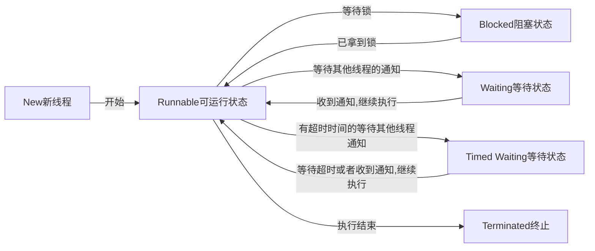

## 一 : 状态定义 

定义位置 : java.lang.Thread.State

线程状态 : 新建, 可运行, 阻塞, 等待, 超时等待, 终止
* **New** : 尚未启动的线程的线程状态
* **Runnable** : 可运行线程的线程状态, 等待CPU调度
* **Blocked** : 线程阻塞, **等待监视器锁定**的线程状态; 处于 synchronized 同步代码块或方法中被阻塞
* **Waiting** : 等待线程的线程状态; 不带超时的方式(Object.wait, Thread.join, LockSupport.park)
* **Time Waiting** : 具有指定等待时间的等待线程的线程状态; 带超时的方式(Thread.sleep, Object.wait, Thread.join, LockSupport.parkNanos, LockSupport.parkUntil)
* **Terminated** : 终止线程的线程状态; 线程正常完成执行或者出现异常

## 二 : 线程状态切换

这 6 种状态在一定条件下会发生转换



* `New` 新线程通过调用 `start` 进入 `Runnable` 可运行状态
* `Runnable` 可运行状态在**等待锁**的时候会进入 `Blocked` 阻塞状态; 一旦拿到锁, 便会从 `Blocked` 阻塞状态进入 `Runnable` 可运行状态
* `Runnable` 可运行状态在**等待其他线程的通知时**会进入 `Waiting` 等待状态; 一旦收到通知,继续执行时, 便会从 `Waiting` 等待状态进入 `Runnable` 可运行状态
* `Runnable` 可运行状态在**有超时时间的等待其他线程的通知时**会进入 `Time Waiting` 定时等待状态; 一旦等待超时或者收到通知, 继续执行时则会进入 `Runnable` 状态
* `Runnable` 可运行状态在线程执行结束时会成为 `Terminated` 终止状态

## 三 : 代码演示

- New => Runnable => Terminated

  ```java
  public static void main(String[] args) throws InterruptedException {
      // 第一种状态切换: 新建 -> 运行 -> 终止
      System.out.println("### 第一种状态切换: 新建 -> 运行 -> 终止 ###");
      Thread thread1 = new Thread(() -> {
          System.out.println("thread1当前状态: " + Thread.currentThread().getState().toString());
          System.out.println("thread1 执行了");
      });
      System.out.println("没调用start方法,thread1当前状态: " + thread1.getState().toString());
      thread1.start();
      Thread.sleep(2000L); // 等待thread1执行结束，再看状态
      System.out.println("等待两秒,再看thread1当前状态: " + thread1.getState().toString());
  }
  ```

- new => Runnable => Timed Waiting => Runnable => Terminated

  ```java
  public static void main(String[] args) throws InterruptedException {
      //第二种：新建 -> 运行 -> 等待 -> 运行 -> 终止(sleep方式)
      System.out.println("### 第二种: 新建 -> 运行 -> 等待 -> 运行 -> 终止(sleep方式) ###");
      Thread thread2 = new Thread(() -> {
          try {
              // 进入超时等待, 时间1.5s
              Thread.sleep(1500);
          } catch (InterruptedException e) {
              e.printStackTrace();
          }
          System.out.println("thread2当前状态: " + Thread.currentThread().getState().toString());
          System.out.println("thread2 执行了");
      });
      System.out.println("没调用start方法，thread2当前状态: " + thread2.getState().toString());
      thread2.start();
      System.out.println("调用start方法，thread2当前状态: " + thread2.getState().toString());
      Thread.sleep(200L); // 等待200毫秒，再看状态
      System.out.println("等待200毫秒，再看thread2当前状态: " + thread2.getState().toString());
      Thread.sleep(3000L); // 再等待3秒，让thread2执行完毕，再看状态
      System.out.println("等待3秒，再看thread2当前状态: " + thread2.getState().toString());
  }
  ```
  
- new => Runnable => Blocked => Runnable => Terminated

  ```java
  public static void main(String[] args) throws InterruptedException {
      //第三种：新建 -> 运行 -> 阻塞 -> 运行 -> 终止
      System.out.println("### 第三种：新建 -> 运行 -> 阻塞 -> 运行 -> 终止 ###");
      Thread thread3 = new Thread(()-> {
          synchronized (Demo.class) {
              System.out.println("thread3当前状态: " + Thread.currentThread().getState().toString());
              System.out.println("thread3 执行了");
          }
      });
      synchronized (Demo.class) {
          System.out.println("没调用start方法，thread3当前状态: " + thread3.getState().toString());
          thread3.start();
          System.out.println("调用start方法，thread3当前状态: " + thread3.getState().toString());
          Thread.sleep(200L); // 等待200毫秒，再看状态
          System.out.println("等待200毫秒，再看thread3当前状态: " + thread3.getState().toString());
      }
      Thread.sleep(3000L); // 再等待3秒，让thread3执行完毕，再看状态
      System.out.println("等待3秒，让thread3抢到锁，再看thread3当前状态: " + thread3.getState().toString());
  }
  ```